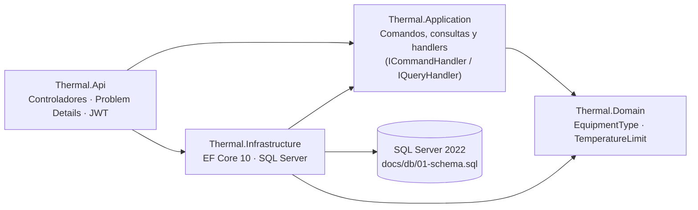

# ThermalCalibration · Monitoreo térmico para calibración de equipos de refrigeración

Captura, almacena y exporta a Excel las lecturas de temperatura de equipos de refrigeración y de laboratorio (refrigeradoras, congeladoras, conservadoras, incubadoras y cámaras ambientales, de uso individual, pequeña y mediana escala, hospitales y clínicas; hasta 2000 L) de empresas cliente. Los datos llegan de hasta 27 termopares tipo T o K, conectados a un adquisidor de bajo costo (Arduino o Raspberry Pi) por puerto serial.

**Fase 1:** Sesión de Medición, Adquisición Serial y Exportación a Excel, solo con datos crudos. El análisis estadístico, los certificados y el inventario de sensores quedan para fases futuras.

| Estado | |
|---|---|
| Especificación y arquitectura | Completas ([docs/](docs/)) |
| Backend implementado | Catálogo de **tipos de equipo** (HU-02): `POST`, `GET` y `PUT` de `/api/v1/equipment-types` |
| Pruebas | 82 automatizadas (73 unitarias y 9 de integración), todas correctas |
| Contrato | [docs/api/thermal-v1.yaml](docs/api/thermal-v1.yaml), verificado contra la API en ejecución ([validation.md §5.2](docs/validation.md#52-auditoría-código--contrato--gherkin-2026-09-25)) |

> Ante cualquier diferencia entre este README y la especificación, prevalece [docs/specs/functional/](docs/specs/functional/).

---

## 1. Inicio rápido

### Requisitos

| Herramienta | Versión | Para qué |
|---|---|---|
| [.NET SDK](https://dotnet.microsoft.com/download) | 10.0.401 o posterior (ver [global.json](global.json)) | Compilar, ejecutar, generar tokens y probar |
| Docker Desktop | Con Docker Compose v2 | Opción A y pruebas de integración |
| SQL Server LocalDB | Incluido con Visual Studio | Solo la opción B |

### Token de desarrollo (ambas opciones)

La API exige un JWT. En desarrollo se genera con `dotnet user-jwts`. Este comando crea un token de administrador válido para las dos opciones:

```bash
dotnet user-jwts create --project src/Thermal.Api --role Admin \
  --audience https://localhost:5001 --audience http://localhost:5000 --audience http://localhost:8080 \
  --output token
```

- Para probar los permisos, `--role Technician` genera un token que puede leer pero no crear ni editar (403).
- Indica **siempre las tres audiencias**: `dotnet user-jwts create --audience X` reescribe `appsettings.Development.json` dejando solo `X`, y los tokens del otro entorno dejarían de valer.

### Opción A · Docker Compose (SQL Server + API)

```bash
# 1. Clave de firma de los tokens (la guarda user-jwts en los user secrets del proyecto)
export JWT_SIGNING_KEY=$(dotnet user-jwts key --project src/Thermal.Api | sed -n "s/^Signing Key: '\(.*\)'$/\1/p")
#    PowerShell: $env:JWT_SIGNING_KEY = (dotnet user-jwts key --project src/Thermal.Api) -replace "^Signing Key: '(.*)'$", '$1'
#    También puede ir en un archivo .env junto a docker-compose.yml (ya está en .gitignore).

# 2. Levantar todo (la primera vez construye la imagen de la API y crea la base con docs/db/01-schema.sql)
docker compose up -d --build        # equivalente: docker-compose up -d --build

# 3. Comprobar
docker compose ps
curl -s http://localhost:8080/openapi/v1.json | head -c 200
```

| Servicio | Qué hace | Puerto | Memoria máxima |
|---|---|---|---|
| `sqlserver` | SQL Server 2022 Developer, zona horaria America/Lima, datos en el volumen `sqlserver-data` | `localhost:14333` | 2 GB (mínimo que exige SQL Server) |
| `db-init` | Crea `ThermalCalibration` con [01-schema.sql](docs/db/01-schema.sql) si no existe, y termina | — | 256 MB |
| `api` | Web API .NET 10 ([Dockerfile](src/Thermal.Api/Dockerfile)) | `http://localhost:8080` | 256 MB |

```bash
docker compose stop      # detiene sin borrar nada (libera la memoria); se reanuda con: docker compose start
docker compose down      # borra los contenedores; la base se conserva en el volumen
docker compose down -v   # borra también la base
```

SQL Server no atiende la señal de parada de Docker: con `docker compose stop` se corta a los 10 s y, al volver a arrancar, recupera la base solo. Para un cierre ordenado, ejecuta antes `SHUTDOWN` (en Git Bash, anteponiendo `MSYS_NO_PATHCONV=1`):

```bash
docker compose exec sqlserver bash -c '/opt/mssql-tools18/bin/sqlcmd -S localhost -U sa -P "$MSSQL_SA_PASSWORD" -C -Q "SHUTDOWN"'
docker compose stop
```

Variables opcionales (en el entorno o en `.env`): `MSSQL_SA_PASSWORD` (por defecto, `Thermal_Dev_2026!`, solo para desarrollo), `SQL_PORT` (14333), `API_PORT` (8080) y `JWT_SIGNING_KEY`. Sin `JWT_SIGNING_KEY`, la API arranca pero responde 401 a todo.

> Compose sirve para **desarrollo y demostración**. En producción la API es un servicio de Windows en la PC del laboratorio, porque la captura necesita el puerto COM, al que un contenedor no accede ([c4-containers.md](docs/architecture/c4-containers.md)).

### Opción B · `dotnet run` con SQL Server LocalDB

```bash
sqlcmd -S "(localdb)\MSSQLLocalDB" -f 65001 -i docs/db/01-schema.sql   # una sola vez: crea ThermalCalibration
dotnet run --project src/Thermal.Api                                     # https://localhost:5001
```

La cadena de conexión de desarrollo está en [appsettings.Development.json](src/Thermal.Api/appsettings.Development.json). También puedes usar [Thermal.Api.http](src/Thermal.Api/Thermal.Api.http) desde VS Code (REST Client) o Visual Studio.

## 2. Endpoints (colección cURL)

Contrato completo: [docs/api/thermal-v1.yaml](docs/api/thermal-v1.yaml). Los ejemplos usan bash y la opción A. Para la opción B, usa `API=https://localhost:5001` y añade `-k` si el certificado de desarrollo no es de confianza. En PowerShell, usa `curl.exe` en lugar de `curl`.

```bash
API=http://localhost:8080
TOKEN=$(dotnet user-jwts create --project src/Thermal.Api --role Admin \
  --audience https://localhost:5001 --audience http://localhost:5000 --audience http://localhost:8080 --output token)
```

| Método y ruta | Rol | Respuestas | Historia |
|---|---|---|---|
| `POST /api/v1/equipment-types` | Admin | 201 (`Location`, `ETag`), 400, 401, 403, 409, 415 | HU-02 |
| `GET /api/v1/equipment-types/{id}` | Cualquiera autenticado | 200 (`ETag`), 401, 404 | HU-02 |
| `PUT /api/v1/equipment-types/{id}` | Admin | 200 (`ETag`), 400, 401, 403, 404, 409, 412, 415 | HU-02 |

No hay `DELETE` (responde 405): un tipo de equipo se **desactiva** con `PUT` e `isActive: false`.

**Crear un tipo de equipo** → `201 Created`

```bash
curl -i -X POST "$API/api/v1/equipment-types" \
  -H "Authorization: Bearer $TOKEN" -H "Content-Type: application/json" \
  -d '{"name":"Ultracongeladora","maxTemperatureC":-60,"minSessionDurationMinutes":60,"description":"Vacunas y reactivos"}'
```

Sin `maxTemperatureC`, o con `null`, el límite queda pendiente. Sin `minSessionDurationMinutes`, la duración mínima es 60.

**Obtener un tipo de equipo** → `200 OK`, con la cabecera `ETag`

```bash
curl -i "$API/api/v1/equipment-types/2" -H "Authorization: Bearer $TOKEN"
```

```json
{"id":2,"name":"Congeladora","maxTemperatureC":-5.00,"isLimitDefined":true,"minSessionDurationMinutes":60,
 "description":"No debe superar -5,0 °C; -4,9 °C ya está fuera de límite","isActive":true,
 "createdAt":"2026-09-25T21:33:40-05:00","updatedAt":null}
```

**Reemplazar un tipo de equipo con control de concurrencia** → `200 OK`, o `412` si alguien lo cambió antes

```bash
ETAG=$(curl -s -D - -o /dev/null "$API/api/v1/equipment-types/2" -H "Authorization: Bearer $TOKEN" \
  | tr -d '\r' | sed -n 's/^[Ee][Tt]ag: //p')

curl -i -X PUT "$API/api/v1/equipment-types/2" \
  -H "Authorization: Bearer $TOKEN" -H "Content-Type: application/json" -H "If-Match: $ETAG" \
  -d '{"name":"Congeladora","maxTemperatureC":-8,"minSessionDurationMinutes":60,"description":"Horizontales y verticales","isActive":true}'
```

`PUT` reemplaza todo: lo que no se envía toma su valor por defecto (límite pendiente, sin descripción, 60 min). `If-Match` es opcional.

**Desactivar un tipo de equipo** (en lugar de borrarlo) → `200 OK`

```bash
curl -i -X PUT "$API/api/v1/equipment-types/4" \
  -H "Authorization: Bearer $TOKEN" -H "Content-Type: application/json" \
  -d '{"name":"Incubadora","minSessionDurationMinutes":120,"isActive":false}'
```

**Errores** (todos en `application/problem+json`, RFC 7807, con títulos en español)

```bash
# 400: límite con 3 decimales  →  errors.maxTemperatureC = "El límite admite como máximo 2 decimales"
curl -i -X POST "$API/api/v1/equipment-types" -H "Authorization: Bearer $TOKEN" -H "Content-Type: application/json" \
  -d '{"name":"Congeladora vertical","maxTemperatureC":-5.123}'

# 409: nombre duplicado (sin distinguir mayúsculas)  →  "Ya existe el tipo de equipo CONGELADORA"
curl -i -X POST "$API/api/v1/equipment-types" -H "Authorization: Bearer $TOKEN" -H "Content-Type: application/json" \
  -d '{"name":"CONGELADORA"}'

# 412: repetir el PUT con el ETag anterior  →  "El tipo de equipo fue modificado por otro usuario..."
curl -i -X PUT "$API/api/v1/equipment-types/2" -H "Authorization: Bearer $TOKEN" -H "Content-Type: application/json" \
  -H "If-Match: $ETAG" -d '{"name":"Congeladora","maxTemperatureC":-9,"isActive":true}'

# 401: sin token
curl -i "$API/api/v1/equipment-types/2"

# 403: un técnico no puede crear ni editar
TECH=$(dotnet user-jwts create --project src/Thermal.Api --role Technician \
  --audience https://localhost:5001 --audience http://localhost:5000 --audience http://localhost:8080 --output token)
curl -i -X POST "$API/api/v1/equipment-types" -H "Authorization: Bearer $TECH" -H "Content-Type: application/json" \
  -d '{"name":"Nuevo tipo"}'
```

## 3. Arquitectura

**Clean Architecture + CQRS lógico + dominio enriquecido** ([ADR-001](docs/architecture/adr/ADR-001-clean-architecture-cqrs-ddd.md)). Las dependencias apuntan hacia el dominio:



| Tema | Decisión |
|---|---|
| Endpoints | Controladores `[ApiController]`, según el contrato [thermal-v1.yaml](docs/api/thermal-v1.yaml) |
| CQRS | Interfaces propias `ICommandHandler` / `IQueryHandler`, **sin MediatR** (licencia comercial desde 2025). Las consultas leen sin pasar por el agregado |
| Dominio | Constructores primarios y la palabra clave `field` de C# 14. Las reglas viven en el agregado (`EquipmentType`) y en value objects (`TemperatureLimit`) |
| Base de datos | Base primero: el esquema es [01-schema.sql](docs/db/01-schema.sql), sin migraciones de EF. Las restricciones `CHECK` son la segunda línea de defensa |
| Concurrencia | `ROWVERSION` expuesta como `ETag`; `If-Match` → 412 |
| Errores | Problem Details (RFC 7807) con títulos y mensajes de negocio en español |
| Autenticación | JWT provisional (roles `Admin`, `Technician`, `Supervisor`) hasta decidir el mecanismo definitivo |
| Fechas | Zona del laboratorio (America/Lima, `-05:00`), redondeadas al segundo como `DATETIMEOFFSET(0)` |
| Paquetes NuGet | Versiones centralizadas en [Directory.Packages.props](Directory.Packages.props). C# 14, nulabilidad y advertencias como errores en [Directory.Build.props](Directory.Build.props) |

Contexto completo: [C4 de contenedores](docs/architecture/c4-containers.md) y [modelo de dominio](docs/architecture/domain-model.md). La captura serial (con el protocolo propio v1.0, en modos `POLL` y `STREAM`) correrá en segundo plano dentro de la misma API.

### Estructura del repositorio

```text
Thermal.slnx                  # solución (.NET 10)
docker-compose.yml            # SQL Server + esquema + API para desarrollo
src/
  Thermal.Domain/             # agregados y value objects, sin dependencias externas
  Thermal.Application/        # comandos, consultas, handlers y puertos
  Thermal.Infrastructure/     # EF Core 10, repositorios, unidad de trabajo
  Thermal.Api/                # controladores, manejo de errores, composición, Dockerfile
tests/
  Thermal.UnitTests/          # xUnit v3 + FluentAssertions 7 + NSubstitute
  Thermal.IntegrationTests/   # Testcontainers (SQL Server 2022 en Docker)
docs/                         # especificación, arquitectura, contrato, diagramas, normas, validación
test-data/                    # 22 escenarios reproducibles para el adquisidor simulado
```

### Convención de nombres: inglés en todo lo técnico

Todo lo que es código o contrato va en **inglés**, con los mismos nombres en todas las capas. El **español** queda para la documentación, los mensajes al usuario y los textos del Excel.

| Capa | Tipo de equipo | Ejemplos |
|---|---|---|
| Base de datos | `dbo.EquipmentType` | `MaxTemperatureC`, `MinSessionDurationMinutes`, `RowVersion` |
| Dominio | `EquipmentType` | `TemperatureLimit`, `ChangeLimit`, `Deactivate` |
| Aplicación | `CreateEquipmentTypeCommand` | `UpdateEquipmentTypeCommand`, `GetEquipmentTypeByIdQuery`, `EquipmentTypeDto` |
| API | `EquipmentTypesController` | `/api/v1/equipment-types`; schemas `CreateEquipmentTypeRequest`, `CreateEquipmentTypeResponse`, `UpdateEquipmentTypeRequest`, `EquipmentTypeResponse`, `ErrorResponse` |
| JSON y datos de prueba | camelCase | `maxTemperatureC`, `isActive`, `config.equipmentTypeMinSessionDurationMinutes` |

- **No** usar nombres en español en clases, propiedades, rutas ni schemas (`TipoEquipo`, `CreateTipoEquipamientoCommand`… no existen).
- Rutas REST en plural, minúsculas y kebab-case: `/api/v1/equipment-types`, `/api/v1/sessions/{id}/alerts`.
- Comandos y consultas: `<Verbo><Entidad>Command` / `Get<Entidad>…Query`, con su handler al lado.
- Mensajes de validación en español, iguales a los de las historias (p. ej. "El límite admite como máximo 2 decimales").

## 4. Pruebas

| Proyecto | Qué prueba | Requiere |
|---|---|---|
| [tests/Thermal.UnitTests](tests/Thermal.UnitTests/) (73) | Dominio, handlers con dobles (NSubstitute), autorización del controlador y redondeo de fechas | Nada |
| [tests/Thermal.IntegrationTests](tests/Thermal.IntegrationTests/) (9) | Persistencia contra el esquema real: valores que genera la base, unicidad, concurrencia y fechas | Docker en ejecución |

```bash
dotnet test --solution Thermal.slnx                                             # todas
dotnet test --project tests/Thermal.UnitTests                                   # solo unitarias, sin Docker
dotnet test --project tests/Thermal.UnitTests -- --filter-trait "Story=HU-02"   # por historia
```

- Cada prueba indica la historia y el escenario Gherkin que verifica: `[Trait("Story", "HU-02")]` y el comentario `// HU-02 · Scenario: …`. La cobertura por escenario está en [validation.md §5.1](docs/validation.md#51-cobertura-automatizada-de-hu-02-2026-09-25).
- **Docker:** Testcontainers crea un SQL Server propio (limitado a 2 GB), compartido por todas las pruebas y **eliminado al terminar**. Conviene detener antes el compose (`docker compose stop`), para no tener dos SQL Server en memoria. La imagen `mssql/server:2022-latest` (unos 2,3 GB en disco) se reutiliza entre ejecuciones y con el compose.
- **FluentAssertions 7.2.2** es la última versión con licencia Apache 2.0; desde la 8.0 es comercial.
- Los 22 escenarios del adquisidor simulado (TD-01 a TD-22) se regeneran con `node test-data/generate-test-data.mjs` ([test-data/](test-data/README.md)).

## 5. Reglas de negocio principales

| Tema | Valor | Regla |
|---|---|---|
| Canales por sesión | **1 a 27** termopares, tipo T o K, cada uno con su ubicación (27: DIN 12880 en incubadoras de más de 50 L) | RN-01, D-06 |
| Mínimo de puntos de medición | **Por tipo de equipo**: 9 (8 esquinas y el centro, IEC 60068-3-5, DKD-R 5-7, USP <1079.4>) y 27 en incubadoras de más de 50 L (DIN 12880). Con menos se advierte y se exige confirmación | RN-20, D-06 |
| Intervalo de muestreo **[PC-01]** | **120 s**, una lectura por canal cada 2 min | RN-02 |
| Inicio de la sesión | Con la **primera muestra recibida** después de pulsar "Iniciar" (muestra 1, t = 0) | RN-02 |
| Duración de la sesión | Base de **1 h**. Mayor si lo exige el tipo de equipo o lo pide el cliente (con referencia), hasta varios días (máximo 7 por defecto). Se cierra sola al cumplirse | RN-04 |
| Sesión completa | Cumplió la duración planificada **y** tiene 1 h de datos válidos (31 muestras con 120 s) | RN-03 |
| Descanso del kit de medición | **15 min** entre sesiones con el mismo adquisidor. Un supervisor puede autorizar un inicio anticipado | RN-17 |
| Límite | **Por tipo de equipo** (D-05): **máximo** (refrigeración; fuera si la lectura es **estrictamente mayor**: con -5,0 °C, -5,0 cumple y -4,9 no) o **banda** consigna ± tolerancia (incubadoras, cámaras ambientales; fuera por arriba o por abajo). Se copia en la sesión al iniciar | RN-06 a RN-08, D-05 |
| Mezcla de termopares T y K | Se permite, con advertencia y confirmación | RN-05 |
| Muestra afectada | **Más del 60 %** de los canales sin lectura válida (6 de 10 no la afecta, 7 de 10 sí) | RN-14 |
| Pérdida de sensores | Advertencia en la 1.ª muestra afectada, **crítica en la 3.ª** seguida y **sesión fallida a los 30 min** seguidos. Un corte de comunicación de 30 min también hace fallar la sesión | RN-14, RN-15 |
| Fuera de límite sostenido | Un canal fuera de límite **30 min** seguidos genera una alerta crítica, con la causa probable: **sensor** o **equipo** | RN-19 |
| Reconexión con otro adquisidor u otro grupo de sensores | Sesión fallida | RN-15 |
| Alertas | **Críticas:** aviso destacado y reconocimiento obligatorio. **Advertencias:** solo se registran | RN-18 |
| Estados de la sesión | Configurada → En curso → Completa / Incompleta / Fallida / Cancelada | 05 §2 |
| Excel exportado | Hojas Resumen, Lecturas, Alertas y Comunicación | HU-11 |

Los parámetros se guardan en la tabla `AppSetting`, los mantiene el administrador y se **copian en cada sesión al iniciarla**.

**Punto de cambio PC-01 (intervalo de muestreo).** Se mantiene en 120 s en la fase 1 (P-11), aunque DKD-R 5-7 §7.3 e IEC 60068-3-5 §4.4 piden 60 s o menos. Todos los lugares donde se define llevan la marca `[PC-01]` (`grep -rn "PC-01" docs test-data`). El código no debe usar los literales `120` ni `31`. Detalle en [01 §12](docs/specs/functional/01-vision-document.md#pc-01--intervalo-de-muestreo).

## 6. Documentación

| Documento | Contenido |
|---|---|
| [01-vision-document.md](docs/specs/functional/01-vision-document.md) | Problema, alcance, reglas de negocio, glosario, base normativa, decisiones, preguntas abiertas y puntos de cambio |
| [02-serial-protocol.md](docs/specs/functional/02-serial-protocol.md) | Protocolo PC ↔ adquisidor |
| [03-user-stories.md](docs/specs/functional/03-user-stories.md) | Historias HU-01 a HU-17 en Gherkin y formato del Excel |
| [04-sequence-diagrams.md](docs/specs/functional/04-sequence-diagrams.md) | Índice de los diagramas de secuencia |
| [05-data-model.md](docs/specs/functional/05-data-model.md) | Modelo de datos y reglas de la base |
| [06-test-data.md](docs/specs/functional/06-test-data.md) | Set de datos de prueba y adquisidor simulado |
| [docs/api/thermal-v1.yaml](docs/api/thermal-v1.yaml) | Contrato OpenAPI 3.0. Validar con `npx @redocly/cli lint docs/api/thermal-v1.yaml` |
| [docs/architecture/](docs/architecture/) | Modelo de dominio, C4 de contenedores y ADR-001 |
| [docs/diagrams/gherkin/](docs/diagrams/gherkin/) | Un `.feature` por historia, generado desde 03 con `node docs/diagrams/generate-features.mjs` |
| [docs/diagrams/sequence/](docs/diagrams/sequence/) | Diagramas de secuencia en Mermaid, con su versión SVG en [svg/](docs/diagrams/sequence/svg/). Validar y regenerar con `node docs/diagrams/render-sequence-svg.mjs` |
| [docs/validation.md](docs/validation.md) | Trazabilidad HU ↔ RN ↔ TD, cobertura de pruebas, estado por historia y auditoría código ↔ contrato |
| [docs/equipment-catalog/](docs/equipment-catalog/README.md) | Fichas públicas de fabricantes (Memmert CTC/TTC, HPP, ICH) con sus especificaciones de temperatura |
| [docs/data/](docs/data/README.md) | Registros reales de temperatura con su análisis y su perfil (DATA-1: cámara ambiental Memmert TTC256 inferida, 72 h, 12 × tipo T, óptima) |
| [docs/implementation-plan.md](docs/implementation-plan.md) | Orden de las entidades pendientes, definición de terminado, guía paso a paso y lecciones aprendidas |
| [docs/delivery/](docs/delivery/README.md) | Plantillas de la documentación de entrega: despliegue, usuario, administrador y cierre técnico con acta de aceptación |
| [tools/contract-check/](tools/contract-check/README.md) | Auditoría automática de la API en ejecución contra el contrato OpenAPI |
| [CLAUDE.md](CLAUDE.md) | Convenciones y comandos para las sesiones de trabajo con Claude Code |
| [docs/standards/](docs/standards/README.md) | Fichas de OMS TRS 961, IEC 60068-3-5, EURAMET cg-20 y DKD-R 5-7 |

## 7. Pendiente

| Tema | Estado |
|---|---|
| Resto de historias (sesiones, captura serial, alertas, Excel) | Especificadas; sin implementar |
| Autenticación definitiva | Cuentas propias o Windows/AD, por decidir |
| Preguntas abiertas | P-03, P-04, P-06 a P-10, P-12 y P-14, con propuesta provisional ([01 §11](docs/specs/functional/01-vision-document.md#11-preguntas-abiertas)) |
| Normas | Revisar la edición 2025-01 de DKD-R 5-7 |
