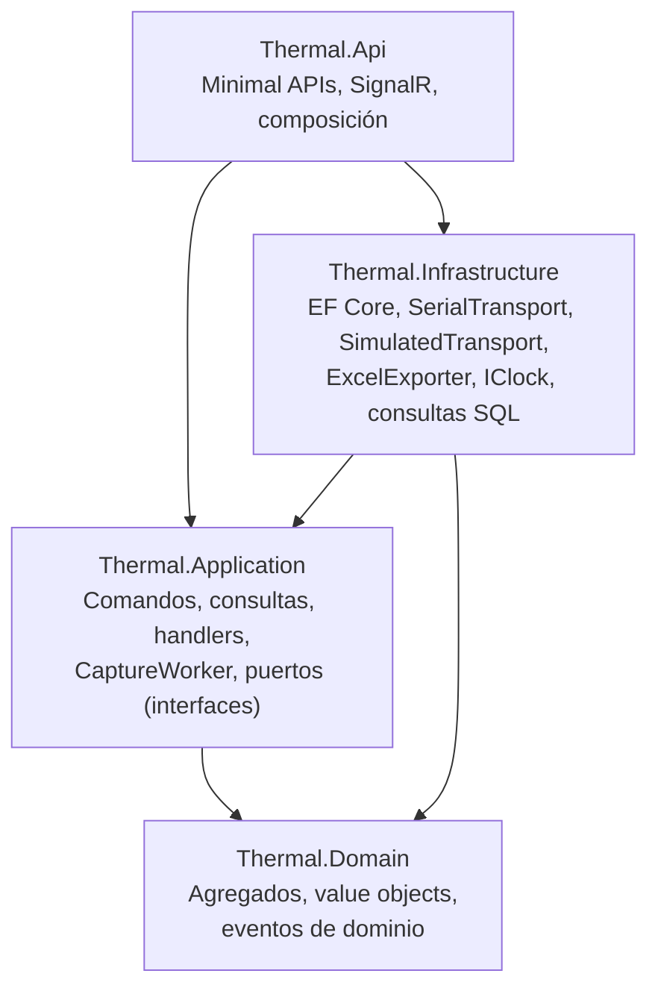

# ADR-001: Clean Architecture + CQRS + dominio enriquecido (DDD)

| Campo | Valor |
|---|---|
| Estado | **Propuesto** |
| Fecha | 2026-09-25 |
| Decisores | Arquitectura de software, líder técnico del laboratorio |
| Relacionado | [domain-model.md](../domain-model.md), [c4-containers.md](../c4-containers.md), [03-user-stories.md](../../specs/functional/03-user-stories.md), [06-test-data.md](../../specs/functional/06-test-data.md) |

## 1. Contexto

La Web API (.NET 10) debe implementar las historias HU-01 a HU-14 sobre SQL Server 2022. Estas son las fuerzas que condicionan la decisión:

1. **Reglas de negocio densas y de alto impacto, concentradas en la sesión.** Límite estricto (`>`), límite y política de pérdida copiados al iniciar, mezcla T/K con confirmación obligatoria, episodios de falla por canal, umbral de pérdida de sensores (> 60 %) con escalamiento a crítica en la 3.ª muestra y falla a los 30 min, duración planificada (1 h a varios días) con 31 muestras válidas, descanso del adquisidor, invalidación por cambio de adquisidor o de grupo, y severidad de las alertas. Un error aquí produce datos de calibración incorrectos.
2. **El hardware no existe todavía.** El núcleo debe poder probarse sin puerto COM, con un simulador y un reloj acelerado (O7, [06-test-data.md](../../specs/functional/06-test-data.md)).
3. **Varios mecanismos de entrada** llegan a las mismas reglas: HTTP (técnico), un proceso en segundo plano (captura serial en modo `Poll` o `Stream`) y la reanudación tras un reinicio.
4. **Lecturas y escrituras asimétricas.** Las escrituras son pocas y exigen reglas estrictas: una muestra cada 2 min por sesión. Las lecturas son consultas tabulares (historial, cobertura, datos del Excel), que la base ya resuelve con vistas.
5. **Auditoría.** Las lecturas, las alertas y los huecos son evidencia inmutable (RN-13).
6. **Equipo pequeño y una sola base de datos.** La solución no debe añadir infraestructura (colas, bases de lectura) que el volumen no justifica: 310 lecturas en la sesión base de 1 h y, como máximo, unas 50 000 en una sesión de 7 días.

## 2. Decisión

Adoptar **Clean Architecture** con **CQRS lógico** y un **dominio enriquecido** según DDD táctico.

### 2.1 Capas y regla de dependencias



- Las dependencias apuntan **hacia el dominio**. `Thermal.Domain` no referencia ningún paquete de infraestructura: ni EF Core, ni ASP.NET, ni `System.IO.Ports`.
- `Thermal.Application` define **puertos** (`ISessionRepository`, `ISerialTransport`, `IClock`, `IExcelExporter`, `IUnitOfWork`). `Thermal.Infrastructure` los implementa.
- `Thermal.Api` es la raíz de composición: registra las dependencias y hospeda el `CaptureWorker` como `BackgroundService`.

### 2.2 CQRS lógico

| Lado | Cómo se implementa |
|---|---|
| **Comandos** | Un handler por caso de uso (`RequestStartCommand`, `RecordSampleCommand`, `CloseSessionCommand`…). Cada handler carga el agregado desde su repositorio, invoca **un** método de dominio, despacha los eventos de dominio (p. ej. crear las `Alert`) y guarda todo en **una** transacción. |
| **Consultas** | Handlers de solo lectura que devuelven DTO, construidos directamente con SQL o proyecciones sobre las tablas y las vistas (`vSessionSampleCoverage`, `vSessionReadingPivot`). **No** pasan por los agregados ni por los repositorios de escritura. |
| **Almacenamiento** | Una sola base de SQL Server para ambos lados. No hay sincronización ni consistencia eventual entre modelos. |
| **Despacho** | Interfaces propias y mínimas (`ICommandHandler<T>`, `IQueryHandler<T,R>`) registradas en el contenedor de dependencias, y decoradores para validación, logging y transacción. Se evita depender de MediatR, que adoptó una licencia comercial en 2025. |

### 2.3 Dominio enriquecido

- Las reglas viven en los **agregados y value objects**, no en servicios ni handlers: `MeasurementSession.RecordSample`, `TemperatureLimit.IsExceededBy`, `SensorLossPolicy.IsAffected`/`ShouldEscalate`/`ShouldFail`, `PlannedDuration`, `MeasurementSession.Reconnect`, `Alert.Acknowledge`.
- Las propiedades tienen setters privados. El estado solo cambia mediante métodos con nombre del negocio, y cada transición de la sesión es un método ([domain-model.md §5](../domain-model.md#5-ciclo-de-vida-de-measurementsession)).
- Entre agregados solo hay referencias por identificador, y la coordinación se hace con **eventos de dominio** despachados dentro de la misma unidad de trabajo, por ejemplo `ReadingAboveLimit` → `Alert`.
- La validación de tramas se reparte así: la infraestructura y la aplicación resuelven el formato y el checksum (V1–V6), y el dominio decide el estado de la lectura (V7–V10), porque eso es regla de negocio.

### 2.4 Estructura de la solución

```text
src/
  Thermal.Domain/            # sin dependencias externas
  Thermal.Application/       # depende de Domain
  Thermal.Infrastructure/    # EF Core 10, System.IO.Ports, OpenXML; depende de Application y Domain
  Thermal.Api/               # ASP.NET Core .NET 10; raíz de composición
tests/
  Thermal.Domain.Tests/          # reglas puras: límite, umbral, episodios, cierre
  Thermal.Application.Tests/     # handlers con dobles de puertos
  Thermal.IntegrationTests/      # API + SQL Server + SimulatedTransport con los escenarios TD-01..TD-22
  Thermal.ArchitectureTests/     # verifican la regla de dependencias
```

## 3. Alternativas consideradas

| Alternativa | Por qué no |
|---|---|
| **N capas CRUD con modelo anémico** (servicios + entidades EF) | Las reglas quedarían dispersas en servicios y controladores, y sería fácil saltarse una, por ejemplo asignar `Status = Completed` sin comprobar las 31 muestras válidas. Además, costaría probarlas sin base de datos ni hardware. |
| **Solo *vertical slices*** sin capa de dominio | Da buena organización por caso de uso, pero `RecordSample`, `Close` y `Reconnect` comparten las mismas reglas de la sesión. Sin agregado, esas reglas se duplicarían entre slices. Sí se adopta la organización por caso de uso **dentro** de `Application`. |
| **CQRS físico** (base de lectura separada, proyecciones asíncronas) | El volumen no lo justifica. Añadiría consistencia eventual en la pantalla de monitoreo y más infraestructura. Las vistas de SQL Server cubren las lecturas. |
| **Event Sourcing** de la sesión | La auditoría ya la cubren la inmutabilidad de `Reading` y `Alert` y el `RawFrame`. Reconstruir cientos o miles de muestras desde eventos y versionar esos eventos añade complejidad sin beneficio en la fase 1. |
| **Lógica en procedimientos almacenados** | Uniría las reglas al motor y complicaría las pruebas con el simulador. La base se queda con las restricciones `CHECK` como segunda línea de defensa. |

## 4. Consecuencias

**Positivas**

- Las reglas críticas (RN-03 a RN-20) se prueban con **pruebas unitarias puras** del dominio, rápidas y sin hardware. Los resultados esperados (`expected`) de los escenarios `TD-xx` sirven directamente como casos de prueba.
- Las tres entradas (HTTP, `CaptureWorker` y la reanudación) invocan los mismos comandos y los mismos métodos del agregado: no hay caminos alternativos que se salten reglas.
- Cambiar de adquisidor (real, simulado, `Poll` o `Stream`), de librería de Excel o de mecanismo de autenticación no toca el dominio.
- Las consultas son simples y rápidas, porque aprovechan las vistas existentes sin atravesar el modelo de dominio.
- Si hace falta separar la captura en un **agente** independiente (varias PC y una API central), el `CaptureWorker` y `ISerialTransport` se mueven a otro proceso que invoque los mismos comandos por HTTP o por cola. El dominio no cambia.

**Negativas y mitigaciones**

| Costo | Mitigación |
|---|---|
| Más proyectos y más código de estructura (DTO, handlers, mapeos) que un CRUD. | Plantillas por caso de uso. El CRUD simple (empresas, catálogos) usa handlers delgados y no necesita un agregado rico. |
| Curva de aprendizaje de DDD y CQRS para el equipo. | Mantener el modelo corto ([domain-model.md](../domain-model.md)) y aplicar el rigor de DDD solo en `MeasurementSession`. |
| Riesgo de que el agregado de sesión cargue todas las lecturas. | Diseño explícito: la raíz mantiene un estado resumido y solo agrega las lecturas de la muestra en curso ([domain-model.md §2](../domain-model.md#2-diagrama-de-clases)). |
| Las reglas quedan duplicadas entre el dominio y los `CHECK` de la base. | Es intencional (defensa en profundidad). Las pruebas de integración con los 22 escenarios verifican que ambos coincidan. |
| Los eventos de dominio en la misma transacción acoplan la sesión y la alerta en tiempo de ejecución. | Aceptado: se exige consistencia inmediata entre una lectura y su alerta. |

## 5. Cumplimiento

- `Thermal.ArchitectureTests` falla si `Thermal.Domain` referencia `Microsoft.EntityFrameworkCore`, `Microsoft.AspNetCore.*` o `System.IO.Ports`, o si `Thermal.Application` referencia `Thermal.Infrastructure`.
- **[PC-01]** Ni el dominio ni el `CaptureWorker` usan literales del intervalo de muestreo (`120`) o de las muestras mínimas (`31`): leen `SamplingIntervalSeconds` de la sesión y derivan el resto ([01 §12](../../specs/functional/01-vision-document.md#pc-01--intervalo-de-muestreo)). Una prueba unitaria ejecuta las reglas con 60 s y con 120 s.
- Ningún handler de comando asigna propiedades de un agregado: solo invoca métodos. Se verifica en la revisión de código, con setters privados.
- Los 22 escenarios `TD-xx` se ejecutan en la integración continua contra SQL Server (un contenedor o LocalDB para las pruebas que no dependan de funciones exclusivas de la versión 2022).
