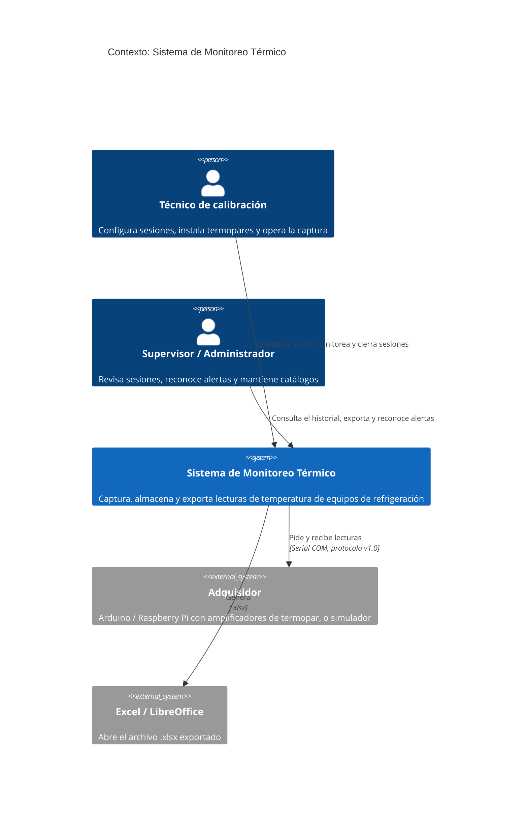
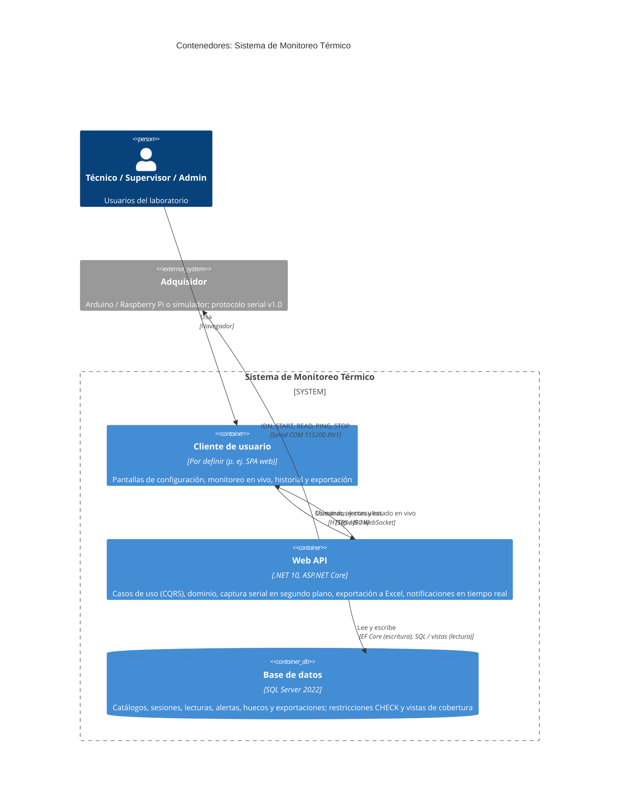

# Arquitectura C4: contexto y contenedores

| Campo | Valor |
|---|---|
| Versión | 0.2 (borrador para revisión) |
| Cambios en 0.2 | Sesiones de 1 h a varios días, descanso del adquisidor, parámetros en `AppSetting` y notificación en vivo solo de alertas críticas. |
| Fecha | 2026-09-25 |
| Decisiones | [ADR-001](adr/ADR-001-clean-architecture-cqrs-ddd.md) (Clean Architecture + CQRS + dominio enriquecido) |
| Fuentes | [01-vision-document.md §5](../specs/functional/01-vision-document.md#5-arquitectura-conceptual), [02-serial-protocol.md](../specs/functional/02-serial-protocol.md), [03-user-stories.md](../specs/functional/03-user-stories.md), [../db/01-schema.sql](../db/01-schema.sql) |

---

## 1. Nivel 1: contexto del sistema

## 2. Nivel 2: contenedores

## 3. Contenedores

### 3.1 Web API (.NET 10)

| Aspecto | Definición |
|---|---|
| Tecnología | .NET 10 (LTS), ASP.NET Core con controladores (`[ApiController]`), SignalR para el tiempo real, `System.IO.Ports` para el puerto serial. |
| Estilo interno | Clean Architecture con CQRS y dominio enriquecido ([ADR-001](adr/ADR-001-clean-architecture-cqrs-ddd.md)). |
| Despliegue | Servicio de Windows (Kestrel) **en la PC del laboratorio** a la que se conecta el adquisidor. Una instancia por PC. Para **desarrollo y demostración** hay un [docker-compose.yml](../../docker-compose.yml) (SQL Server + API en `http://localhost:8080`); no sirve para la captura, porque un contenedor no accede al puerto COM de Windows. |
| Responsabilidades | Exponer los casos de uso de las HU-01 a HU-14. Ejecutar la captura serial en segundo plano (`BackgroundService`), con una tarea por sesión en curso. Aplicar las reglas del dominio. Generar el Excel. Notificar en vivo al cliente. Recuperar las sesiones `Running` al reiniciar (HU-10). |
| Seguridad | Usuarios de `AppUser`, con políticas por rol (`Admin`, `Technician`, `Supervisor`). El mecanismo de autenticación (cuentas locales con cookie/JWT, o Windows/AD) está **por decidir**. |
| Modo simulación | El transporte `SIM` (en memoria) y el reloj acelerable solo se registran si el entorno no es `Production` ([06-test-data.md §3](../specs/functional/06-test-data.md#3-adquisidor-simulado)). |

**Por qué la captura va dentro de la Web API y no en un contenedor aparte.** El puerto COM solo es accesible desde la PC a la que está conectado el adquisidor. En la fase 1 hay una sola PC por puesto de medición, así que un único proceso en esa PC evita un segundo despliegue y la coordinación entre procesos. El módulo de captura queda aislado detrás de interfaces (`ISerialTransport`, `IAcquisitionSession`). Si en el futuro hay varias PC de captura y una API central, se podrá extraer como un **agente de captura** independiente sin tocar el dominio (ver ADR-001, consecuencias).

**Componentes principales** (visión rápida; el detalle de capas está en el ADR):

| Componente | Capa | Qué hace |
|---|---|---|
| Endpoints REST + `MonitorHub` | Api | Traduce HTTP y SignalR a comandos y consultas. |
| Command handlers | Application | `ConfigureSession`, `RequestStart`, `AuthorizeEarlyStart`, `AcknowledgeMixedTypes`, `RecordSample`, `RegisterMissedSample`, `ExtendSession`, `CloseSession`, `AcknowledgeAlert`, `UpdateSettings`... Cargan el agregado, invocan su método y guardan. |
| Query handlers | Application | Historial, detalle, cobertura y datos del Excel. Leen directamente de las vistas (`vSessionSampleCoverage`, `vSessionReadingPivot`) sin pasar por el dominio. |
| `CaptureWorker` | Application / Infrastructure | Programa las muestras (modo `Poll`) o recibe los bloques (modo `Stream`). Valida las tramas (V1–V6) y envía `RecordSample`. En cada hora programada sin datos envía `RegisterMissedSample`, para que el dominio cuente los 30 min de la falla. Gestiona los reintentos, la pérdida de comunicación, la reconexión y el cierre automático al final de la duración planificada. |
| Agregados y value objects | Domain | Ver [domain-model.md](domain-model.md). |
| `SerialTransport` / `SimulatedTransport` | Infrastructure | Acceso al puerto COM real, o reproducción de los escenarios `TD-xx`. |
| `ThermalDbContext` y repositorios | Infrastructure | EF Core 10 contra SQL Server, con una unidad de trabajo por comando. |
| `ExcelExporter` | Infrastructure | Genera el .xlsx con el formato de la HU-11 (con una librería OpenXML, p. ej. ClosedXML). |
| `IClock` (`TimeProvider`) | Infrastructure | Reloj del sistema (`TimeProvider.System`), o reloj virtual en simulación (SIM-06). |

**Interfaz pública (resumen):** todas las rutas llevan el prefijo de versión `/api/v1`. El contrato OpenAPI está en [docs/api/thermal-v1.yaml](../api/thermal-v1.yaml) (por ahora cubre los tipos de equipo) y se valida con `npx @redocly/cli lint docs/api/thermal-v1.yaml`.

| Método y ruta | Tipo | HU |
|---|---|---|
| `POST /companies`, `POST /companies/{id}/equipment` | Comando | HU-01 |
| `POST /equipment-types`, `PUT /equipment-types/{id}` (Admin), `GET /equipment-types/{id}` | Comando / Consulta | HU-02 |
| `GET /ports`, `POST /ports/{port}/detect` | Consulta / Comando | HU-03 |
| `POST /sessions`, `PUT /sessions/{id}/channels` | Comando | HU-03 |
| `POST /sessions/{id}/start`, `POST /sessions/{id}/acknowledge-mixed-types` | Comando | HU-04, HU-05, HU-06 |
| `POST /sessions/{id}/authorize-early-start` (Supervisor, Admin) | Comando | HU-16 |
| `POST /sessions/{id}/extend` | Comando | HU-10, HU-16 |
| `GET /devices/{id}/rest` | Consulta | HU-16 |
| `GET /settings`, `PUT /settings` (Admin) | Consulta / Comando | HU-02 |
| `POST /sessions/{id}/close`, `POST /sessions/{id}/cancel` | Comando | HU-10 |
| `GET /sessions?companyId&equipmentId&from&to&includeSimulations` | Consulta | HU-12 |
| `GET /sessions/{id}`, `GET /sessions/{id}/coverage`, `GET /sessions/{id}/alerts?severity=` | Consulta | HU-12, HU-13, HU-15 |
| `POST /alerts/{id}/acknowledge` | Comando | HU-08 |
| `GET /sessions/{id}/export.xlsx` | Consulta + registro de `SessionExport` | HU-11 |
| `POST /simulations` (solo fuera de producción) | Comando | HU-14 |
| Hub `/hubs/monitor`: `SampleRecorded` (con contadores de advertencias), `CriticalAlertRaised` (solo alertas `Critical`, que la UI muestra como aviso destacado), `SessionStatusChanged`, `CommunicationChanged` | Notificación | HU-06 a HU-10, HU-13, HU-15 |

La captura **no** se expone como endpoint: `RecordSample` lo invoca internamente el `CaptureWorker`, nunca un cliente HTTP.

### 3.2 SQL Server 2022

| Aspecto | Definición |
|---|---|
| Esquema | [docs/db/01-schema.sql](../db/01-schema.sql): 12 tablas de negocio, `AppSetting` (parámetros), `Tally` (auxiliar) y 3 vistas. |
| Ubicación | Instancia local en la PC del laboratorio o en la LAN (supuesto S-06). SQL Server Express es suficiente: 310 lecturas por sesión base de 1 h, y unas 50 000 en el caso extremo de 7 días con 10 canales. |
| Integridad | Las restricciones `CHECK`, `UNIQUE` y `FK` son la **segunda línea de defensa** detrás del dominio. Por ejemplo, `CK_MeasurementSession_MixedAck`, `CK_MeasurementSession_Invalid` y `CK_MeasurementSession_MinDuration`. |
| Escritura | Solo a través de los agregados (EF Core), con una transacción por comando. Una muestra y sus alertas se guardan juntas. |
| Lectura | Consultas directas a las tablas y a las vistas `vSessionSampleCoverage`, `vSessionReadingPivot` y `vSessionThermocoupleMix`. **Una sola base** para escritura y lectura (CQRS lógico, no físico). |
| Inmutabilidad | La cuenta de la aplicación debería tener `DENY DELETE` sobre `Reading`, `Alert` y `CommunicationGap` (mejora M-07 de 05). |
| Respaldo | Copia completa diaria y copia del log. Las lecturas son evidencia de calibración (por definir con el laboratorio). |

### 3.3 Cliente de usuario (por definir)

Fuera del alcance de este documento. Consume la API por HTTPS y el hub de SignalR. Puede ser una SPA servida por la misma Web API, para no añadir otro despliegue.

## 4. Requisitos no funcionales que condicionan la arquitectura

| Requisito | Decisión de arquitectura |
|---|---|
| No perder muestras (O1, ≥ 99 %) | La captura corre en el servidor (`BackgroundService`), no en el navegador. Cerrar el cliente no detiene la sesión. |
| Sesiones de varios días | El worker no guarda estado propio: todo el estado vive en el agregado persistido, de modo que un reinicio del servicio (actualizaciones de Windows, cortes) se trata como una reconexión. Si el reinicio dura 30 min, la sesión falla según RN-15. |
| No interrumpir por variaciones esperables (RN-18) | Solo las alertas `Critical` viajan como `CriticalAlertRaised`. Las advertencias se entregan agregadas en `SampleRecorded`. |
| Temporización exacta cada 120 s sin deriva (RN-02) | Programación desde `StartedAt` con `PeriodicTimer` e `IClock`, no con retardos acumulados. |
| Reanudar tras un reinicio (HU-10) | Al arrancar, el worker busca las sesiones `Running` de esta PC y las reanuda como una reconexión. |
| Pruebas sin hardware (O7) | `ISerialTransport` e `IClock` inyectables. Los 22 escenarios `TD-xx` se ejecutan en pruebas de integración. |
| Auditoría (RN-13) | Escritura solo a través del dominio, `RawFrame` en cada lectura y permisos `DENY` en la base. |
| Volumen | 310 lecturas en la sesión base y, como máximo, unas 50 000 lecturas en una sesión de 7 días: no requiere una base de lectura separada ni colas. |
