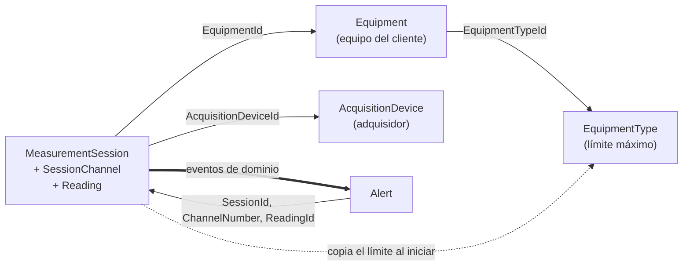
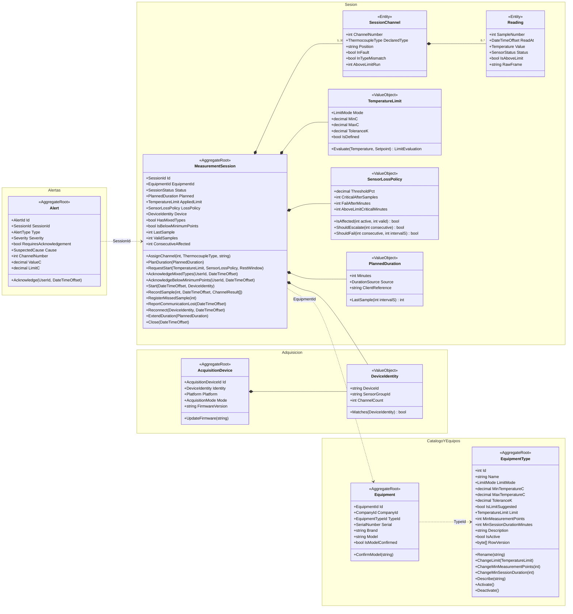
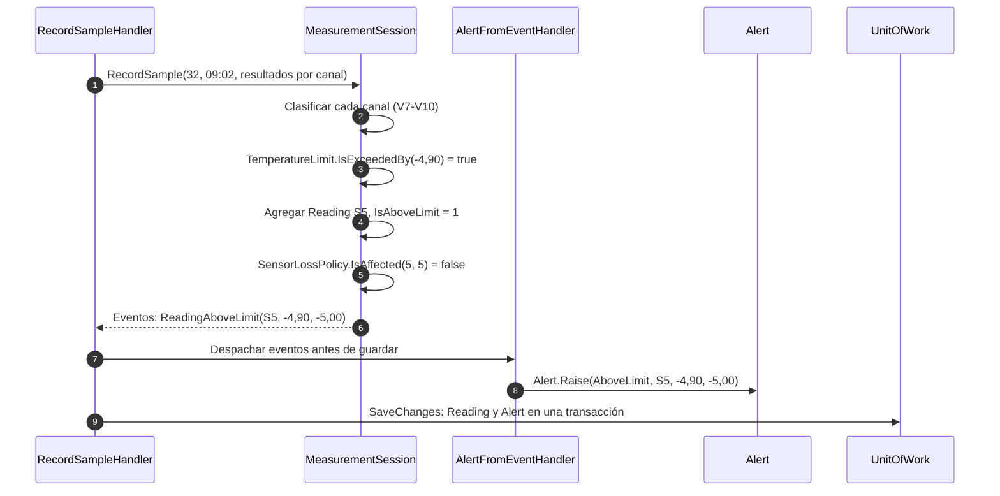

# Modelo de dominio

| Campo | Valor |
|---|---|
| Versión | 0.6 (borrador para revisión) |
| Cambios en 0.2 | Duración planificada, política de pérdida de sensores (escalamiento y falla), descanso del adquisidor y severidad de las alertas (críticas y advertencias). |
| Cambios en 0.3 | Fuera de límite sostenido con causa probable (`AboveLimitSustained`, `SuspectedCause`). Mínimo de 9 puntos de medición con confirmación. |
| Cambios en 0.6 | D-07: `LimitMode.Range` (mínimo y/o máximo) reemplaza a `Maximum`; `EquipmentType.MinTemperatureC` e `IsLimitSuggested`. |
| Cambios en 0.5 | D-05 y D-06: `EquipmentType` con `LimitMode`, `ToleranceK` y `MinMeasurementPoints`; `TemperatureLimit` evalúa máximo o banda (`Evaluate`); eventos `ReadingBelowLimit` y `BelowLimitSustained`; sesiones de 1 a 27 canales. |
| Cambios en 0.4 | `EquipmentType` alineado con [01-schema.sql](../db/01-schema.sql) y el contrato [thermal-v1.yaml](../api/thermal-v1.yaml): `MinSessionDurationMinutes` (antes `MinSessionMinutes`), `Description`, `IsActive`, `RowVersion` y sus métodos de edición y desactivación. |
| Fecha | 2026-09-25 |
| Enfoque | DDD táctico: agregados con comportamiento (dominio enriquecido). Ver [ADR-001](adr/ADR-001-clean-architecture-cqrs-ddd.md). |
| Fuentes | [03-user-stories.md](../specs/functional/03-user-stories.md), [05-data-model.md](../specs/functional/05-data-model.md), [02-serial-protocol.md](../specs/functional/02-serial-protocol.md) |

Este documento muestra el **camino más corto** para explicar el dominio: los cuatro agregados pedidos (`Equipment`, `AcquisitionDevice`, `MeasurementSession` y `Alert`) y solo un intermedio imprescindible, `EquipmentType`, porque la sesión copia su límite al iniciar. Lo que se omite está listado en la §6.

---

## 1. Mapa de agregados

Cada agregado es una frontera de consistencia. Entre agregados solo hay **referencias por identificador**, nunca por objeto.

| Agregado | Raíz | Responsabilidad | Historias |
|---|---|---|---|
| `EquipmentType` | `EquipmentType` | Catálogo con el límite máximo, que puede estar pendiente. | HU-02 |
| `Equipment` | `Equipment` | Equipo bajo prueba de una empresa cliente, identificado por su serie. | HU-01 |
| `AcquisitionDevice` | `AcquisitionDevice` | Identidad y capacidades del adquisidor detectado por `IDN`. | HU-03, HU-09 |
| `MeasurementSession` | `MeasurementSession` | Ciclo de vida de la sesión, canales, lecturas y todas las reglas de captura. Es el **corazón del dominio**. | HU-03 a HU-10, HU-13 |
| `Alert` | `Alert` | Evento que requiere atención. Solo admite el reconocimiento. | HU-04, HU-08, HU-09, HU-13 |

## 2. Diagrama de clases

Notas de diseño:

- `ChannelResult` es el valor que entrega la capa de adquisición por canal: tipo informado, valor, estado del adquisidor y trama original, ya validada contra el checksum. El **dominio** decide el `SensorStatus` final, siguiendo los pasos V7–V10 de [02 §7](../specs/functional/02-serial-protocol.md#7-validación-de-tramas-en-la-pc).
- `Reading` pertenece al agregado, pero `MeasurementSession` **no carga** sus lecturas en memoria (pueden ser decenas de miles en una sesión de varios días). Mantiene un estado resumido (`LastSample`, `ValidSamples`, `ConsecutiveAffected` y el episodio abierto de cada canal: `InFault`, `InTypeMismatch`) y solo **agrega** las lecturas nuevas de la muestra en curso. La unicidad de canal y muestra la refuerza la base (`UQ_Reading_Channel_Sample`).
- `DeviceIdentity` aparece en dos agregados como **valor copiado**. La sesión guarda la identidad con la que empezó, para compararla al reconectar (RN-15), sin depender del agregado `AcquisitionDevice`.
- `TemperatureLimit` y `SensorLossPolicy` son **copias** tomadas al iniciar (RN-08): cambiar `EquipmentType` o `AppSetting` no afecta a las sesiones existentes.
- **Implementado** (2026-09-25): `EquipmentType` y `TemperatureLimit` en `src/Thermal.Domain/EquipmentTypes`. El identificador es un `int` (`EquipmentTypeId` de la base); los tipos de identificador propios (`SessionId`, `AlertId`…) de los demás agregados son de diseño y se decidirán al implementarlos. Las violaciones de invariantes lanzan `DomainValidationException` con el nombre de la propiedad del dominio (`nameof`), que la API traduce a camelCase.
- `EquipmentType` no se borra si tiene equipos: `Deactivate` lo retira del registro de equipos nuevos. El `PUT /api/v1/equipment-types/{id}` del [contrato](../api/thermal-v1.yaml) invoca `Rename`, `ChangeLimit`, `ChangeMinSessionDuration`, `Describe` y `Activate` o `Deactivate` en una sola transacción. `RowVersion` lo gestiona la base y se expone como `ETag` para la concurrencia optimista (412 si cambió).
- `PlannedDuration` se calcula al configurar: máx(base 60 min, `EquipmentType.MinSessionDurationMinutes`, pedido del cliente), hasta el máximo del parámetro. `ExtendDuration` solo la alarga. La última muestra (`LastSample`) decide el cierre automático.
- `RestWindow` (descanso del adquisidor, RN-17) es un valor que calcula el handler con la última sesión cerrada del adquisidor, más la autorización del supervisor si la hay. `RequestStart` lo rechaza si el descanso no terminó y no hay autorización. Así el agregado `AcquisitionDevice` no necesita conocer las sesiones.
- `Alert.RequiresAcknowledgement` es verdadero para la severidad `Critical`: la UI notifica visualmente solo esas alertas (RN-18).

## 3. Invariantes por agregado

| Agregado | Invariante | Dónde se protege | Regla |
|---|---|---|---|
| `EquipmentType` | Nombre de 1 a 100 caracteres, sin espacios en los extremos y único. | Constructor y `Rename` + `CK_EquipmentType_Name`, `UQ_EquipmentType_Name` | HU-02 |
| | Criterio de límite (D-05, D-07): `Range` con mínimo y/o máximo de 2 decimales entre -9999,99 y 9999,99 °C (mínimo menor que máximo), o `Band` con una tolerancia positiva de hasta 99,99 K; cada modo solo admite sus valores, y ambos pueden quedar pendientes. Editar el límite lo confirma (`IsLimitSuggested` = false). La base redondearía un tercer decimal, así que solo el dominio lo rechaza. | `TemperatureLimit.For` | RN-06, D-05 |
| | Puntos de medición mínimos entre 1 y 27 (D-06). | `ChangeMinMeasurementPoints` + `CK_EquipmentType_MinPoints` | RN-20, D-06 |
| | Duración mínima entre 60 y 43 200 min. Al planificar se comprueba además que no supere `MaxSessionMinutes`. | `ChangeMinSessionDuration` + `CK_EquipmentType_MinDuration`; `PlanDuration` | RN-04 |
| | No se borra si tiene equipos: se desactiva. | `Deactivate` | HU-02 |
| `Equipment` | Serie única dentro de la empresa. | Comprobación en la aplicación + `UQ_Equipment_Company_Serial` | HU-01 |
| | Marca y modelo obligatorios (clave de los perfiles de eficacia). Un modelo inferido se registra con `IsModelConfirmed` = false hasta confirmarlo en la placa. | Constructor + `CK_Equipment_BrandModel` | HU-01, [DATA-1](../data/DATA-1-analisis.md) |
| `AcquisitionDevice` | Entre 1 y 27 canales. `DeviceId` único. | Constructor + `UQ_AcquisitionDevice_Identifier` | RN-01 |
| `MeasurementSession` | De 1 a 27 canales, sin repetir número y sin superar `ChannelCount`. | `AssignChannel`, `RequestStart` | RN-01 |
| | Con mezcla T/K, no se puede iniciar sin la confirmación del técnico. | `Start` exige `MixedTypesAcknowledgedAt` | RN-05 |
| | Con menos de 9 canales activos, no se puede iniciar sin la confirmación del técnico. | `Start` exige `BelowMinimumAcknowledgedAt` | RN-20 |
| | Límite y umbral inmutables una vez iniciada. | Se asignan solo en `RequestStart` | RN-08 |
| | `StartedAt` = primera muestra recibida. Esa es la muestra 1. | `Start` | RN-02 |
| | Duración planificada ≥ mínimo del tipo, con referencia si la pide el cliente; solo se extiende. | `PlanDuration`, `ExtendDuration` | RN-04 |
| | No inicia mientras el adquisidor descansa, salvo autorización. | `RequestStart` con `RestWindow` | RN-17 |
| | Muestra creciente, como máximo la última de la duración planificada. Al llegar a ella se cierra sola. | `RecordSample` | RN-04 |
| | Fuera de límite solo si la lectura está `OK`: `valor > máximo`, o fuera de `consigna ± tolerancia` por arriba o por abajo (comparación estricta). La consigna es obligatoria para iniciar una sesión con banda. | `TemperatureLimit.Evaluate` | RN-07, D-05 |
| | Un canal fuera de límite 30 min seguidos genera una crítica por racha, con la causa probable según la proporción de canales fuera de límite en esa muestra. | `RecordSample` (`SessionChannel.AboveLimitRun`) | RN-19 |
| | Muestra afectada si `(activos − OK) × 100 > umbral × activos`. | `SensorLossPolicy.IsAffected` | RN-14 |
| | Crítica en la 3.ª muestra afectada consecutiva. `Invalid`/`DataLoss` a los 30 min consecutivos (incluidas las muestras perdidas). | `SensorLossPolicy`, `RecordSample`, `RegisterMissedSample` | RN-15, 01 §6.2 |
| | Otro adquisidor u otro grupo al reconectar → `Invalid`. | `Reconnect` | RN-15 |
| | `Completed` solo si alcanzó la duración planificada y tiene ≥ 31 muestras válidas. Si no, `Incomplete`. | `Close` | RN-03 |
| | No se registran muestras fuera de `Running`. | Todos los métodos comprueban `Status` | §2 de 05 |
| `Alert` | Inmutable salvo el reconocimiento, que registra usuario y fecha juntos. La severidad la fija el tipo y no cambia: si la situación empeora, se crea otra alerta. | `Alert.Raise`, `Acknowledge` | RN-13, RN-18 |

## 4. Del evento de dominio a la alerta

`MeasurementSession` **no crea** alertas directamente, porque `Alert` es otro agregado. En su lugar publica **eventos de dominio**. Un manejador de la capa de aplicación los convierte en alertas, **dentro de la misma transacción** (unidad de trabajo), para que una lectura y su alerta se guarden juntas o ninguna.

| Evento de dominio | Método que lo emite | Alerta | Severidad |
|---|---|---|---|
| `MixedThermocoupleTypesDetected` | `RequestStart` | `MixedThermocoupleTypes` | Warning |
| `BelowMinimumPointsDetected` | `RequestStart` | `BelowMinimumPoints` | Warning |
| `LimitNotDefined` | `RequestStart` | `LimitNotDefined` | Info |
| `ReadingAboveLimit` | `RecordSample` (una por lectura) | `AboveLimit` | Warning |
| `ReadingBelowLimit` | `RecordSample` (una por lectura, solo con banda) | `BelowLimit` | Warning |
| `AboveLimitSustained` | `RecordSample` (30 min seguidos en un canal, con la causa probable `Sensor` o `Equipment`) | `AboveLimitSustained` | **Critical** |
| `BelowLimitSustained` | `RecordSample` (30 min seguidos por debajo de la banda) | `BelowLimitSustained` | **Critical** |
| `SensorFaultStarted` | `RecordSample` (inicio del episodio) | `SensorFault` | Warning |
| `TypeMismatchStarted` | `RecordSample` (inicio del episodio) | `TypeMismatch` | Warning |
| `SensorLossStarted` | `RecordSample` (inicio del episodio) | `SensorLoss` | Warning |
| `SensorLossPersisted` | `RecordSample` (3.ª muestra afectada consecutiva) | `SensorLossPersistent` | **Critical** |
| `SessionFailed` | `RecordSample` o `RegisterMissedSample` (30 min consecutivos) | `SessionFailed` | **Critical** |
| `CommunicationLost` | `ReportCommunicationLost` | `CommunicationLost` | **Critical** |
| `SessionInvalidated` | `Reconnect` | `DeviceMismatch` | **Critical** |
| `SessionClosed` | `Close` o cierre automático | — (inicia el descanso del adquisidor) | — |

Las alertas **críticas** además se publican en el hub de tiempo real como aviso destacado. Las advertencias solo actualizan contadores y listas.

Ejemplo del recorrido más frecuente: una muestra con una lectura fuera de límite (-4,90 °C con un límite de -5,00 °C).

## 5. Ciclo de vida de `MeasurementSession`

Los estados y sus transiciones están en [05-data-model.md §2](../specs/functional/05-data-model.md#2-ciclo-de-vida-de-la-sesión). En el dominio, cada transición es **un método** de la raíz, y ningún código externo puede asignar `Status` directamente:

| Transición | Método |
|---|---|
| `Configured` → `Configured` (esperando datos) | `RequestStart` (tras verificar el descanso) |
| `Configured` → `Running` | `Start` |
| `Running` → `Running` | `RecordSample`, `RegisterMissedSample`, `ReportCommunicationLost`, `Reconnect` (mismo equipo), `ExtendDuration` |
| `Running` → `Invalid` (fallida) | `Reconnect` (otro adquisidor u otro grupo), o `RecordSample`/`RegisterMissedSample` al cumplir 30 min sin datos suficientes |
| `Running` → `Completed` / `Incomplete` | `Close`, o `RecordSample` al llegar a la última muestra de la duración planificada |
| `Configured` / `Running` → `Cancelled` | `Cancel` |

## 6. Omitido a propósito

Para mantener el camino corto, estos elementos existen en [05-data-model.md](../specs/functional/05-data-model.md) pero no se dibujan:

| Elemento | Dónde vive | Motivo |
|---|---|---|
| `Company` | Agregado propio, referenciado por `CompanyId`. | Solo aporta datos del cliente, sin reglas de captura. |
| `AppUser` | Contexto de identidad, referenciado por `UserId`. | Genérico. |
| `CommunicationGap` | Entidad del agregado `MeasurementSession`. | Sigue el mismo patrón que `Reading`: la crean `ReportCommunicationLost` y `Reconnect`. |
| `SessionExport` | Registro de la capa de aplicación (exportación). | No tiene reglas de dominio: es una bitácora. |
| `ThermocoupleType` | Enumeración o valor (T, K) con su rango físico. | Es un catálogo fijo. |
