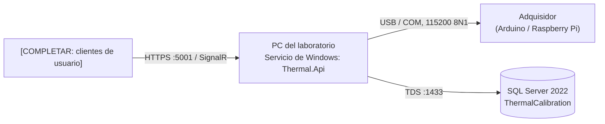

# Manual de despliegue e implementación

| Campo | Valor |
|---|---|
| Sistema | ThermalCalibration: monitoreo térmico para calibración de equipos de refrigeración (fase 1) |
| Versión del sistema | [COMPLETAR: versión liberada, p. ej. 1.0.0, y commit o etiqueta de git] |
| Versión del documento | [COMPLETAR] |
| Lectores | TI del laboratorio y equipo de despliegue |
| Estado | **Plantilla** |

## Índice

1. Introducción
2. Arquitectura de la solución
3. Requisitos de infraestructura
4. Preparación del entorno
5. Base de datos: scripts e instalación
6. Instalación de la aplicación (pasos secuenciales)
7. Configuración y variables de entorno
8. Verificación posterior al despliegue
9. Actualización a una nueva versión
10. Plan de rollback (contingencia)
11. Operación: respaldo, monitoreo y mantenimiento
12. Anexos

---

## 1. Introducción

**Contenido:** propósito del documento, alcance (qué se instala: Web API con la captura serial, base de datos SQL Server; qué no: cliente de usuario si se despliega aparte), entornos cubiertos (desarrollo con Docker Compose, pruebas, producción en la PC del laboratorio), glosario mínimo (adquisidor, puerto COM, sesión).
**Fuente:** [README](../../README.md), [01-vision-document.md §3](../specs/functional/01-vision-document.md#3-alcance). **Estado:** ✅

## 2. Arquitectura de la solución

### 2.1 Diagrama de arquitectura

**Contenido:** diagrama de despliegue: PC del laboratorio (servicio de Windows con la Web API y el `CaptureWorker`), adquisidor por USB/COM, SQL Server (local o en la LAN), clientes de usuario por HTTPS y SignalR. Indicar puertos y protocolos en cada flecha.
**Fuente:** [c4-containers.md](../architecture/c4-containers.md) (niveles 1 y 2). **Estado:** ✅ (falta el cliente de usuario)

### 2.2 Componentes y responsabilidades

**Contenido:** tabla con cada componente (Web API, `CaptureWorker`, base de datos, adquisidor, cliente), tecnología y versión, y qué ocurre si falla.
**Fuente:** [ADR-001](../architecture/adr/ADR-001-clean-architecture-cqrs-ddd.md), [c4-containers.md §3](../architecture/c4-containers.md#3-contenedores). **Estado:** ✅

### 2.3 Topologías soportadas

**Contenido:** (a) todo en una PC; (b) API en la PC y SQL Server en la LAN; (c) desarrollo o demostración con Docker Compose (sin captura serial). Ventajas y restricciones de cada una.
**Estado:** ✅ (a y c documentadas; b [COMPLETAR])

## 3. Requisitos de infraestructura

### 3.1 Hardware

**Contenido:** PC del laboratorio (CPU, RAM, disco, puerto USB libre, sin suspensión ni hibernación, supuesto S-05), servidor de base de datos si es aparte, dimensionamiento de disco según el volumen (unas 50 000 lecturas en una sesión de 7 días con 10 canales).
**Fuente:** [01 §8](../specs/functional/01-vision-document.md#8-supuestos), [c4-containers.md §3.2](../architecture/c4-containers.md#32-sql-server-2022). **Estado:** ⏳ [COMPLETAR: valores mínimos medidos]

### 3.2 Software

**Contenido:** Windows [COMPLETAR: versión], runtime de ASP.NET Core 10, SQL Server 2022 (Express es suficiente), controlador USB-serie del adquisidor, sincronización horaria NTP y zona America/Lima (S-04).
**Estado:** ⏳

### 3.3 Red y seguridad

**Contenido:** puertos (5001 HTTPS de la API, 1433 de SQL Server si está en la LAN), reglas de firewall, certificado TLS, cuentas de servicio y permisos mínimos (la cuenta de la aplicación con `DENY DELETE` sobre `Reading`, `Alert` y `CommunicationGap`, mejora M-07).
**Fuente:** [05-data-model.md §5](../specs/functional/05-data-model.md#5-observaciones-y-mejoras-propuestas-al-script). **Estado:** ⏳ (depende de la decisión de autenticación)

## 4. Preparación del entorno

**Contenido:** lista de verificación previa: runtime instalado, instancia de SQL Server accesible, puerto COM identificado, cuenta de servicio creada, certificado disponible, respaldo previo si es una actualización.
**Estado:** ⏳

## 5. Base de datos: scripts e instalación

### 5.1 Scripts disponibles

**Contenido:** tabla de scripts en orden de ejecución, con su propósito e idempotencia. Hoy: `docs/db/01-schema.sql` (crea la base, las tablas, las vistas y los datos iniciales). La estrategia es base primero, **sin migraciones de EF Core**: cada cambio posterior se entrega como script numerado (`02-…sql`).
**Fuente:** [01-schema.sql](../db/01-schema.sql), [05-data-model.md](../specs/functional/05-data-model.md). **Estado:** ✅ (script inicial) / ⏳ (scripts de cambio)

### 5.2 Instalación inicial

**Contenido:** comando exacto (`sqlcmd -S <servidor> -f 65001 -i 01-schema.sql`), permisos necesarios, verificación (tablas, vistas y datos iniciales de `AppSetting`, `ThermocoupleType` y `EquipmentType`).
**Estado:** ✅ (verificado en LocalDB y Docker)

### 5.3 Scripts de cambio (migraciones)

**Contenido:** convención de nombres y versionado, cómo aplicarlos, cómo registrar la versión aplicada [COMPLETAR: tabla de control de versiones del esquema, si se adopta] y su script de reversión asociado.
**Estado:** ⏳

### 5.4 Datos iniciales y parámetros

**Contenido:** valores de `AppSetting` que deben revisarse antes de producción (intervalo de muestreo **[PC-01]**, umbral de pérdida, descanso, duración máxima), límites por tipo de equipo (P-03).
**Estado:** ⏳

## 6. Instalación de la aplicación (pasos secuenciales)

**Contenido:** pasos numerados, cada uno con acción, comando y resultado esperado:

1. Obtener el paquete de la versión (`dotnet publish -c Release`) [COMPLETAR: ubicación del artefacto].
2. Copiar a la carpeta de instalación [COMPLETAR].
3. Configurar `appsettings.Production.json` o las variables de entorno (sección 7).
4. Registrar el servicio de Windows [COMPLETAR: `sc create` o instalador].
5. Iniciar el servicio y verificar (sección 8).

**Anexo de desarrollo:** instalación con Docker Compose (`docker compose up -d --build`), remitiendo al [README §1](../../README.md#1-inicio-rápido).
**Estado:** ⏳ (producción) / ✅ (desarrollo)

## 7. Configuración y variables de entorno

**Contenido:** tabla completa con variable, descripción, valor por defecto, si es obligatoria y si es secreta. Incluye como mínimo:

| Variable | Descripción | Obligatoria | Secreta |
|---|---|---|---|
| `ConnectionStrings__Thermal` | Cadena de conexión a `ThermalCalibration` | Sí | Sí |
| `ASPNETCORE_ENVIRONMENT` | `Production` (deshabilita el modo simulación, SIM-08) | Sí | No |
| `ASPNETCORE_URLS` / `ASPNETCORE_HTTPS_PORTS` | Direcciones y puertos de Kestrel | Sí | No |
| `Authentication__…` | Configuración del mecanismo de autenticación definitivo | Sí | Según el mecanismo |
| `TZ` o zona del sistema | America/Lima (S-04) | Sí | No |
| [COMPLETAR: puerto COM y parámetros de captura] | | | |

Indicar dónde se guardan los secretos en producción [COMPLETAR: p. ej. variables de entorno del servicio o un almacén seguro]; nunca en archivos del repositorio.
**Fuente:** [docker-compose.yml](../../docker-compose.yml), [appsettings.Development.json](../../src/Thermal.Api/appsettings.Development.json). **Estado:** ⏳

## 8. Verificación posterior al despliegue

**Contenido:** pruebas de humo en orden: el servicio responde, hay conexión con la base, la autenticación funciona, se detecta el adquisidor en el puerto, y una sesión simulada de prueba solo en entornos que no son de producción. Criterio de éxito de cada una.
**Fuente:** [tools/contract-check/](../../tools/contract-check/README.md) (entornos de prueba). **Estado:** ⏳

## 9. Actualización a una nueva versión

**Contenido:** procedimiento cuando hay sesiones en curso (esperar a su cierre o tratar el reinicio como una reconexión: si dura 30 min, la sesión falla, RN-15), orden de pasos (respaldo, scripts de base, aplicación, verificación) y ventana de mantenimiento recomendada.
**Estado:** ⏳

## 10. Plan de rollback (contingencia)

### 10.1 Criterios para activar el rollback

**Contenido:** condiciones objetivas (falla la verificación de la sección 8, errores en la captura, pérdida de datos) y quién decide.

### 10.2 Procedimiento de reversión de la aplicación

**Contenido:** detener el servicio, restaurar la versión anterior del binario y la configuración, reiniciar y verificar.

### 10.3 Procedimiento de reversión de la base de datos

**Contenido:** script de reversión por cada script de cambio, o restauración del respaldo previo. Advertencia: restaurar un respaldo pierde las lecturas capturadas después, que son evidencia de calibración (RN-13), por lo que se prefiere la reversión por script.

### 10.4 Sesiones en curso durante la contingencia

**Contenido:** qué pasa con una sesión `Running` (reanudación tras el reinicio, HU-10) y cómo documentarla.

### 10.5 Comunicación y registro

**Contenido:** a quién se avisa y qué se registra (fecha, versión, causa, acciones).
**Estado de la sección 10:** ⏳

## 11. Operación: respaldo, monitoreo y mantenimiento

**Contenido:** política de respaldo (completo diario y del log, c4 §3.2), retención [COMPLETAR], prueba de restauración, monitoreo del servicio y del espacio en disco, rotación de logs (remite al manual de administrador).
**Estado:** ⏳

## 12. Anexos

- A. Lista de verificación de despliegue (imprimible).
- B. Registro de despliegues (versión, fecha, responsable, resultado).
- C. Contactos de soporte y escalamiento [COMPLETAR].
- D. Referencias: README, ADR-001, C4, 01-schema.sql, contrato OpenAPI.
