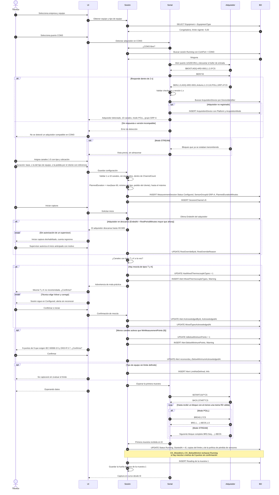

# Diagrama 1 · Configuración, detección del adquisidor, advertencia de mezcla e inicio al llegar datos

Diagrama de secuencia de la fase 1. Participantes y convenciones en [04-sequence-diagrams.md](../../specs/functional/04-sequence-diagrams.md).

Cubre HU-03, HU-04, HU-05, HU-16 (duración y descanso), HU-17 (menos de 9 puntos) y el inicio de HU-06.

