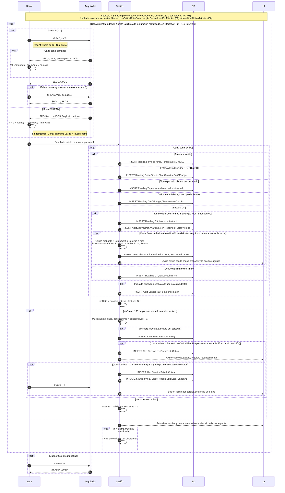

# Diagrama 2 · Ciclo de captura cada 2 minutos

Diagrama de secuencia de la fase 1. Participantes y convenciones en [04-sequence-diagrams.md](../../specs/functional/04-sequence-diagrams.md). Vista gráfica: [svg/02-ciclo-de-captura.svg](svg/02-ciclo-de-captura.svg) (se regenera con `node docs/diagrams/render-sequence-svg.mjs`).

Cubre HU-06, HU-07, HU-08 y HU-13. Validaciones V1–V10 de [02-serial-protocol.md §7](../../specs/functional/02-serial-protocol.md#7-validación-de-tramas-en-la-pc).

Ejemplos:

- Evaluación del límite con `MaxTemperatureC = -5,00`: una lectura de `-5,00` se inserta con `IsAboveLimit = 0`, y una de `-4,90` con `IsAboveLimit = 1`, más una alerta `AboveLimit`.
- Pérdida de sensores con 10 canales y umbral del 60 %: 6 canales sin dato (6 × 100 = 600, que no es mayor que 60 × 10 = 600) dejan la muestra válida. Con 7 canales sin dato (700 > 600) la muestra queda afectada.
- Escalamiento (TD-16, con el intervalo de 120 s): afectadas desde la muestra 20 → advertencia en la 20, crítica en la 22, sesión fallida en la 35 (30 min).
