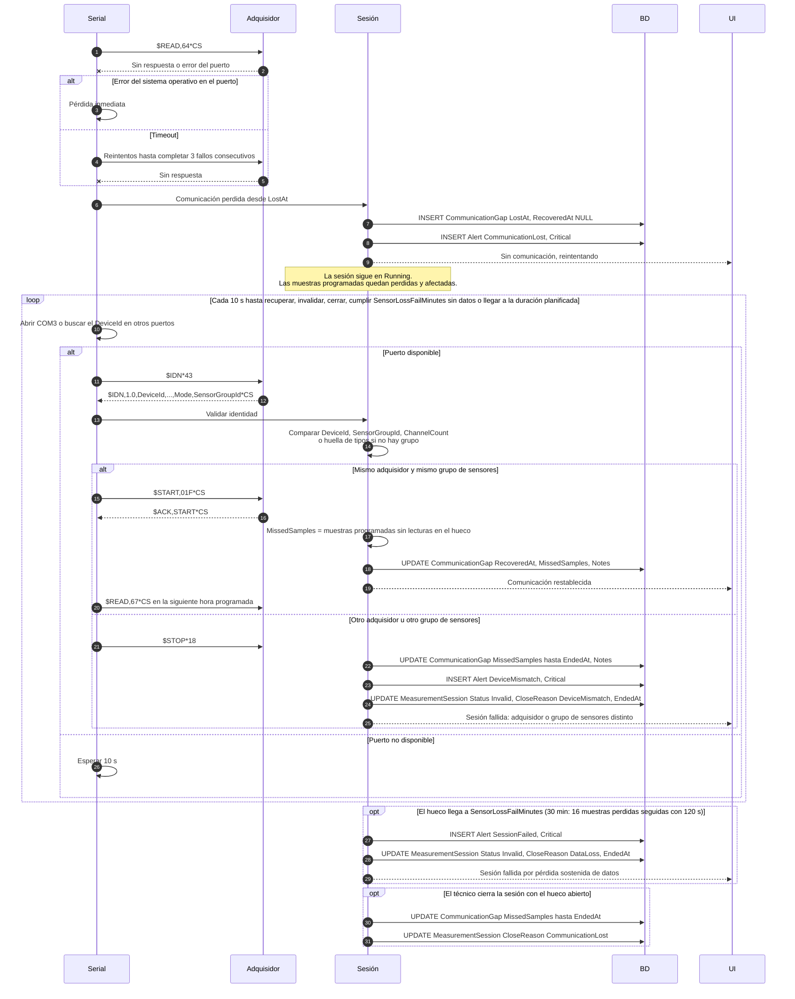

# Diagrama 3 · Pérdida y recuperación de la comunicación serial

Diagrama de secuencia de la fase 1. Participantes y convenciones en [04-sequence-diagrams.md](../../specs/functional/04-sequence-diagrams.md). Vista gráfica: [svg/03-perdida-de-comunicacion.svg](svg/03-perdida-de-comunicacion.svg) (se regenera con `node docs/diagrams/render-sequence-svg.mjs`).

Cubre HU-09. Ver [02-serial-protocol.md §9](../../specs/functional/02-serial-protocol.md#9-pérdida-y-recuperación-de-la-comunicación).

