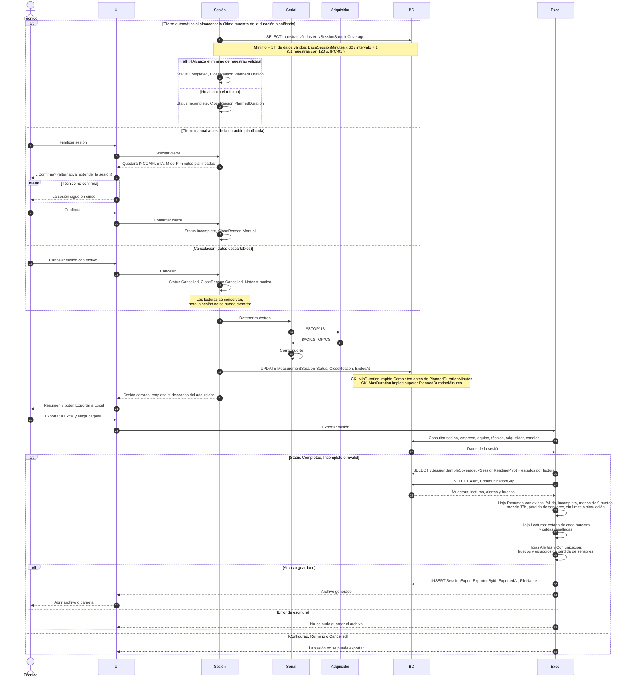

# Diagrama 4 · Cierre, cancelación y exportación a Excel

Diagrama de secuencia de la fase 1. Participantes y convenciones en [04-sequence-diagrams.md](../../specs/functional/04-sequence-diagrams.md). Vista gráfica: [svg/04-cierre-y-exportacion.svg](svg/04-cierre-y-exportacion.svg) (se regenera con `node docs/diagrams/render-sequence-svg.mjs`).

Cubre HU-10 (cierre automático, manual y cancelación) y HU-11.

