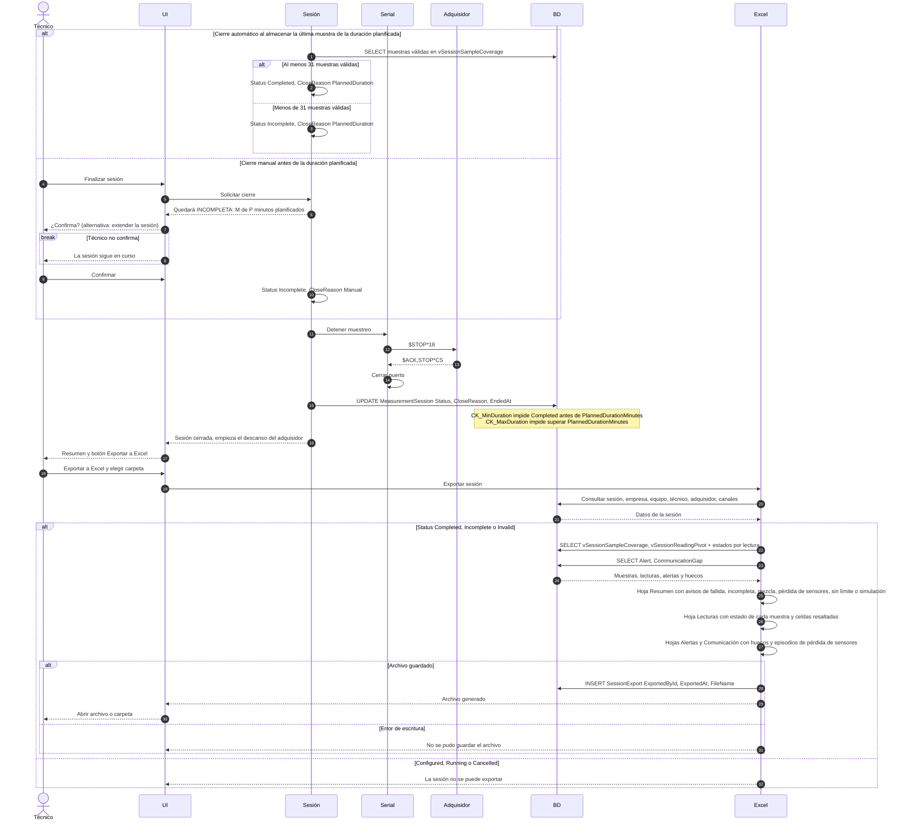

# Diagrama 4 · Cierre de sesión y exportación a Excel

Diagrama de secuencia de la fase 1. Participantes y convenciones en [04-sequence-diagrams.md](../../specs/functional/04-sequence-diagrams.md).

Cubre HU-10 y HU-11.

