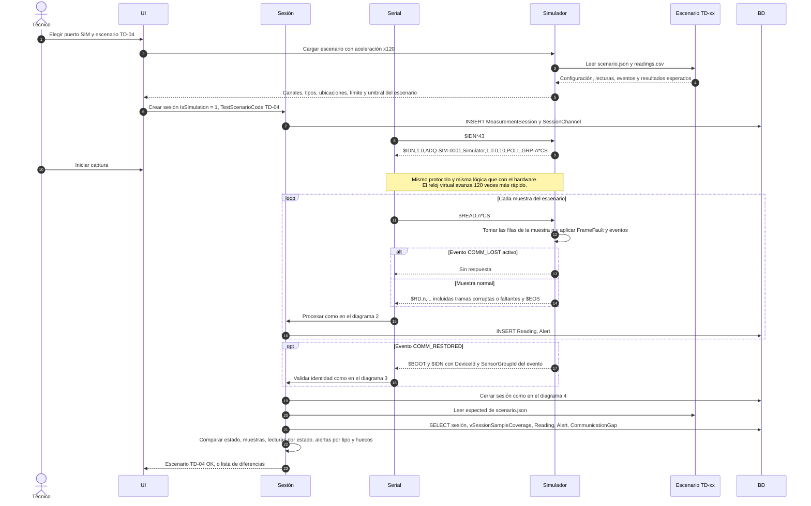

# Diagrama 5 · Sesión simulada con el set de datos de prueba

Diagrama de secuencia de la fase 1. Participantes y convenciones en [04-sequence-diagrams.md](../../specs/functional/04-sequence-diagrams.md).

Cubre HU-14. Ver [06-test-data.md](../../specs/functional/06-test-data.md).

