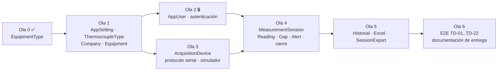

# Plan de implementación del backend

Orden, dependencias y definición de terminado para implementar las entidades que faltan, siguiendo el patrón que ya se aplicó a `EquipmentType` (HU-02).

| Campo | Valor |
|---|---|
| Versión | 0.1 |
| Fecha | 2026-09-25 |
| Estado actual | Ola 0 terminada: `EquipmentType` (HU-02 parcial). 59 pruebas correctas, contrato verificado 24/24 |
| Relacionado | [validation.md](validation.md) (cobertura y auditorías), [ADR-001](architecture/adr/ADR-001-clean-architecture-cqrs-ddd.md), [c4-containers.md §3.1](architecture/c4-containers.md#31-web-api-net-10) (endpoints previstos), [domain-model.md](architecture/domain-model.md), [01-schema.sql](db/01-schema.sql) |

---

## 1. Estado por entidad

| Ola | Entidad (tabla) | Historias | Estado |
|---|---|---|---|
| 0 | `EquipmentType` | HU-02 | ✅ Implementada (7/13 escenarios completos; el resto depende de olas siguientes) |
| 1 | `AppSetting` | HU-02 (parámetros), HU-16 | ⏳ Siguiente |
| 1 | `ThermocoupleType` (catálogo fijo T/K) | HU-07 (rango físico) | ⏳ |
| 1 | `Company`, `Equipment` | HU-01, HU-02 (desactivar con equipos) | ⏳ |
| 2 | `AppUser` y autenticación | Todas (técnico responsable, roles) | 🔒 Bloqueada por la decisión de autenticación |
| 3 | `AcquisitionDevice`, protocolo serial, simulador | HU-03, HU-09, HU-14 | ⏳ |
| 4 | `MeasurementSession` + `SessionChannel` (configurar e iniciar) | HU-03, HU-04, HU-05, HU-16, HU-17 | ⏳ |
| 4 | `Reading`, `CommunicationGap`, `Alert` (captura) | HU-06, HU-07, HU-08, HU-09, HU-13, HU-15 | ⏳ |
| 4 | Cierre y reanudación | HU-10 | ⏳ |
| 5 | Consultas, `SessionExport` y Excel | HU-11, HU-12 | ⏳ |
| 6 | Pruebas de extremo a extremo con TD-01 a TD-22, documentación de entrega | HU-14 y todas | ⏳ |

Mantener esta tabla al día al terminar cada entidad (y la §5 de [validation.md](validation.md)).

## 2. Olas y dependencias



### Ola 1 · Catálogos y configuración

| Entidad | Endpoints (prefijo `/api/v1`) | Reglas clave | Pruebas de referencia | Notas |
|---|---|---|---|---|
| `AppSetting` | `GET /settings`, `PUT /settings` (Admin) | Umbral de pérdida > 0 y < 100 (HU-02); escalamiento 2 a 10 muestras; falla 10 a 240 min; descanso; duración base y máxima; `SamplingIntervalSeconds` **[PC-01]**. Se **copian** en la sesión al iniciarla (RN-08) | Escenarios "Cambiar el umbral…" y "Rechazar un umbral fuera de rango" de HU-02 | Tabla clave-valor: el agregado debe exponer valores tipados (p. ej. `SensorLossPolicy`), no cadenas |
| `ThermocoupleType` | `GET /thermocouple-types` (solo lectura) | Rango físico por tipo (T: -200 a 350 °C; K: -200 a 1260 °C), usado en la validación V10 | HU-07 "Valor fuera del rango físico" | Catálogo sembrado por el script; sin edición en la fase 1 |
| `Company` | `POST /companies`, `GET /companies/{id}`, `GET /companies?taxId&name` | RUC único, 11 dígitos, prefijo 10/15/17/20 y dígito verificador módulo 11 (HU-01) | 7 escenarios de HU-01 | Mejora M-08 de 05: `CHECK` del RUC en la base |
| `Equipment` | `POST /companies/{id}/equipment`, `GET /equipment/{id}` | Serie única por empresa; tipo obligatorio y **activo**; campos obligatorios | HU-01 (equipo) y HU-02 "Desactivar un tipo con equipos asociados" | Al existir `Equipment`, completar la regla de HU-02: no se borra un tipo con equipos |

### Ola 2 · Identidad (bloqueada)

- **Decisión pendiente:** cuentas propias con JWT o Windows/AD ([c4-containers.md §3.1](architecture/c4-containers.md#31-web-api-net-10)). Hasta decidir, el JWT de desarrollo (`dotnet user-jwts`) cubre roles.
- Lo que se puede avanzar sin la decisión: el agregado `AppUser` (rol ∈ `Admin`/`Technician`/`Supervisor`, correo único) y un puerto `ICurrentUser` en la aplicación, que la API resuelva desde el token. Las sesiones necesitan el técnico responsable (`TechnicianId`).

### Ola 3 · Adquisición

- `AcquisitionDevice` (identidad por `IDN`, 1 a 10 canales, `DeviceId` único) y `DeviceIdentity` como value object ([domain-model.md](architecture/domain-model.md)).
- Parser del protocolo v1.0 (V1–V6 en infraestructura) contra `transcript.log` de los 22 escenarios; `ISerialTransport` con `SerialTransport` y `SimulatedTransport` (SIM-01 a SIM-09 de [06 §3](specs/functional/06-test-data.md#3-adquisidor-simulado)).
- `TimeProvider` como reloj inyectable (reloj virtual acelerable en simulación, SIM-06).

### Ola 4 · Sesión de medición (núcleo del dominio)

- Es el agregado con más reglas: seguir estrictamente [domain-model.md §2–§5](architecture/domain-model.md) (métodos por transición, estado resumido, sin cargar todas las lecturas).
- Eventos de dominio → `Alert` en la misma transacción (§4 del modelo de dominio).
- **[PC-01]:** ningún literal `120` ni `31`; todo se deriva de `SamplingIntervalSeconds` copiado en la sesión. Una prueba ejecuta las reglas con 60 s y con 120 s (ADR-001 §5).
- Oráculo: `expected` de cada `scenario.json` en [test-data/scenarios/](../test-data/scenarios/) es el caso de prueba de las reglas (pruebas unitarias del agregado con `readings.csv`).
- `CaptureWorker` como `BackgroundService`; SignalR `MonitorHub` (`CriticalAlertRaised` solo para alertas `Critical`).

### Ola 5 · Consultas y exportación

- Historial y detalle (HU-12) sobre las vistas `vSessionSampleCoverage` y `vSessionReadingPivot`, sin pasar por el agregado.
- Excel con ClosedXML (u otra librería OpenXML con licencia libre: **verificar la licencia antes de añadirla**), con el formato de [03 §Formato del Excel](specs/functional/03-user-stories.md#formato-del-excel-exportado); `SessionExport` como bitácora.

### Ola 6 · Cierre

- Pruebas de integración de extremo a extremo: API + `SimulatedTransport` con los 22 escenarios; el validador SIM-09 debe informar "OK" en todos.
- Completar la [documentación de entrega](delivery/README.md).

## 3. Preguntas abiertas que afectan a cada ola

| Pregunta | Afecta a | Propuesta provisional (usar mientras no se decida) |
|---|---|---|
| Autenticación definitiva | Ola 2 | JWT de desarrollo |
| P-03 Límites de refrigeradora, conservadora e incubadora | Datos iniciales | Pendientes (NULL) |
| P-06 ¿Exportar sesiones canceladas? | Ola 5 | No |
| P-07 `SensorFault`/`TypeMismatch` por lectura o por episodio | Ola 4 | Por episodio |
| P-12 Duración mínima por tipo de equipo | Ola 1, datos | 60 min para todos |
| P-14 `TypeMismatch` cuenta como sin dato válido | Ola 4 | Sí |

Detalle en [01 §11](specs/functional/01-vision-document.md#11-preguntas-abiertas).

## 4. Definición de terminado (por entidad)

Una entidad está terminada cuando cumple **todo** lo siguiente, en este orden:

1. **Contrato primero.** Rutas, schemas (en inglés), ejemplos y respuestas de error en [thermal-v1.yaml](api/thermal-v1.yaml). `npx @redocly/cli lint docs/api/thermal-v1.yaml` sin errores ni advertencias.
2. **Dominio.** Agregado con constructor primario, setters privados y validación en el setter (`field`), métodos con nombre del negocio, `DomainValidationException(nameof(Propiedad), "mensaje de la historia")`.
3. **Aplicación.** `Command`/`Query` (records públicos) con handler `internal sealed` al lado; puertos (`IXxxRepository`, `IXxxReadStore`) en la aplicación. Se registran solos (`AddApplication`).
4. **Infraestructura.** Mapeo EF Core **a la tabla existente** (base primero, sin migraciones). Si hace falta cambiar el esquema: [01-schema.sql](db/01-schema.sql) + [05-data-model.md](specs/functional/05-data-model.md) y verificar el script en SQL Server.
5. **API.** Controlador `[ApiController]` en `api/v1/<plural-kebab>`, `[Authorize(Roles = …)]`, `ETag`/`If-Match` en recursos editables, errores RFC 7807.
6. **Pruebas.** Unitarias (dominio y handlers con NSubstitute) e integración (Testcontainers), con `[Trait("Story", "HU-xx")]` y el comentario `// HU-xx · Scenario: …`. Un escenario Gherkin sin prueba se marca como pendiente en validation.md, nunca se omite en silencio.
7. **Verificación.** `dotnet build` sin advertencias, `dotnet format --verify-no-changes`, `dotnet test --solution Thermal.slnx` todo en verde, y auditoría del contrato contra la API en Docker ([tools/contract-check/](../tools/contract-check/README.md)).
8. **Documentación.** [validation.md](validation.md) (cobertura por escenario y auditoría), tabla de endpoints y cURL del [README](../README.md), [c4-containers.md](architecture/c4-containers.md), "Implementado" en [domain-model.md](architecture/domain-model.md), solicitudes en `Thermal.Api.http`, la §1 de este plan y las secciones afectadas de la [documentación de entrega](delivery/README.md).
9. **Commit y push** con el resumen de la entidad.

## 5. Guía paso a paso (patrón de `EquipmentType`)

| Paso | Archivo de referencia (copiar la forma, no el contenido) |
|---|---|
| Agregado y value objects | [EquipmentType.cs](../src/Thermal.Domain/EquipmentTypes/EquipmentType.cs), [TemperatureLimit.cs](../src/Thermal.Domain/EquipmentTypes/TemperatureLimit.cs) |
| Comando + handler | [CreateEquipmentTypeCommand.cs](../src/Thermal.Application/EquipmentTypes/Create/CreateEquipmentTypeCommand.cs), [UpdateEquipmentTypeCommand.cs](../src/Thermal.Application/EquipmentTypes/Update/UpdateEquipmentTypeCommand.cs) |
| Consulta + handler | [GetEquipmentTypeByIdQuery.cs](../src/Thermal.Application/EquipmentTypes/GetById/GetEquipmentTypeByIdQuery.cs) |
| Puertos y DTO | [IEquipmentTypeRepository.cs](../src/Thermal.Application/EquipmentTypes/IEquipmentTypeRepository.cs), [EquipmentTypeDto.cs](../src/Thermal.Application/EquipmentTypes/EquipmentTypeDto.cs) |
| Mapeo EF Core | [EquipmentTypeConfiguration.cs](../src/Thermal.Infrastructure/Persistence/Configurations/EquipmentTypeConfiguration.cs) |
| Repositorio y lecturas | [EquipmentTypeRepository.cs](../src/Thermal.Infrastructure/Persistence/EquipmentTypeRepository.cs) (registrar en [DependencyInjection.cs](../src/Thermal.Infrastructure/DependencyInjection.cs)) |
| Controlador y contratos HTTP | [EquipmentTypesController.cs](../src/Thermal.Api/EquipmentTypes/EquipmentTypesController.cs), [EquipmentTypeContracts.cs](../src/Thermal.Api/EquipmentTypes/EquipmentTypeContracts.cs) |
| Pruebas unitarias | [EquipmentTypeTests.cs](../tests/Thermal.UnitTests/Domain/EquipmentTypeTests.cs), [EquipmentTypeHandlersTests.cs](../tests/Thermal.UnitTests/Application/EquipmentTypeHandlersTests.cs) |
| Pruebas de integración | [EquipmentTypePersistenceTests.cs](../tests/Thermal.IntegrationTests/EquipmentTypePersistenceTests.cs) (base compartida: nombres únicos por prueba) |

Comandos del ciclo:

```bash
dotnet build Thermal.slnx
dotnet format Thermal.slnx --verify-no-changes --severity info
docker compose stop                                   # antes de Testcontainers: un solo SQL Server en memoria
dotnet test --solution Thermal.slnx
npx @redocly/cli lint docs/api/thermal-v1.yaml
node docs/diagrams/generate-features.mjs              # si cambió 03 o 06
```

## 6. Lecciones aprendidas (evitar repetirlas)

| Tema | Qué pasó | Regla |
|---|---|---|
| Licencias | MediatR (v13+) y FluentAssertions (v8+) pasaron a licencia comercial | CQRS con interfaces propias; FluentAssertions fijado en 7.2.2. Revisar la licencia de **toda** dependencia nueva |
| Tokens de desarrollo | `dotnet user-jwts create --audience X` reescribe `appsettings.Development.json` con solo `X` | Crear siempre con las tres audiencias (5001, 5000 y 8080), como indica el README |
| Pruebas en .NET 10 | xUnit v3 usa Microsoft Testing Platform; el SDK exige activarlo en `global.json` | `dotnet test --project …` / `--solution …`; filtrar con `-- --filter-trait "Story=HU-xx"` |
| Fechas | SQL Server **redondea** `DATETIMEOFFSET(0)`; truncar dejaba `UpdatedAt` antes que `CreatedAt`. En Docker la hora salía en UTC | Usar `ThermalDbContext.RoundToSecond`; `TZ: America/Lima` en el compose |
| Decimales | `DECIMAL(6,2)` redondea un tercer decimal sin error | Las reglas de formato numérico se validan en el dominio |
| EF Core, base primero | EF materializa con el constructor primario si sus parámetros coinciden con propiedades mapeadas; un `bool` con `HasDefaultValue` no se puede insertar como `false` | Mismos nombres en parámetros y propiedades; no configurar valores por defecto de EF para `bool` |
| Errores de validación | El dominio usaba nombres JSON (`"maxTemperatureC"`) | El dominio usa `nameof(Propiedad)`; la API convierte a camelCase |
| Persistencia en la aplicación | Comparar `RowVersion` en el handler obligaba a usar reflexión en las pruebas | La versión la comprueba el repositorio (`EnsureVersion`) |
| Formato | `dotnet format` mezclaba CRLF y LF | [.editorconfig](../.editorconfig) con LF y UTF-8 |
| Git Bash en Windows | Convierte rutas `/opt/...` en `docker exec`; cuerpos con "°" se envían en otra codificación | `MSYS_NO_PATHCONV=1`; enviar JSON con `--data-binary @archivo` en UTF-8 |
| Docker | Memoria limitada en la PC; SQL Server no atiende SIGTERM | SQL Server a 2 GB y API a 256 MB; detener el compose antes de Testcontainers; cierre ordenado con `SHUTDOWN`; no borrar los contenedores del compose salvo que den problemas |
