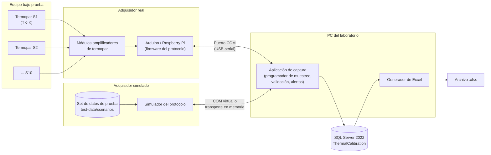

# 01 · Documento de visión

**Sistema de Monitoreo Térmico para Calibración de Equipos de Refrigeración**
Fase 1: Sesión de Medición, Adquisición Serial y Exportación a Excel

| Campo | Valor |
|---|---|
| Versión | 0.2 (borrador para revisión) |
| Fecha | 2026-09-25 |
| Cambios en 0.2 | Resueltas las preguntas P-01 (muestra en t = 0, inicio al llegar datos), P-02 (umbral de pérdida de sensores) y P-05 (otro adquisidor o grupo de sensores invalida la sesión). Se añaden el simulador de adquisidor, el set de datos de prueba y la base normativa. |
| Documentos relacionados | [02-serial-protocol.md](02-serial-protocol.md), [03-user-stories.md](03-user-stories.md), [04-sequence-diagrams.md](04-sequence-diagrams.md), [05-data-model.md](05-data-model.md), [06-test-data.md](06-test-data.md), [../../db/01-schema.sql](../../db/01-schema.sql), [normas técnicas](../../standards/README.md) |

---

## 1. Problema

El laboratorio calibra y verifica equipos de refrigeración (refrigeradoras, congeladoras, conservadoras, incubadoras) de diferentes empresas cliente. Para ello instrumenta cada equipo con varios termopares y registra la temperatura durante un periodo de entre 1 y 24 horas.

Hoy ese registro presenta los siguientes problemas:

- **Captura poco confiable.** Las lecturas se anotan o se copian a mano, o dependen de software propietario del registrador. No se puede demostrar qué valor entregó realmente el sensor en cada instante.
- **Sin trazabilidad.** No queda constancia estructurada de qué equipo, qué técnico, qué adquisidor y qué termopares (tipo y ubicación) se usaron en cada sesión, ni de las interrupciones de comunicación.
- **Límites aplicados de forma inconsistente.** Cada tipo de equipo tiene una temperatura máxima admisible. Algunos límites aún no están definidos, y cuando un límite cambia no queda claro cuál se aplicó en una medición anterior.
- **Malas prácticas no detectadas.** A veces se mezclan termopares tipo T y tipo K en un mismo equipo sin dejar constancia.
- **Entrega manual del reporte.** El Excel entregado al cliente o al revisor se arma a mano, con riesgo de errores de transcripción.
- **Hardware no disponible todavía.** El adquisidor está en diseño y quizá no haya sensores al comienzo del desarrollo. Hace falta poder probar el software de punta a punta sin ellos.

## 2. Objetivos de la fase 1

| # | Objetivo | Indicador de éxito |
|---|---|---|
| O1 | Capturar automáticamente, por puerto serial, una lectura por canal cada 2 minutos, con hasta 10 canales. | ≥ 99 % de las muestras programadas quedan almacenadas cuando no hay pérdida física de comunicación. |
| O2 | Almacenar los datos crudos de forma íntegra y auditable. | Cada lectura guarda la marca de tiempo, el valor, el estado del sensor y la trama serial original. |
| O3 | Evaluar cada lectura contra el límite máximo del tipo de equipo, congelado al iniciar la sesión. | El 100 % de las lecturas estrictamente mayores que el límite generan una alerta. |
| O4 | Dejar constancia de las anomalías: mezcla de tipos T/K, tipo reportado distinto del declarado, fallas de sensor, pérdida de sensores sobre el umbral, huecos de comunicación y cambio de adquisidor o de grupo de sensores. | Cada anomalía queda registrada como alerta o como hueco de comunicación, y aparece en el Excel. |
| O5 | Exportar cada sesión a un archivo Excel (.xlsx) estandarizado. | Se genera el archivo sin intervención manual, con las hojas Resumen, Lecturas, Alertas y Comunicación. |
| O6 | Mantener el historial de sesiones por empresa y equipo. | Se pueden consultar las sesiones filtrando por empresa, equipo y rango de fechas. |
| O7 | Probar el sistema completo sin hardware, con un adquisidor simulado y un set de datos de prueba reproducible. | Los 15 escenarios de [06-test-data.md](06-test-data.md) producen exactamente los resultados esperados (estado, muestras válidas y afectadas, alertas, huecos). |

## 3. Alcance

### 3.1 Dentro del alcance (fase 1)

Módulos especificados en este paquete:

1. **Sesión de Medición.** Registro de empresas cliente, equipos y tipos de equipo con su límite máximo. Configuración de la sesión (equipo, técnico, puerto COM, adquisidor, canales con su tipo de termopar y su ubicación). Advertencias de mezcla T/K y de límite no definido. Ciclo de vida de la sesión (configurada → en curso → completa/incompleta/no válida/cancelada), con duración mínima de 1 h y máxima de 24 h. Evaluación de la pérdida de sensores por muestra. Alertas. Historial.
2. **Adquisición Serial.** Protocolo de mensajes PC ↔ adquisidor, independiente del hardware, con dos modos (la PC pide cada muestra, o el adquisidor transmite por su cuenta). Detección e identificación del adquisidor y del grupo de sensores, inicio de la sesión al llegar la primera muestra, muestreo cada 2 minutos, validación de tramas, verificación del tipo de termopar, detección de pérdida de comunicación, reconexión y registro de huecos.
3. **Exportación a Excel.** Generación del .xlsx con cuatro hojas (Resumen, Lecturas, Alertas y Comunicación) y registro de cada exportación.
4. **Simulación y datos de prueba.** Adquisidor simulado que implementa el mismo protocolo, más un set de 15 escenarios de datos de prueba con sus resultados esperados, para probar el sistema sin sensores ([06-test-data.md](06-test-data.md)).

Datos crudos solamente: el sistema **no** calcula estadísticas en esta fase. Sí presenta conteos simples (muestras programadas, válidas y afectadas, número de alertas) porque son necesarios para juzgar la integridad de la captura.

### 3.2 Fuera del alcance (fases futuras)

| Fase futura | Contenido |
|---|---|
| Análisis estadístico | Promedios, desviación estándar, estabilidad y uniformidad entre zonas, detección de outliers, incertidumbre, certificados de calibración. |
| Inventario de sensores | Registro individual de termopares y grupos de sensores, disponibilidad (en uso/libre), asignación por urgencia y trazabilidad de la calibración de cada sensor. En la fase 1 el técnico declara a mano el tipo y la ubicación de cada canal, y el grupo de sensores solo se usa como identificador que informa el adquisidor (`SensorGroupId`). |
| Otros | Monitoreo remoto o web, notificaciones por correo o mensajería, firma digital de reportes, integración con ERP o facturación. |

## 4. Perfiles de usuario

| Perfil (rol en BD) | Descripción | Permisos principales en la fase 1 |
|---|---|---|
| **Administrador** (`Admin`) | Responsable del sistema y de los catálogos. | Gestiona usuarios, tipos de equipo y sus límites máximos, el umbral de pérdida de sensores, el catálogo de adquisidores, empresas y equipos. Todo lo que puede hacer un supervisor. |
| **Técnico de calibración** (`Technician`) | Instala los termopares y opera la captura. | Registra empresas y equipos. Configura, inicia, cierra y cancela sus sesiones. Confirma advertencias (mezcla T/K, límite no definido). Ejecuta sesiones simuladas. Exporta y consulta el historial. |
| **Supervisor/revisor** (`Supervisor`) | Revisa la calidad de las mediciones antes de entregarlas. | Consulta el historial y las sesiones de todos los técnicos, exporta a Excel, reconoce (acusa recibo de) alertas y agrega notas. No modifica lecturas. |

Regla transversal: **nadie puede editar ni borrar lecturas, alertas ni huecos** una vez registrados. Son evidencia.

## 5. Arquitectura conceptual

| Componente | Responsabilidad |
|---|---|
| Termopares T/K | Transducen la temperatura en cada zona del equipo (superior, centro, inferior, puerta, fondo, etc.). |
| Adquisidor | Convierte la señal (compensación de unión fría y linealización en el módulo amplificador), diagnostica el sensor (abierto, cortocircuito, fuera de rango) e implementa el protocolo. Informa su identificador y el del grupo de sensores conectado. **No** necesita reloj de tiempo real: la PC marca el tiempo. |
| Adquisidor simulado | Implementa el mismo protocolo que el firmware, pero reproduce un escenario del set de datos de prueba, con reloj acelerado. Se conecta por un par de puertos COM virtuales o por un transporte en memoria. Ver [06-test-data.md](06-test-data.md). |
| Puerto COM | Enlace serial, normalmente USB-CDC. El protocolo está definido en [02-serial-protocol.md](02-serial-protocol.md). |
| Aplicación de captura | Inicia la sesión con la primera muestra recibida, programa o recibe una muestra cada 120 s, valida tramas y tipos, evalúa el límite y la pérdida de sensores, genera alertas, detecta y registra huecos, gestiona el ciclo de vida de la sesión. |
| SQL Server 2022 | Persistencia. Aplica las reglas de integridad críticas mediante restricciones `CHECK` y la vista de cobertura por muestra (ver [05-data-model.md](05-data-model.md)). |
| Generador de Excel | Construye el .xlsx a partir de la base de datos (no desde memoria) y registra la exportación. |

Decisiones clave:

- **La PC marca el tiempo.** Es la aplicación la que asigna el número de muestra y la marca de tiempo. Así el sistema funciona con adquisidores sin reloj (Arduino). En el modo `Poll` la PC además pide cada muestra. En el modo `Stream` el adquisidor transmite solo y la PC asigna cada bloque recibido a su muestra según el tiempo transcurrido.
- **La sesión empieza cuando llegan datos.** El adquisidor puede estar midiendo y transmitiendo antes de conectarse a la PC. Lo que se reciba antes de que el técnico pulse "Iniciar captura" se descarta (solo sirve de vista previa). `StartedAt` es el instante de la **primera muestra válida recibida** después de pulsar "Iniciar": esa es la muestra 1, en t = 0.
- **Los datos simulados nunca se confunden con los reales.** Las sesiones simuladas quedan marcadas (`IsSimulation`), usan un adquisidor de plataforma `Simulator` y llevan un aviso en pantalla y en el Excel.

## 6. Reglas de negocio principales

| Id | Regla |
|---|---|
| RN-01 | Una sesión tiene de 1 a 10 canales activos, numerados del 1 al 10, cada uno con su tipo de termopar (T o K) y su ubicación. |
| RN-02 | Frecuencia fija: una lectura por canal cada 120 s. La muestra 1 es la primera recibida después de "Iniciar" (t = 0 = `StartedAt`), y la muestra *n* corresponde a `StartedAt + (n − 1) × 120 s`. |
| RN-03 | Una sesión solo queda **completa** si dura al menos 1 h **y** tiene al menos **31 muestras válidas** (30 intervalos de 2 min más la muestra inicial). Si no, queda **incompleta**. |
| RN-04 | Duración máxima: 24 h. Al tomar la muestra 721 (t = 24 h) la sesión se cierra automáticamente. |
| RN-05 | Se permite mezclar T y K, pero el sistema muestra una advertencia de mala práctica, registra la alerta `MixedThermocoupleTypes` y exige la confirmación del técnico antes de iniciar. La mezcla queda marcada en la sesión y en el Excel. |
| RN-06 | Límite máximo por tipo de equipo, configurable, que admite quedar *pendiente* (NULL). |
| RN-07 | Una lectura está fuera de límite si `TemperatureC > MaxTemperatureC` (estrictamente mayor). Con un límite de -5,0 °C: -5,0 cumple y -4,9 está fuera de límite. |
| RN-08 | Al iniciar la sesión se copian el límite vigente (`MaxTemperatureC`) y el umbral de pérdida de sensores vigente (`SensorLossThresholdPct`). Editarlos después no altera las sesiones ya registradas. |
| RN-09 | Si el tipo de equipo no tiene límite definido, se advierte, se registra la alerta `LimitNotDefined` y se captura igual, sin evaluar el límite. |
| RN-10 | Una lectura fuera de límite **no invalida** la sesión: genera una alerta `AboveLimit` asociada al canal, a la lectura y a la marca de tiempo. |
| RN-11 | Las lecturas inválidas (sensor abierto, cortocircuito, fuera de rango, trama corrupta, tipo no coincidente) se almacenan marcadas y **no detienen** la sesión. |
| RN-12 | La pérdida de comunicación no detiene la sesión: se registra un hueco, se reintenta la conexión y las muestras no recibidas quedan contabilizadas. |
| RN-13 | Las lecturas, alertas y huecos son inmutables. Las alertas solo admiten el reconocimiento (quién y cuándo). |
| RN-14 | **Pérdida de sensores.** Una muestra está **afectada** si el porcentaje de canales activos sin lectura válida (`SensorStatus` ≠ `OK`, o sin lectura) es **estrictamente mayor que el umbral** (60 % por defecto). Las muestras afectadas no cuentan como muestras válidas. Las muestras perdidas por un hueco de comunicación también están afectadas (el 100 % de los canales queda sin datos). Si la proporción es igual o menor que el umbral, las fallas individuales solo generan alertas de sensor y la muestra sigue siendo válida. Cada episodio de muestras afectadas con datos genera una alerta `SensorLoss`. |
| RN-15 | **Cambio de adquisidor o de grupo de sensores.** Si al reconectar responde un adquisidor con otro `DeviceId`, o con otro `SensorGroupId`, la sesión se cierra como **no válida** (`Invalid`, motivo `DeviceMismatch`) y se registra una alerta `DeviceMismatch`. Una sesión no válida conserva sus datos como evidencia, pero no puede presentarse como calibración. |
| RN-16 | **Sesiones simuladas.** Una sesión que use el adquisidor simulado se marca como simulación, se asocia a un escenario del set de pruebas y se excluye del historial por defecto. Su Excel lleva el aviso "DATOS SIMULADOS – NO VÁLIDOS PARA CALIBRACIÓN". |

### 6.1 Umbral de muestras afectadas según el número de canales

Con el umbral por defecto del 60 % (hay que **superarlo**, no basta con alcanzarlo):

| Canales activos | Canales sin dato válido que hacen **afectada** la muestra |
|---|---|
| 1 | 1 |
| 2 | 2 |
| 3 | 2 o más |
| 4 | 3 o más |
| 5 | 4 o más |
| 6 | 4 o más |
| 7 | 5 o más |
| 8 | 5 o más |
| 9 | 6 o más |
| 10 | 7 o más (6 de 10 = 60 % **no** afecta) |

## 7. Glosario

| Término | Definición |
|---|---|
| **Sesión (de medición)** | Periodo continuo de captura sobre un único equipo, con configuración fija de canales, técnico responsable, puerto COM, adquisidor, límite congelado y umbral de pérdida de sensores congelado. Entidad `MeasurementSession`. |
| **Muestra** | Ciclo de muestreo identificado por un número correlativo (1…721) y un instante `StartedAt + (n − 1) × 120 s`. Agrupa la lectura de todos los canales activos. Equivale a una fila de la hoja "Lecturas". |
| **Muestra válida** | Muestra no afectada por pérdida de sensores (RN-14). Solo las muestras válidas cuentan para la duración mínima de datos (RN-03). |
| **Muestra afectada** | Muestra en la que el porcentaje de canales sin lectura válida supera el umbral de pérdida de sensores, o que se perdió por un hueco de comunicación. |
| **Umbral de pérdida de sensores** | Porcentaje configurable (60 % por defecto) que determina si una muestra está afectada. Se copia en la sesión al iniciarla. Ver §9. |
| **Lectura** | Valor obtenido de **un** canal en **una** muestra: temperatura en °C (o nula si es inválida), estado del sensor, tipo reportado y trama original. Entidad `Reading`. |
| **Canal** | Entrada física numerada (1…10) del adquisidor, a la que se conecta un termopar. En la sesión, cada canal activo tiene un tipo declarado y una ubicación. Entidad `SessionChannel`. En el Excel se rotula S1…S10. |
| **Termopar tipo T** | Termopar cobre–constantán. Rango físico según el catálogo: -200 a 350 °C. Recomendado para bajas temperaturas por su mejor exactitud en ese rango. |
| **Termopar tipo K** | Termopar cromel–alumel. Rango físico según el catálogo: -200 a 1260 °C. De uso general. |
| **Límite máximo** | Temperatura máxima admisible para un tipo de equipo. Una lectura mayor es una lectura fuera de límite. Puede estar *pendiente* (sin definir). |
| **Límite aplicado** | Copia del límite máximo que se toma al iniciar la sesión y que se usa durante toda ella. |
| **Alerta** | Evento registrado que requiere atención: `AboveLimit`, `MixedThermocoupleTypes`, `TypeMismatch`, `SensorFault`, `SensorLoss`, `CommunicationLost`, `DeviceMismatch` o `LimitNotDefined`. Puede reconocerse, pero no borrarse. |
| **Mezcla de termopares** | Situación en la que los canales activos de una sesión no son todos del mismo tipo (T y K a la vez). Se permite con advertencia y confirmación. |
| **Tipo no coincidente** | El tipo de termopar que el adquisidor informa para un canal difiere del tipo declarado por el técnico para ese canal. |
| **Adquisidor** | Dispositivo de bajo costo (Arduino, Raspberry Pi u otro) con módulos amplificadores de termopar que implementa el protocolo serial. Entidad `AcquisitionDevice`. |
| **Grupo de sensores** | Conjunto físico de termopares (arnés o placa de conexión) conectado al adquisidor. Se identifica por el `SensorGroupId` que el adquisidor informa en `IDN`. En la fase 1 solo se usa para detectar que se cambió el grupo durante la sesión. Su inventario queda para una fase futura. |
| **Modo de adquisición** | `Poll`: la PC pide cada muestra con `READ`. `Stream`: el adquisidor transmite un bloque cada 120 s por su cuenta, incluso antes de conectarse a la PC. |
| **Trama** | Línea de texto ASCII del protocolo serial, con delimitador de inicio, campos y checksum. |
| **Hueco de comunicación** | Intervalo en que la aplicación no puede comunicarse con el adquisidor (puerto cerrado o sin respuesta). Tiene inicio, fin y número de muestras perdidas. Entidad `CommunicationGap`. |
| **Muestra perdida** | Muestra programada durante un hueco de comunicación, de la que no se obtuvo ninguna lectura. |
| **Sesión no válida** | Sesión cerrada por un cambio de adquisidor o de grupo de sensores durante la captura (RN-15). Estado `Invalid`. |
| **Adquisidor simulado** | Programa que implementa el protocolo del adquisidor y reproduce un escenario de prueba. Plataforma `Simulator`. |
| **Escenario de prueba** | Conjunto de archivos (configuración, lecturas, transcripción serial y resultados esperados) que describe un caso de prueba reproducible (TD-01…TD-15). |

## 8. Supuestos

| Id | Supuesto |
|---|---|
| S-01 | Una PC gestiona una sesión por puerto COM. Puede haber varias sesiones simultáneas en puertos distintos, pero un puerto no puede usarse en dos sesiones en curso. |
| S-02 | El adquisidor hace la compensación de unión fría y la linealización, y entrega la temperatura ya en °C. |
| S-03 | El adquisidor conoce el tipo de termopar configurado en cada canal (por jumper, por configuración o por el módulo instalado) y lo informa en cada trama. |
| S-04 | El reloj de la PC está sincronizado (NTP). Las marcas de tiempo se guardan con desfase horario (`DATETIMEOFFSET`). La zona de referencia es America/Lima (UTC-05:00). |
| S-05 | La PC permanece encendida durante toda la sesión. La suspensión o hibernación debe estar deshabilitada, y la aplicación lo advierte al iniciar. |
| S-06 | Hay conectividad permanente entre la aplicación y SQL Server (instancia local o en la LAN). |
| S-07 | Las ubicaciones de los canales se escriben en texto libre, con una lista de sugerencias (Superior, Centro, Inferior, Puerta, Fondo, Lateral izq., Lateral der.). |
| S-08 | Cada canal lleva un solo termopar. No se promedian canales en esta fase. |
| S-09 | El adquisidor puede informar un `SensorGroupId` (p. ej. leído de una memoria en el arnés de sensores o configurado a mano). Si no lo informa (campo vacío), el cambio de grupo se detecta por el patrón de tipos informados por canal (ver [02-serial-protocol.md §9](02-serial-protocol.md#9-pérdida-y-recuperación-de-la-comunicación)). |
| S-10 | Al comienzo del desarrollo no habrá sensores ni adquisidor. Las pruebas de integración se hacen con el adquisidor simulado y el set de datos de prueba. |

## 9. Base normativa del umbral de pérdida de sensores

Se revisaron las principales referencias internacionales para mapeo y calibración de recintos con temperatura controlada:

| Referencia | Qué establece | Relevancia |
|---|---|---|
| **OMS, TRS 961 Anexo 9, Suplemento 8** – *Temperature mapping of storage areas* | Intervalo de registro de 1 a 15 min. Para cámaras frigoríficas y congeladoras, estudios de 24 a 72 h. "Usar un solo tipo de dispositivo por estudio de mapeo". Las desviaciones se documentan en un informe de desviación, que puede recomendar un remapeo parcial o total. | Respalda el intervalo de 2 min y la advertencia de mezcla T/K. **No** fija un porcentaje de sensores caídos. |
| **IEC 60068-3-5:2018** – *Confirmation of the performance of temperature chambers* | Mínimo 9 sensores (esquinas y centro) en cámaras de hasta 2000 L y 15 en las mayores. Registro al menos una vez por minuto para la confirmación del desempeño. Termopares o PT100 como sensores. | Define la cantidad mínima de puntos, pero **no** un porcentaje de sensores caídos admisible. |
| **EURAMET cg-20 v3.0** – *Calibration of climatic chambers* | Calibración en varios puntos, con estabilidad temporal y distribución espacial dentro del presupuesto de incertidumbre. El certificado incluye un diagrama de la distribución de los sensores. | Tampoco fija un porcentaje de sensores caídos. |
| **DKD-R 5-7 (09/2018)** – *Kalibrierung von Klimaschränken* | Al menos 9 puntos (esquinas y centro). El resultado vale solo para el volumen que abarcan los puntos medidos. Para la inestabilidad temporal, **al menos 30 valores en 30 min**. | No fija un porcentaje, pero implica que perder una esquina reduce el volumen calibrado. El intervalo de 2 min no alcanza los 30 valores en 30 min (P-11). |

**Conclusión:** ninguna de estas referencias define un porcentaje de sensores que puedan dejar de enviar datos antes de que se afecte el ensayo. Tratan la falla de un sensor como una **desviación documentada**, cuyo impacto se evalúa según los puntos que quedaron sin cubrir. Por eso:

1. El **60 %** se adopta como **criterio interno del laboratorio**, configurable por el administrador y copiado en cada sesión (`SensorLossThresholdPct`), para que un cambio posterior no altere las sesiones registradas.
2. Toda falla de sensor, aunque no supere el umbral, queda registrada como alerta y aparece en el Excel. Así el revisor puede aplicar el criterio normativo que corresponda (p. ej. perder un punto de esquina en un ensayo según IEC 60068-3-5).
3. Se recomienda que el procedimiento interno del laboratorio documente este criterio y su justificación (ver preguntas P-11 a P-13).

Fichas, copias locales (cuando la licencia lo permite) y matriz de trazabilidad norma → especificación: [docs/standards/](../../standards/README.md) ([OMS TRS 961 Supl. 8](../../standards/WHO-TRS-961-Supl8.md), [IEC 60068-3-5](../../standards/IEC-60068-3-5.md), [EURAMET cg-20](../../standards/EURAMET-cg-20.md), [DKD-R 5-7](../../standards/DKD-R-5-7.md)).

## 10. Decisiones tomadas

| Id | Pregunta original | Decisión (2026-09-25) |
|---|---|---|
| P-01 | ¿Se requiere una lectura en t = 0? | **Sí.** El adquisidor puede empezar a generar datos antes de conectarse a la PC, así que la sesión inicia cuando empiezan a llegar datos después de pulsar "Iniciar": esa es la muestra 1 (t = 0). En 24 h hay 721 muestras. La duración mínima de 1 h equivale a 31 muestras. |
| P-02 | ¿Los huecos de comunicación afectan a que una sesión cuente como completa? | La sesión solo se afecta si **más del 60 %** de los sensores dejan de enviar datos en la misma muestra (RN-14). Un hueco de comunicación afecta el 100 %. Para quedar completa, la sesión necesita al menos 31 muestras válidas. Las normas revisadas no fijan un porcentaje (§9): el 60 % es un criterio interno configurable. |
| P-05 | ¿Qué hacer si al reconectar responde otro adquisidor? | Si responde **otro adquisidor u otro grupo de sensores**, la sesión se considera **no válida** (RN-15). |

## 11. Preguntas abiertas

| Id | Pregunta | Impacto | Propuesta provisional |
|---|---|---|---|
| P-03 | ¿Límites máximos de refrigeradora, conservadora e incubadora? | Evaluación de las alertas. | Quedan pendientes (NULL) hasta que el cliente o la norma los definan. |
| P-04 | ¿Hace falta un límite **mínimo** (p. ej. una refrigeradora no debe congelar)? | Modelo y reglas. | Fuera de la fase 1. Solo existe límite máximo. |
| P-06 | ¿Se pueden exportar sesiones canceladas? | Alcance de la exportación. | No. Se exportan las completas, las incompletas y las no válidas (estas últimas con un aviso). |
| P-07 | ¿Las alertas `SensorFault` y `TypeMismatch` se generan por cada lectura o por episodio? | Volumen de alertas. | Por episodio: al pasar de lectura válida a inválida en un canal. `AboveLimit` se genera por cada lectura. |
| P-08 | ¿La reconexión debe buscar el adquisidor en otros puertos COM si Windows lo reenumera? | Robustez. | Sí: si el puerto original no existe, buscar por `DeviceId` entre los puertos disponibles. |
| P-09 | ¿Resolución y exactitud mínimas exigidas al adquisidor? | Diseño del hardware. | Resolución de 0,25 °C o mejor (p. ej. MAX31856). Se reportan 1 o 2 decimales. |
| P-10 | ¿El Excel se entrega al cliente final o solo es interno? | Diseño del formato y la marca. | Interno para revisión. Sin logotipo en la fase 1. |
| P-11 | IEC 60068-3-5 pide registro al menos cada minuto, y DKD-R 5-7 §7.3 exige al menos 30 valores en 30 min para la inestabilidad temporal. La OMS admite de 1 a 15 min. ¿Se mantiene el intervalo de 2 min? | Frecuencia y volumen. Con 60 s, 24 h serían 1441 muestras: habría que ampliar `CK_Reading_SampleNumber`, y el mínimo de 1 h pasaría a 61 muestras válidas. | Mantener 120 s en la fase 1 (dentro del rango de la OMS). Si el laboratorio calibra según DKD-R 5-7 o IEC 60068-3-5, pasar a 60 s. `SamplingIntervalSeconds` ya es configurable. Ver [docs/standards §4](../../standards/README.md#4-hallazgos-para-decidir). |
| P-12 | La OMS recomienda de 24 a 72 h para congeladoras y cámaras frías. ¿La duración mínima de 1 h es para verificación rápida y no para mapeo? | Alcance del ensayo. | Mantener 1 h como mínimo técnico del sistema. El procedimiento del laboratorio define la duración por tipo de ensayo. |
| P-13 | IEC 60068-3-5 y DKD-R 5-7 exigen al menos 9 puntos (esquinas y centro), y según DKD-R 5-7 el resultado solo vale para el volumen que abarcan los puntos medidos. ¿Debe el sistema advertir cuando una sesión tiene menos de 9 canales, o cuando las fallas dejan una esquina o el centro sin datos? | Criterio de validez. Requeriría un catálogo de posiciones normalizadas (esquinas, centro) en lugar de texto libre. | Fuera de la fase 1. Todas las fallas quedan registradas para que el revisor lo evalúe. |
| P-14 | ¿Una lectura `TypeMismatch` cuenta como "sin dato válido" para el umbral de pérdida? | Cálculo de muestras afectadas. | Sí: su valor no es confiable. Solo cuenta como válida una lectura `OK`. |
