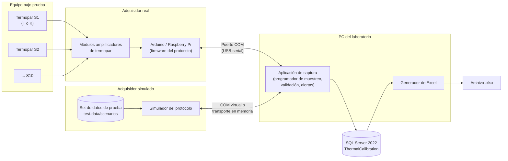

# 01 · Documento de visión

**Sistema de Monitoreo Térmico para Calibración de Equipos de Refrigeración**
Fase 1: Sesión de Medición, Adquisición Serial y Exportación a Excel

| Campo | Valor |
|---|---|
| Versión | 0.9 (borrador para revisión) |
| Fecha | 2026-09-26 |
| Cambios en 0.2 | Resueltas las preguntas P-01 (muestra en t = 0, inicio al llegar datos), P-02 (umbral de pérdida de sensores) y P-05 (otro adquisidor o grupo de sensores invalida la sesión). Se añaden el simulador de adquisidor, el set de datos de prueba y la base normativa. |
| Cambios en 0.3 | Sesión base de 1 h con **duración planificada** según el tipo de equipo o el pedido del cliente (hasta varios días), en lugar del tope fijo de 24 h. **Descanso** del adquisidor entre sesiones. Alertas separadas en **críticas** (notificación visual) y **advertencias** (solo registro). **Escalamiento** de la pérdida de sensores a crítica en la 3.ª muestra consecutiva y **falla de sesión** tras 30 min sin datos suficientes. |
| Cambios en 0.5 | P-11: se mantiene el intervalo de 120 s, marcado como **punto de cambio PC-01** con la guía para cambiarlo (§12). P-13: mínimo de **9 puntos de medición** (8 esquinas y el centro), con advertencia y confirmación si hay menos (RN-20). |
| Cambios en 0.4 | Confirmadas P-15 (descanso de 15 min del kit de medición), P-16 y P-17. Nueva alerta crítica **`AboveLimitSustained`**: un canal fuera de límite 30 min seguidos, con la **causa probable** (sensor o equipo). |
| Cambios en 0.9 | Decisión **D-08**: rangos admitidos de los parámetros del sistema (`AppSetting`), que el administrador edita desde la API (sprint 1). |
| Cambios en 0.8 | Decisión **D-07**: el criterio `Maximum` se reemplaza por `Range` (mínimo y/o máximo absolutos), porque las refrigeradoras de vacunas y de sangre tienen un rango (+2 … +8 °C, +1 … +6 °C) y la congelación también las deja fuera de especificación. Límites **sugeridos** por la norma en el catálogo inicial (`IsLimitSuggested`), pendientes de confirmar (P-03). |
| Cambios en 0.7 | Decisiones **D-05** (criterio de límite por tipo: máximo o banda alrededor de la consigna; antes P-19) y **D-06** (hasta 27 canales y puntos mínimos por tipo de equipo según su norma; antes P-18). Alcance acotado a equipos de uso individual, de pequeña y mediana escala y de hospitales y clínicas, de hasta 2000 L. |
| Cambios en 0.6 | Primer registro real ([DATA-1](../../data/DATA-1-analisis.md)): cámara ambiental Memmert, 12 termopares tipo T, 5 min, 72 h. Se añaden las cámaras ambientales al alcance y las preguntas P-18 (más de 10 canales) y P-19 (banda de tolerancia). Marca y modelo del equipo obligatorios. |
| Documentos relacionados | [02-serial-protocol.md](02-serial-protocol.md), [03-user-stories.md](03-user-stories.md), [04-sequence-diagrams.md](04-sequence-diagrams.md), [05-data-model.md](05-data-model.md), [06-test-data.md](06-test-data.md), [../../db/01-schema.sql](../../db/01-schema.sql), [normas técnicas](../../standards/README.md) |

---

## 1. Problema

El laboratorio calibra y verifica equipos de refrigeración (refrigeradoras, congeladoras, conservadoras, incubadoras) y cámaras ambientales o climáticas de diferentes empresas cliente. Para ello instrumenta cada equipo con varios termopares y registra la temperatura durante una sesión que normalmente dura **1 hora**. Después, el kit de medición descansa y pasa al siguiente equipo. Algunos tipos de equipo, por su forma de funcionar, exigen sesiones más largas. Algunos clientes, por sus propias exigencias de control, piden registros de 24 horas o, en casos extremos, de varios días.

Hoy ese registro presenta los siguientes problemas:

- **Captura poco confiable.** Las lecturas se anotan o se copian a mano, o dependen de software propietario del registrador. No se puede demostrar qué valor entregó realmente el sensor en cada instante.
- **Sin trazabilidad.** No queda constancia estructurada de qué equipo, qué técnico, qué adquisidor y qué termopares (tipo y ubicación) se usaron en cada sesión, ni de las interrupciones de comunicación.
- **Límites aplicados de forma inconsistente.** Cada tipo de equipo tiene una temperatura máxima admisible. Algunos límites aún no están definidos, y cuando un límite cambia no queda claro cuál se aplicó en una medición anterior.
- **Malas prácticas no detectadas.** A veces se mezclan termopares tipo T y tipo K en un mismo equipo sin dejar constancia.
- **Entrega manual del reporte.** El Excel entregado al cliente o al revisor se arma a mano, con riesgo de errores de transcripción.
- **Hardware no disponible todavía.** El adquisidor está en diseño y quizá no haya sensores al comienzo del desarrollo. Hace falta poder probar el software de punta a punta sin ellos.

## 2. Objetivos de la fase 1

| # | Objetivo | Indicador de éxito |
|---|---|---|
| O1 | Capturar automáticamente, por puerto serial, una lectura por canal cada 2 minutos, con hasta 10 canales. | ≥ 99 % de las muestras programadas quedan almacenadas cuando no hay pérdida física de comunicación. |
| O2 | Almacenar los datos crudos de forma íntegra y auditable. | Cada lectura guarda la marca de tiempo, el valor, el estado del sensor y la trama serial original. |
| O3 | Evaluar cada lectura contra el límite máximo del tipo de equipo, congelado al iniciar la sesión. | El 100 % de las lecturas estrictamente mayores que el límite generan una alerta. |
| O4 | Dejar constancia de las anomalías: mezcla de tipos T/K, tipo reportado distinto del declarado, fallas de sensor, pérdida de sensores sobre el umbral, huecos de comunicación y cambio de adquisidor o de grupo de sensores. | Cada anomalía queda registrada como alerta o como hueco de comunicación, y aparece en el Excel. |
| O4b | Interrumpir al técnico solo cuando hace falta actuar. | Solo las alertas **críticas** se notifican visualmente. Las variaciones de temperatura (advertencias) se registran sin interrumpir. |
| O5 | Exportar cada sesión a un archivo Excel (.xlsx) estandarizado. | Se genera el archivo sin intervención manual, con las hojas Resumen, Lecturas, Alertas y Comunicación. |
| O6 | Mantener el historial de sesiones por empresa y equipo. | Se pueden consultar las sesiones filtrando por empresa, equipo y rango de fechas. |
| O7 | Probar el sistema completo sin hardware, con un adquisidor simulado y un set de datos de prueba reproducible. | Los 22 escenarios de [06-test-data.md](06-test-data.md) producen exactamente los resultados esperados (estado, muestras válidas y afectadas, alertas, huecos). |

## 3. Alcance

### 3.1 Dentro del alcance (fase 1)

Módulos especificados en este paquete:

1. **Sesión de Medición.** Registro de empresas cliente, equipos y tipos de equipo con su límite máximo. Configuración de la sesión (equipo, técnico, puerto COM, adquisidor, canales con su tipo de termopar y su ubicación). Advertencias de mezcla T/K y de límite no definido. Duración planificada de la sesión (base de 1 h, por tipo de equipo o por pedido del cliente). Descanso del adquisidor entre sesiones. Ciclo de vida de la sesión (configurada → en curso → completa/incompleta/fallida/cancelada). Evaluación, escalamiento y falla por pérdida de sensores. Alertas críticas y advertencias. Historial.
2. **Adquisición Serial.** Protocolo de mensajes PC ↔ adquisidor, independiente del hardware, con dos modos (la PC pide cada muestra, o el adquisidor transmite por su cuenta). Detección e identificación del adquisidor y del grupo de sensores, inicio de la sesión al llegar la primera muestra, muestreo cada 2 minutos, validación de tramas, verificación del tipo de termopar, detección de pérdida de comunicación, reconexión y registro de huecos.
3. **Exportación a Excel.** Generación del .xlsx con cuatro hojas (Resumen, Lecturas, Alertas y Comunicación) y registro de cada exportación.
4. **Simulación y datos de prueba.** Adquisidor simulado que implementa el mismo protocolo, más un set de 22 escenarios de datos de prueba con sus resultados esperados, para probar el sistema sin sensores ([06-test-data.md](06-test-data.md)).

**Equipos cubiertos:** de uso individual, de pequeña y mediana escala, y de hospitales y clínicas, con un volumen útil de **hasta 2000 L** (refrigeradoras, congeladoras, conservadoras, incubadoras, estufas y cámaras ambientales o climáticas de laboratorio).

Datos crudos solamente: el sistema **no** calcula estadísticas en esta fase. Sí presenta conteos simples (muestras programadas, válidas y afectadas, número de alertas) porque son necesarios para juzgar la integridad de la captura.

### 3.2 Fuera del alcance (fases futuras)

| Fase futura | Contenido |
|---|---|
| Análisis estadístico | Promedios, desviación estándar, estabilidad y uniformidad entre zonas, detección de outliers, incertidumbre, certificados de calibración. |
| Inventario de sensores | Registro individual de termopares y grupos de sensores, disponibilidad (en uso/libre), asignación por urgencia y trazabilidad de la calibración de cada sensor. En la fase 1 el técnico declara a mano el tipo y la ubicación de cada canal, y el grupo de sensores solo se usa como identificador que informa el adquisidor (`SensorGroupId`). |
| Equipos industriales o masivos | Cámaras frigoríficas visitables, almacenes y equipos de más de 2000 L (IEC 60068-3-5 pide 15 puntos o más, y el mapeo de almacenes de la OMS usa rejillas de 5–10 m). No se medirán en este sistema. |
| Otros | Monitoreo remoto o web, notificaciones por correo o mensajería, firma digital de reportes, integración con ERP o facturación. |

## 4. Perfiles de usuario

| Perfil (rol en BD) | Descripción | Permisos principales en la fase 1 |
|---|---|---|
| **Administrador** (`Admin`) | Responsable del sistema y de los catálogos. | Gestiona usuarios, tipos de equipo y sus límites máximos, el umbral de pérdida de sensores, el catálogo de adquisidores, empresas y equipos. Todo lo que puede hacer un supervisor. |
| **Técnico de calibración** (`Technician`) | Instala los termopares y opera la captura. | Registra empresas y equipos. Configura, inicia, cierra y cancela sus sesiones. Confirma advertencias (mezcla T/K, límite no definido). Ejecuta sesiones simuladas. Exporta y consulta el historial. |
| **Supervisor/revisor** (`Supervisor`) | Revisa la calidad de las mediciones antes de entregarlas. | Consulta el historial y las sesiones de todos los técnicos, exporta a Excel, reconoce (acusa recibo de) alertas y agrega notas. No modifica lecturas. |

Regla transversal: **nadie puede editar ni borrar lecturas, alertas ni huecos** una vez registrados. Son evidencia.

## 5. Arquitectura conceptual

| Componente | Responsabilidad |
|---|---|
| Termopares T/K | Transducen la temperatura en cada zona del equipo (superior, centro, inferior, puerta, fondo, etc.). |
| Adquisidor | Convierte la señal (compensación de unión fría y linealización en el módulo amplificador), diagnostica el sensor (abierto, cortocircuito, fuera de rango) e implementa el protocolo. Informa su identificador y el del grupo de sensores conectado. **No** necesita reloj de tiempo real: la PC marca el tiempo. |
| Adquisidor simulado | Implementa el mismo protocolo que el firmware, pero reproduce un escenario del set de datos de prueba, con reloj acelerado. Se conecta por un par de puertos COM virtuales o por un transporte en memoria. Ver [06-test-data.md](06-test-data.md). |
| Puerto COM | Enlace serial, normalmente USB-CDC. El protocolo está definido en [02-serial-protocol.md](02-serial-protocol.md). |
| Aplicación de captura | Inicia la sesión con la primera muestra recibida, programa o recibe una muestra cada 120 s, valida tramas y tipos, evalúa el límite y la pérdida de sensores, genera alertas, detecta y registra huecos, gestiona el ciclo de vida de la sesión. |
| SQL Server 2022 | Persistencia. Aplica las reglas de integridad críticas mediante restricciones `CHECK` y la vista de cobertura por muestra (ver [05-data-model.md](05-data-model.md)). |
| Generador de Excel | Construye el .xlsx a partir de la base de datos (no desde memoria) y registra la exportación. |

Decisiones clave:

- **La PC marca el tiempo.** Es la aplicación la que asigna el número de muestra y la marca de tiempo. Así el sistema funciona con adquisidores sin reloj (Arduino). En el modo `Poll` la PC además pide cada muestra. En el modo `Stream` el adquisidor transmite solo y la PC asigna cada bloque recibido a su muestra según el tiempo transcurrido.
- **La sesión empieza cuando llegan datos.** El adquisidor puede estar midiendo y transmitiendo antes de conectarse a la PC. Lo que se reciba antes de que el técnico pulse "Iniciar captura" se descarta (solo sirve de vista previa). `StartedAt` es el instante de la **primera muestra válida recibida** después de pulsar "Iniciar": esa es la muestra 1, en t = 0.
- **Los datos simulados nunca se confunden con los reales.** Las sesiones simuladas quedan marcadas (`IsSimulation`), usan un adquisidor de plataforma `Simulator` y llevan un aviso en pantalla y en el Excel.

## 6. Reglas de negocio principales

| Id | Regla |
|---|---|
| RN-01 | Una sesión tiene de **1 a 27 canales** activos, numerados del 1 al 27, cada uno con su tipo de termopar (T o K) y su ubicación. El mínimo esperado lo fija el tipo de equipo (RN-20). 27 es lo que exige DIN 12880 para incubadoras y estufas de más de 50 L, la norma más exigente dentro del alcance (D-06). |
| RN-02 | **[PC-01]** Frecuencia fija: una lectura por canal cada **120 s** (parámetro `SamplingIntervalSeconds`, copiado en la sesión; ver §12 para cambiarlo). La muestra 1 es la primera recibida después de "Iniciar" (t = 0 = `StartedAt`), y la muestra *n* corresponde a `StartedAt + (n − 1) × 120 s`. |
| RN-03 | Una sesión solo queda **completa** si alcanza su **duración planificada** **y** tiene al menos **1 h de datos válidos**: `BaseSessionMinutes × 60 / intervalo + 1` muestras válidas, es decir **31** con el intervalo de 120 s **[PC-01]** (30 intervalos más la muestra inicial). Si no, queda **incompleta**. |
| RN-04 | **Duración planificada.** Base: **60 min**. Se alarga si el tipo de equipo exige más (`EquipmentType.MinSessionDurationMinutes`) o si el cliente lo solicita (con una referencia, p. ej. la orden de servicio). Esto puede llegar a 24 h o, en casos extremos, a varios días. El máximo que se puede planificar es un parámetro (7 días por defecto; la base admite hasta 30). La duración se puede **extender** mientras la sesión está en curso. Al llegar a la duración planificada, la sesión se cierra sola. |
| RN-05 | Se permite mezclar T y K, pero el sistema muestra una advertencia de mala práctica, registra la alerta `MixedThermocoupleTypes` y exige la confirmación del técnico antes de iniciar. La mezcla queda marcada en la sesión y en el Excel. |
| RN-06 | **Criterio de límite por tipo de equipo** (D-05, D-07), configurable y copiado en la sesión: **rango** absoluto (`Range`: mínimo y/o máximo; refrigeradora +2 … +8 °C, congeladora de plasma o ultracongeladora solo con máximo) o **banda** alrededor de la consigna (`Band`: incubadoras, cámaras ambientales), con una tolerancia ± en K. La consigna la indica el técnico en cada sesión con banda y es obligatoria para iniciar. Sin valores, el límite queda *pendiente*. Los valores del catálogo inicial son **sugeridos** por la norma (`IsLimitSuggested`) hasta que el laboratorio los confirme. |
| RN-07 | Comparación **estricta**. Rango: fuera de límite si `TemperatureC > MaxTemperatureC` (alerta `AboveLimit`) o `TemperatureC < MinTemperatureC` (alerta `BelowLimit`); con +2 … +8 °C, 8,0 y 2,0 cumplen, y 8,1 y 1,9 no; con solo máximo -5,0 °C, -5,0 cumple y -4,9 no. Banda: fuera de límite si `TemperatureC > SetpointC + ToleranceK` o `< SetpointC − ToleranceK`; con 20,0 ± 2,0 °C, 22,0 y 18,0 cumplen, y 22,1 y 17,9 no. |
| RN-08 | Al iniciar la sesión se copian el límite vigente (`MaxTemperatureC`) y la política de pérdida de sensores vigente (umbral, muestras para escalar y minutos para fallar). Editarlos después no altera las sesiones ya registradas. |
| RN-09 | Si el tipo de equipo no tiene límite definido, se advierte, se registra la alerta `LimitNotDefined` y se captura igual, sin evaluar el límite. |
| RN-10 | Una lectura fuera de límite **no invalida** la sesión: genera una alerta `AboveLimit` asociada al canal, a la lectura y a la marca de tiempo. |
| RN-11 | Las lecturas inválidas (sensor abierto, cortocircuito, fuera de rango, trama corrupta, tipo no coincidente) se almacenan marcadas y **no detienen** la sesión. |
| RN-12 | La pérdida de comunicación no detiene la sesión: se registra un hueco, se reintenta la conexión y las muestras no recibidas quedan contabilizadas. |
| RN-13 | Las lecturas, alertas y huecos son inmutables. Las alertas solo admiten el reconocimiento (quién y cuándo). |
| RN-14 | **Pérdida de sensores.** Una muestra está **afectada** si el porcentaje de canales activos sin lectura válida (`SensorStatus` ≠ `OK`, o sin lectura) es **estrictamente mayor que el umbral** (60 % por defecto). Las muestras afectadas no cuentan como muestras válidas. Las muestras perdidas por un hueco de comunicación también están afectadas (el 100 % de los canales queda sin datos). Si la proporción es igual o menor que el umbral, las fallas individuales solo generan alertas de sensor y la muestra sigue siendo válida. La pérdida se **escala** según la §6.2. |
| RN-15 | **Sesión fallida.** La sesión se cierra como **fallida** (`Invalid`), conserva sus datos como evidencia pero no puede presentarse como calibración, y se registra una alerta crítica, en dos casos: (a) al reconectar responde un adquisidor con otro `DeviceId` u otro `SensorGroupId` (motivo `DeviceMismatch`); (b) las muestras siguen afectadas durante **30 min consecutivos** (motivo `DataLoss`, §6.2). |
| RN-16 | **Sesiones simuladas.** Una sesión que use el adquisidor simulado se marca como simulación, se asocia a un escenario del set de pruebas y se excluye del historial por defecto. Su Excel lleva el aviso "DATOS SIMULADOS – NO VÁLIDOS PARA CALIBRACIÓN". |
| RN-17 | **Descanso del kit de medición.** Entre el fin de una sesión y el inicio de la siguiente con el mismo adquisidor (y su grupo de sensores) debe pasar un **periodo de descanso** (parámetro `RestPeriodMinutes`, **15 min**), para no saturar el equipo de medición mientras se traslada a otro equipo. Mientras dura, el sistema muestra el tiempo restante y no permite iniciar. Un supervisor o administrador puede autorizar el inicio anticipado, indicando el motivo, que queda registrado. |
| RN-20 | **Mínimo de puntos de medición por tipo de equipo** (D-06). Cada tipo fija sus puntos mínimos según su norma, y se copian en la sesión al iniciar: **9** (8 esquinas y centro) en cámaras ambientales, refrigeradoras, congeladoras y conservadoras de hasta 2000 L (IEC 60068-3-5 §4.4, DKD-R 5-7 §5 y §7.1.1, USP <1079.4>), y **27** en incubadoras y estufas de más de 50 L (DIN 12880; 9 si son de 50 L o menos). Con menos canales se permite iniciar: el sistema advierte que la sesión **no cumple el mínimo normativo**, registra la alerta `BelowMinimumPoints` (Warning), exige la **confirmación** del técnico y lo marca en la sesión y en el Excel. |
| RN-18 | **Prioridad de las alertas.** Las alertas **críticas** (`Critical`) exigen actuar: se notifican visualmente de forma destacada y deben reconocerse. Las **advertencias** (`Warning`) y las **informativas** (`Info`) solo se registran: aparecen en contadores, en la lista de alertas y resaltadas en la tabla de lecturas, sin interrumpir al técnico. Las variaciones de temperatura son esperables por distintas causas, así que `AboveLimit` es una advertencia. Clasificación completa en la §6.3. |
| RN-19 | **Fuera de límite sostenido.** Si un mismo canal tiene todas sus lecturas fuera de límite **del mismo lado** durante **30 min seguidos** (parámetro `AboveLimitCriticalMinutes`), se genera **una** alerta crítica para ese canal: `AboveLimitSustained` (por encima) o `BelowLimitSustained` (por debajo de la banda). La alerta indica la **causa probable**, porque el problema puede ser del sensor y no del equipo (§6.4). No invalida la sesión: los datos siguen siendo válidos. |

### 6.1 Umbral de muestras afectadas según el número de canales

Con el umbral por defecto del 60 % (hay que **superarlo**, no basta con alcanzarlo):

| Canales activos | Canales sin dato válido que hacen **afectada** la muestra |
|---|---|
| 1 | 1 |
| 2 | 2 |
| 3 | 2 o más |
| 4 | 3 o más |
| 5 | 4 o más |
| 6 | 4 o más |
| 7 | 5 o más |
| 8 | 5 o más |
| 9 | 6 o más |
| 10 | 7 o más (6 de 10 = 60 % **no** afecta) |
| 11 | 7 o más |
| 12 | 8 o más (DATA-1: 7 de 12 = 58 % no afecta) |
| 13 | 8 o más |
| 14 | 9 o más |
| 15 | 10 o más |
| 16 | 10 o más |
| 17 | 11 o más |
| 18 | 11 o más |
| 19 | 12 o más |
| 20 | 13 o más |
| 21 | 13 o más |
| 22 | 14 o más |
| 23 | 14 o más |
| 24 | 15 o más |
| 25 | 16 o más |
| 26 | 16 o más |
| 27 | 17 o más |

### 6.2 Escalamiento de la pérdida de sensores

Con el intervalo de 2 min **[PC-01]** y los valores por defecto (parámetros `SensorLossCriticalAfterSamples` = 3 y `SensorLossFailMinutes` = 30, copiados en la sesión al iniciar):

| Muestras afectadas consecutivas | Tiempo transcurrido desde la primera | Qué ocurre | Alerta | Severidad |
|---|---|---|---|---|
| 1.ª | 0 min | Se registra la pérdida. | `SensorLoss` | Warning |
| 2.ª | 2 min | Nada nuevo: se espera la recuperación. | — | — |
| **3.ª** | 4 min | La pérdida **no se restableció en la 3.ª medición**: se notifica al técnico para que revise los sensores. | `SensorLossPersistent` | **Critical** |
| 4.ª a 15.ª | 6 a 28 min | La sesión sigue. Esas muestras no cuentan como válidas. | — | — |
| **16.ª** | **30 min** | **Sesión fallida**: se detiene la captura. `Status` = `Invalid`, motivo `DataLoss`. | `SessionFailed` | **Critical** |

- Las muestras perdidas por un hueco de comunicación **cuentan** para el conteo consecutivo. Durante el hueco, el aviso crítico es `CommunicationLost`, así que no se genera además `SensorLossPersistent`. Un corte de 30 min también hace fallar la sesión.
- Una sola muestra válida reinicia el conteo.
- Base normativa de los valores en la §9.

### 6.3 Clasificación de alertas

| Severidad | Presentación | Alertas |
|---|---|---|
| **Critical** | Aviso destacado y persistente en pantalla (banner o sonido opcional), notificación en tiempo real, y exige reconocimiento. Si varias llegan en la misma muestra, se agrupan en un solo aviso. | `AboveLimitSustained`, `SensorLossPersistent`, `SessionFailed`, `DeviceMismatch`, `CommunicationLost` |
| **Warning** | Solo registro: contador en la pantalla de la sesión, lista de alertas y celda resaltada en la tabla de lecturas. No interrumpe. | `AboveLimit`, `SensorFault`, `TypeMismatch`, `SensorLoss`, `MixedThermocoupleTypes` y `BelowMinimumPoints` (estas dos últimas ya se confirman en un diálogo al iniciar) |
| **Info** | Solo registro. | `LimitNotDefined` |

### 6.4 Fuera de límite sostenido: ¿sensor o equipo?

Con el intervalo de 2 min, un canal está fuera de límite de forma sostenida cuando acumula **16 lecturas `OK` seguidas** por encima del límite (30 min). Cualquier lectura dentro del límite, inválida o perdida reinicia la cuenta. Se genera una sola alerta por racha.

Para orientar al técnico, la alerta incluye la **causa probable** (`Alert.SuspectedCause`), calculada en la muestra en que se escala:

| Situación en esa muestra | Causa probable | Mensaje | Acción sugerida |
|---|---|---|---|
| Solo una **minoría** de los canales con lectura válida está fuera de límite (menos de la mitad) | `Sensor` | "S3 (Inferior) lleva 30 min fuera de límite mientras los demás sensores están dentro: posible falla o mala colocación del termopar, o una zona localizada (p. ej. la puerta)." | Revisar la colocación y la conexión del termopar, compararlo con el sensor vecino o reemplazarlo. |
| Al menos la **mitad** de los canales con lectura válida está fuera de límite | `Equipment` | "S1 (Superior) lleva 30 min fuera de límite y la mayoría de los sensores también: posible falla del equipo (p. ej. compresor o puerta abierta)." | Revisar el equipo bajo prueba e informar al supervisor. |

- La causa es **orientativa**, no un diagnóstico. El supervisor la confirma al reconocer la alerta y puede dejar una nota.
- Un sensor sospechoso **no** se descarta automáticamente: sus lecturas se conservan como `OK` y cuentan como válidas, porque la temperatura medida podría ser real (p. ej. una zona mal refrigerada). Solo el revisor puede decidir excluirlo en el análisis de una fase futura.
- Ejemplos en los escenarios TD-20 (causa `Sensor`) y TD-21 (causa `Equipment`).

## 7. Glosario

| Término | Definición |
|---|---|
| **Sesión (de medición)** | Periodo continuo de captura sobre un único equipo, con configuración fija de canales, técnico responsable, puerto COM, adquisidor, límite congelado y umbral de pérdida de sensores congelado. Entidad `MeasurementSession`. |
| **Duración planificada** | Tiempo que debe durar la sesión: base de 60 min, o lo que exija el tipo de equipo, o lo que pida el cliente. Al alcanzarla, la sesión se cierra automáticamente. Se puede extender durante la sesión. |
| **Periodo de descanso** | Tiempo mínimo entre el fin de una sesión y el inicio de la siguiente con el mismo adquisidor (RN-17). |
| **Escalamiento** | Paso de una pérdida de sensores de advertencia a alerta crítica cuando no se restablece en la 3.ª muestra consecutiva (§6.2). |
| **Causa probable** | Indicio que acompaña a la alerta `AboveLimitSustained`: `Sensor` si solo una minoría de canales está fuera de límite, o `Equipment` si lo está la mayoría (§6.4). |
| **Alerta crítica / advertencia** | Una alerta crítica se notifica visualmente y exige actuar. Una advertencia solo se registra (RN-18). |
| **Muestra** | Ciclo de muestreo identificado por un número correlativo (1, 2, 3…; 31 en la sesión base de 1 h) y un instante `StartedAt + (n − 1) × 120 s`. Agrupa la lectura de todos los canales activos. Equivale a una fila de la hoja "Lecturas". |
| **Muestra válida** | Muestra no afectada por pérdida de sensores (RN-14). Solo las muestras válidas cuentan para la duración mínima de datos (RN-03). |
| **Muestra afectada** | Muestra en la que el porcentaje de canales sin lectura válida supera el umbral de pérdida de sensores, o que se perdió por un hueco de comunicación. |
| **Umbral de pérdida de sensores** | Porcentaje configurable (60 % por defecto) que determina si una muestra está afectada. Se copia en la sesión al iniciarla. Ver §9. |
| **Lectura** | Valor obtenido de **un** canal en **una** muestra: temperatura en °C (o nula si es inválida), estado del sensor, tipo reportado y trama original. Entidad `Reading`. |
| **Canal** | Entrada física numerada (1…10) del adquisidor, a la que se conecta un termopar. En la sesión, cada canal activo tiene un tipo declarado y una ubicación. Entidad `SessionChannel`. En el Excel se rotula S1…S10. |
| **Termopar tipo T** | Termopar cobre–constantán. Rango físico según el catálogo: -200 a 350 °C. Recomendado para bajas temperaturas por su mejor exactitud en ese rango. |
| **Termopar tipo K** | Termopar cromel–alumel. Rango físico según el catálogo: -200 a 1260 °C. De uso general. |
| **Rango de temperatura** | Criterio `Range`: límites absolutos mínimo y/o máximo de un tipo de equipo (p. ej. refrigeradora +2 … +8 °C). Una lectura fuera de ellos es una lectura fuera de límite. Puede estar *pendiente* (sin definir) o ser *sugerido* por la norma. |
| **Banda de tolerancia** | Criterio `Band`: intervalo consigna ± tolerancia. Una lectura por encima o por debajo es una lectura fuera de límite (RN-07). Se usa en incubadoras y cámaras ambientales. |
| **Consigna** | Temperatura de trabajo del equipo en la sesión (`SetpointC`), indicada por el técnico; obligatoria en los tipos con banda. |
| **Límite aplicado** | Copia del criterio de límite (rango, o consigna y tolerancia) que se toma al iniciar la sesión y que se usa durante toda ella. |
| **Alerta** | Evento registrado que requiere atención: `AboveLimit`, `AboveLimitSustained`, `MixedThermocoupleTypes`, `BelowMinimumPoints`, `TypeMismatch`, `SensorFault`, `SensorLoss`, `SensorLossPersistent`, `SessionFailed`, `CommunicationLost`, `DeviceMismatch` o `LimitNotDefined`. Tiene una severidad (§6.3). Puede reconocerse, pero no borrarse. |
| **Mínimo de puntos de medición** | 9 canales, en las 8 esquinas y el centro del volumen útil (RN-20). Con menos, la sesión se marca como por debajo del mínimo normativo. |
| **Mezcla de termopares** | Situación en la que los canales activos de una sesión no son todos del mismo tipo (T y K a la vez). Se permite con advertencia y confirmación. |
| **Tipo no coincidente** | El tipo de termopar que el adquisidor informa para un canal difiere del tipo declarado por el técnico para ese canal. |
| **Adquisidor** | Dispositivo de bajo costo (Arduino, Raspberry Pi u otro) con módulos amplificadores de termopar que implementa el protocolo serial. Entidad `AcquisitionDevice`. |
| **Grupo de sensores** | Conjunto físico de termopares (arnés o placa de conexión) conectado al adquisidor. Se identifica por el `SensorGroupId` que el adquisidor informa en `IDN`. En la fase 1 solo se usa para detectar que se cambió el grupo durante la sesión. Su inventario queda para una fase futura. |
| **Modo de adquisición** | `Poll`: la PC pide cada muestra con `READ`. `Stream`: el adquisidor transmite un bloque cada 120 s por su cuenta, incluso antes de conectarse a la PC. |
| **Trama** | Línea de texto ASCII del protocolo serial, con delimitador de inicio, campos y checksum. |
| **Hueco de comunicación** | Intervalo en que la aplicación no puede comunicarse con el adquisidor (puerto cerrado o sin respuesta). Tiene inicio, fin y número de muestras perdidas. Entidad `CommunicationGap`. |
| **Muestra perdida** | Muestra programada durante un hueco de comunicación, de la que no se obtuvo ninguna lectura. |
| **Sesión fallida (no válida)** | Sesión cerrada por un cambio de adquisidor o de grupo de sensores, o por 30 min consecutivos de muestras afectadas (RN-15). Estado `Invalid`. |
| **Adquisidor simulado** | Programa que implementa el protocolo del adquisidor y reproduce un escenario de prueba. Plataforma `Simulator`. |
| **Escenario de prueba** | Conjunto de archivos (configuración, lecturas, transcripción serial y resultados esperados) que describe un caso de prueba reproducible (TD-01…TD-22). |

## 8. Supuestos

| Id | Supuesto |
|---|---|
| S-01 | Una PC gestiona una sesión por puerto COM. Puede haber varias sesiones simultáneas en puertos distintos, pero un puerto no puede usarse en dos sesiones en curso. |
| S-02 | El adquisidor hace la compensación de unión fría y la linealización, y entrega la temperatura ya en °C. |
| S-03 | El adquisidor conoce el tipo de termopar configurado en cada canal (por jumper, por configuración o por el módulo instalado) y lo informa en cada trama. |
| S-04 | El reloj de la PC está sincronizado (NTP). Las marcas de tiempo se guardan con desfase horario (`DATETIMEOFFSET`). La zona de referencia es America/Lima (UTC-05:00). |
| S-05 | La PC permanece encendida durante toda la sesión. La suspensión o hibernación debe estar deshabilitada, y la aplicación lo advierte al iniciar. |
| S-06 | Hay conectividad permanente entre la aplicación y SQL Server (instancia local o en la LAN). |
| S-07 | Las ubicaciones de los canales se escriben en texto libre, con una lista de sugerencias. La lista incluye las **9 posiciones normalizadas** (Esquina sup./inf. izq./der. frontal/fondo y Centro) y otras habituales (Puerta, Bandeja media…). |
| S-08 | Cada canal lleva un solo termopar. No se promedian canales en esta fase. |
| S-09 | El adquisidor puede informar un `SensorGroupId` (p. ej. leído de una memoria en el arnés de sensores o configurado a mano). Si no lo informa (campo vacío), el cambio de grupo se detecta por el patrón de tipos informados por canal (ver [02-serial-protocol.md §9](02-serial-protocol.md#9-pérdida-y-recuperación-de-la-comunicación)). |
| S-10 | Al comienzo del desarrollo no habrá sensores ni adquisidor. Las pruebas de integración se hacen con el adquisidor simulado y el set de datos de prueba. |

## 9. Base normativa del umbral de pérdida de sensores

Se revisaron las principales referencias internacionales para mapeo y calibración de recintos con temperatura controlada:

| Referencia | Qué establece | Relevancia |
|---|---|---|
| **OMS, TRS 961 Anexo 9, Suplemento 8** – *Temperature mapping of storage areas* | Intervalo de registro de 1 a 15 min. Para cámaras frigoríficas y congeladoras, estudios de 24 a 72 h. "Usar un solo tipo de dispositivo por estudio de mapeo". Las desviaciones se documentan en un informe de desviación, que puede recomendar un remapeo parcial o total. | Respalda el intervalo de 2 min y la advertencia de mezcla T/K. **No** fija un porcentaje de sensores caídos. |
| **IEC 60068-3-5:2018** – *Confirmation of the performance of temperature chambers* | Mínimo 9 sensores (esquinas y centro) en cámaras de hasta 2000 L y 15 en las mayores. Registro al menos una vez por minuto para la confirmación del desempeño. Termopares o PT100 como sensores. | Define la cantidad mínima de puntos, pero **no** un porcentaje de sensores caídos admisible. |
| **EURAMET cg-20 v3.0** – *Calibration of climatic chambers* | Calibración en varios puntos, con estabilidad temporal y distribución espacial dentro del presupuesto de incertidumbre. El certificado incluye un diagrama de la distribución de los sensores. | Tampoco fija un porcentaje de sensores caídos. |
| **DKD-R 5-7 (09/2018)** – *Kalibrierung von Klimaschränken* | Al menos 9 puntos (esquinas y centro). El resultado vale solo para el volumen que abarcan los puntos medidos. Para la inestabilidad temporal, **al menos 30 valores en 30 min**. | No fija un porcentaje, pero implica que perder una esquina reduce el volumen calibrado. El intervalo de 2 min no alcanza los 30 valores en 30 min (P-11). |

**Conclusión:** ninguna de estas referencias define un porcentaje de sensores que puedan dejar de enviar datos antes de que se afecte el ensayo. Tratan la falla de un sensor como una **desviación documentada**, cuyo impacto se evalúa según los puntos que quedaron sin cubrir. Por eso:

1. El **60 %** se adopta como **criterio interno del laboratorio**, configurable por el administrador y copiado en cada sesión (`SensorLossThresholdPct`), para que un cambio posterior no altere las sesiones registradas.
2. Toda falla de sensor, aunque no supere el umbral, queda registrada como alerta y aparece en el Excel. Así el revisor puede aplicar el criterio normativo que corresponda (p. ej. perder un punto de esquina en un ensayo según IEC 60068-3-5).
3. Se recomienda que el procedimiento interno del laboratorio documente este criterio y su justificación (ver preguntas P-11 a P-13).

### 9.1 Base normativa del escalamiento, la falla de sesión y la duración

Las normas revisadas **no** fijan un número de mediciones consecutivas para escalar una pérdida de sensores. Los valores adoptados se apoyan en las ventanas de tiempo que sí definen:

| Valor adoptado | Apoyo normativo | Razonamiento |
|---|---|---|
| **Crítica en la 3.ª muestra afectada consecutiva** (4 min con 120 s) | DKD-R 5-7 §7.3 exige al menos 30 valores en 30 min, a intervalos aproximadamente constantes, para evaluar la inestabilidad temporal. | Con 120 s se registran 15 valores en 30 min. Perder 3 seguidos elimina el 20 % de esa ventana: es el punto en que la evaluación empieza a comprometerse y conviene que el técnico actúe. Esperar a la 4.ª (27 %) sería la alternativa más tolerante. Es configurable (2 a 10). |
| **Falla de sesión a los 30 min consecutivos** | OMS TRS 961 Supl. 8: tras abrir la puerta, se admite salir de rango durante un **máximo de 30 min**. IEC 60068-3-5 §4.5: estabilización y temperatura alcanzada evaluadas en ventanas de **al menos 30 min**. DKD-R 5-7 §7.3: inestabilidad temporal en **30 min**. | Si durante una ventana completa de 30 min no hay datos suficientes, no se puede demostrar la estabilidad en ese periodo, y la sesión deja de ser representativa. Configurable (10 a 240 min). |
| **Sesión base de 1 h** | IEC 60068-3-5 y DKD-R 5-7: al menos 30 min de registro en estado estable. | 1 h cubre la ventana de 30 min con margen para la estabilización. |
| **Fuera de límite 30 min seguidos → crítica** | OMS TRS 961 Supl. 8, paso 4: la temperatura debe mantenerse dentro de los límites, salvo un **máximo de 30 min** después de abrir la puerta. | Una excursión breve (apertura de puerta) es esperable y queda como advertencia. Si dura más de 30 min, ya no se explica por una apertura normal y requiere acción. La causa probable separa la falla del sensor de la del equipo. Configurable (10 a 240 min). |
| **Duración mayor por tipo de equipo o por pedido del cliente, hasta varios días** | OMS: de 24 a 72 h en cámaras frías y congeladoras, al menos 7 días en almacenes, "o más si se justifica". EURAMET cg-20 §3: la duración la acuerdan el laboratorio y el cliente, y se registra. | Por eso la duración planificada es por sesión, con su origen (`Base`, `EquipmentType`, `ClientRequest`) y la referencia del pedido. El máximo por defecto es de 7 días. |

Fichas, copias locales (cuando la licencia lo permite) y matriz de trazabilidad norma → especificación: [docs/standards/](../../standards/README.md) ([OMS TRS 961 Supl. 8](../../standards/WHO-TRS-961-Supl8.md), [IEC 60068-3-5](../../standards/IEC-60068-3-5.md), [EURAMET cg-20](../../standards/EURAMET-cg-20.md), [DKD-R 5-7](../../standards/DKD-R-5-7.md)).

## 10. Decisiones tomadas

| Id | Pregunta original | Decisión (2026-09-25) |
|---|---|---|
| P-01 | ¿Se requiere una lectura en t = 0? | **Sí.** El adquisidor puede empezar a generar datos antes de conectarse a la PC, así que la sesión inicia cuando empiezan a llegar datos después de pulsar "Iniciar": esa es la muestra 1 (t = 0). En 24 h hay 721 muestras. La duración mínima de 1 h equivale a 31 muestras. |
| P-02 | ¿Los huecos de comunicación afectan a que una sesión cuente como completa? | La sesión solo se afecta si **más del 60 %** de los sensores dejan de enviar datos en la misma muestra (RN-14). Un hueco de comunicación afecta el 100 %. Para quedar completa, la sesión necesita al menos 31 muestras válidas. Las normas revisadas no fijan un porcentaje (§9): el 60 % es un criterio interno configurable. |
| P-05 | ¿Qué hacer si al reconectar responde otro adquisidor? | Si responde **otro adquisidor u otro grupo de sensores**, la sesión se considera **no válida** (RN-15). |
| D-01 | ¿Cuánto dura una sesión? | La base es de **1 h**. Las sesiones de 24 h son ocasionales. La duración se alarga por el tipo de equipo o a pedido del cliente, hasta varios días en casos extremos (RN-04). |
| D-02 | ¿Hay descanso entre sesiones? | Sí: un periodo de descanso del adquisidor antes de la siguiente sesión, para no saturar el equipo de medición (RN-17). |
| D-03 | ¿Todas las alertas se notifican? | No. Solo las **críticas** se notifican visualmente. Las advertencias, como las variaciones de temperatura, solo se registran (RN-18). |
| D-04 | ¿Cuándo es crítica la pérdida de sensores? | Si no se restablece en la **3.ª** medición consecutiva. Si dura **30 min**, la sesión falla (§6.2 y §9.1). |
| P-15 | ¿El descanso es del kit de medición o del equipo bajo prueba? ¿Cuánto dura? | Del **kit de medición** (adquisidor y sensores). **15 min** (RN-17). |
| P-16 | ¿Una lectura fuera de límite sostenida debe escalar a crítica? | **Sí**, a los 30 min seguidos en el mismo canal, pero indicando que **puede ser un problema del sensor y no del equipo** (RN-19, §6.4). |
| P-17 | ¿Un corte de comunicación de 30 min hace fallar la sesión? | **Sí**, igual que la pérdida de sensores (RN-15). |
| P-13 | ¿Cuántos puntos de medición como mínimo? (se pidió 8, si no contraviene las normas) | **9**: 8 puntos contravienen IEC 60068-3-5 §4.4 y DKD-R 5-7 §7.1.1, que exigen 9 (8 esquinas y centro) en volúmenes menores de 2000 L. Con menos canales: **advertir y exigir confirmación**, como con la mezcla T/K (RN-20). Evaluar qué posiciones concretas faltan por fallas (p. ej. una esquina) queda para una fase futura, porque requiere posiciones normalizadas en lugar de texto libre. |
| P-11 | ¿Se mantiene el intervalo de 2 min, aunque IEC 60068-3-5 y DKD-R 5-7 piden 60 s o menos? | **Sí**, en la fase 1. Queda marcado como **punto de cambio PC-01**, con todas sus ubicaciones y lo que se recalcula, por si el Product Owner decide cambiarlo (§12). |
| D-05 (P-19) | ¿Basta un límite máximo para equipos que trabajan alrededor de una consigna? | **No.** Cada tipo de equipo tiene un **criterio de límite**: `Maximum` (refrigeración) o `Band` (consigna ± tolerancia: incubadoras, cámaras ambientales). La consigna se registra en la sesión. Lecturas fuera de banda por abajo: `IsBelowLimit` y alertas `BelowLimit` / `BelowLimitSustained` (RN-06, RN-07, RN-19). Origen: [DATA-1](../../data/DATA-1-analisis.md), cámara a ~19,4 °C. Resuelve también P-04 para esos tipos. En D-07, `Maximum` se reemplaza por `Range` (mínimo y/o máximo). |
| D-06 (P-18) | ¿Cuántos canales como máximo, y el mínimo es igual para todos los equipos? | **Hasta 27 canales** por sesión y **puntos mínimos por tipo de equipo** según su norma: 9 (IEC 60068-3-5, DKD-R 5-7, USP <1079.4>, hasta 2000 L) y 27 en incubadoras de más de 50 L (DIN 12880). Alcance: equipos de uso individual, de pequeña y mediana escala y de hospitales y clínicas; sin equipos industriales. Origen: DATA-1 usó 12 termopares. |
| D-07 | ¿El límite de un grupo es solo un máximo, o cambia por tipo de equipo? | **Cambia por tipo, y la refrigeración también necesita mínimo.** Criterios: `Range` (mínimo y/o máximo absolutos: refrigeradoras +2 … +8 °C, bancos de sangre +1 … +6 °C, congeladoras de vacunas −25 … −15 °C; congeladoras de plasma y ultracongeladoras solo máximo) y `Band` (consigna ± tolerancia: incubadoras, cámaras ambientales). `Range` reemplaza a `Maximum`. El catálogo inicial trae **límites sugeridos** (`IsLimitSuggested`): refrigeradora y conservadora +2 … +8 °C, incubadora ±1,0 K, cámara ambiental ±2,0 K. Fuentes: OMS PQS E003 (vacunas: +2 … +8 °C y congeladoras −25 … −15 °C), AABB 5.1.8.1 (sangre: +1 … +6 °C; plasma: −18 °C o menos; plaquetas: +20 … +24 °C). |
| D-08 | ¿Qué valores puede poner el administrador en los parámetros del sistema (`AppSetting`)? | **Rangos acotados** (confirmados el 2026-09-26), validados por la aplicación antes de guardar: intervalo de muestreo 30 … 900 s [PC-01], que además debe **dividir exactamente** la duración base; duración base 30 … 240 min; duración máxima planificable desde la base hasta 43 200 min (30 días, el tope de `dbo.Tally`); descanso del kit 0 … 240 min (0 lo desactiva); umbral de pérdida de sensores mayor que 0 y menor que 100 %, con 2 decimales como máximo; escalamiento a crítica en la muestra 2 … 10; falla de sesión y alerta fuera de límite sostenido 10 … 240 min. Un cambio solo afecta a las sesiones que se inicien después (RN-08). Las muestras válidas mínimas se derivan: duración base × 60 / intervalo + 1. |

## 11. Preguntas abiertas

| Id | Pregunta | Impacto | Propuesta provisional |
|---|---|---|---|
| P-03 | ¿Límites de refrigeradora, conservadora, incubadora y cámara ambiental? | Evaluación de las alertas. | **Sugeridos** por la norma en el catálogo inicial (D-07): refrigeradora y conservadora +2 … +8 °C, incubadora consigna ± 1,0 K, cámara ambiental consigna ± 2,0 K. El laboratorio debe confirmarlos (al editarlos quedan confirmados). |
| P-04 | ¿Hace falta un límite **mínimo** (p. ej. una refrigeradora no debe congelar)? | Modelo y reglas. | **Resuelto** por D-05 y D-07: rango con mínimo (refrigeración) o banda (equipos con consigna). |
| P-06 | ¿Se pueden exportar sesiones canceladas? | Alcance de la exportación. | No. Se exportan las completas, las incompletas y las no válidas (estas últimas con un aviso). |
| P-07 | ¿Las alertas `SensorFault` y `TypeMismatch` se generan por cada lectura o por episodio? | Volumen de alertas. | Por episodio: al pasar de lectura válida a inválida en un canal. `AboveLimit` se genera por cada lectura. |
| P-08 | ¿La reconexión debe buscar el adquisidor en otros puertos COM si Windows lo reenumera? | Robustez. | Sí: si el puerto original no existe, buscar por `DeviceId` entre los puertos disponibles. |
| P-09 | ¿Resolución y exactitud mínimas exigidas al adquisidor? | Diseño del hardware. | Resolución de 0,25 °C o mejor (p. ej. MAX31856). Se reportan 1 o 2 decimales. |
| P-10 | ¿El Excel se entrega al cliente final o solo es interno? | Diseño del formato y la marca. | Interno para revisión. Sin logotipo en la fase 1. |
| P-12 | ¿Qué duración mínima exige cada tipo de equipo? La OMS recomienda de 24 a 72 h para congeladoras y cámaras frías en estudios de **mapeo**. | Valor de `EquipmentType.MinSessionDurationMinutes`. | Todos los tipos en 60 min hasta que el laboratorio lo defina. Para mapeo según la OMS, el cliente pide la duración mayor (D-01). |
| P-14 | ¿Una lectura `TypeMismatch` cuenta como "sin dato válido" para el umbral de pérdida? | Cálculo de muestras afectadas. | Sí: su valor no es confiable. Solo cuenta como válida una lectura `OK`. |

## 12. Puntos de cambio previstos

Decisiones que el Product Owner podría cambiar más adelante. Cada una tiene un identificador **`[PC-nn]`** que aparece como marca en **todos** los lugares donde se define el valor (parámetros, script SQL, generador de datos de prueba), para encontrarlos con una sola búsqueda: `grep -rn "PC-01"`.

### PC-01 · Intervalo de muestreo

| Campo | Valor |
|---|---|
| Valor actual | **120 s** (una lectura por canal cada 2 min) |
| Decisión | Se mantiene en la fase 1 (P-11, 2026-09-25). |
| Motivo para cambiarlo | Calibrar o confirmar el desempeño según DKD-R 5-7 §7.3 (al menos 30 valores en 30 min) o IEC 60068-3-5 §4.4 (al menos 1 registro por minuto) exige **60 s o menos**. 120 s está dentro del rango de la OMS (1 a 15 min). Ver [docs/standards §4](../../standards/README.md#4-hallazgos-para-decidir). |
| Alcance del cambio | Afecta solo a las sesiones **nuevas**: el intervalo se copia en `MeasurementSession.SamplingIntervalSeconds` al crear la sesión. Las sesiones ya registradas conservan el suyo. |

**Dónde se cambia** (buscar `PC-01`):

| # | Ubicación | Qué cambiar | Obligatorio |
|---|---|---|---|
| 1 | Tabla `dbo.AppSetting`, clave `SamplingIntervalSeconds` | El valor, p. ej. `60`. Es el **único cambio necesario en producción**, y lo hace el administrador desde la aplicación. | Sí |
| 2 | [01-schema.sql](../../db/01-schema.sql): el `INSERT` inicial de `AppSetting` y el valor por defecto `DF_MeasurementSession_Interval` | El mismo valor, para que una base nueva nazca con él. | Sí, para instalaciones nuevas |
| 3 | [generate-test-data.mjs](../../../test-data/generate-test-data.mjs), constante `INTERVAL_S` | El mismo valor. Luego regenerar los escenarios con `node test-data/generate-test-data.mjs` y revisar la tabla de [06-test-data.md §5](06-test-data.md#5-catálogo-de-escenarios). | Sí, para las pruebas |
| 4 | [README.md](../../../README.md), tablas "Datos principales" y "PC-01" | El valor y las muestras mínimas mostradas. | Sí, para que el resumen no quede desactualizado |
| 5 | Ejemplos de horas en las historias y los diagramas (p. ej. "la muestra 16 a las 08:30") | Son ilustrativos y están calculados con 120 s. Se pueden actualizar o dejar con una nota. | No |

**Qué se recalcula solo** (no hay que tocarlo, porque se deriva del intervalo):

| Valor derivado | Fórmula | Con 120 s | Con 60 s |
|---|---|---|---|
| Muestras válidas mínimas (1 h de datos, RN-03) | `BaseSessionMinutes × 60 / intervalo + 1` | 31 | 61 |
| Última muestra de la sesión | `PlannedDurationMinutes × 60 / intervalo + 1` | 31 en 1 h, 721 en 24 h | 61 en 1 h, 1441 en 24 h |
| Falla por pérdida sostenida (RN-15) | 30 min, medidos en tiempo | 16 muestras seguidas | 31 muestras seguidas |
| Fuera de límite sostenido (RN-19) | 30 min, medidos en tiempo | 16 lecturas seguidas | 31 lecturas seguidas |
| Escalamiento de la pérdida de sensores (§6.2) | 3.ª muestra seguida (se cuenta en muestras, no en tiempo) | a los 4 min | a los 2 min |
| Programación de las muestras y tolerancia en modo `STREAM` | `StartedAt + (n − 1) × intervalo`, tolerancia ± intervalo / 4 | ± 30 s | ± 15 s |

**Condición para el desarrollo:** el código **no** debe usar el literal `120` ni el número `31`. Siempre debe leer `SamplingIntervalSeconds` de la sesión y calcular los valores derivados con las fórmulas de arriba (ver [ADR-001 §5](../../architecture/adr/ADR-001-clean-architecture-cqrs-ddd.md#5-cumplimiento)).

**Otros cambios a revisar si se pasa a 60 s:** el volumen se duplica (620 lecturas en la sesión base de 10 canales) y el adquisidor debe completar cada bloque en menos de 10 s (F-09), lo que con 27 canales exige conversiones de unos 250 ms por canal o menos.
