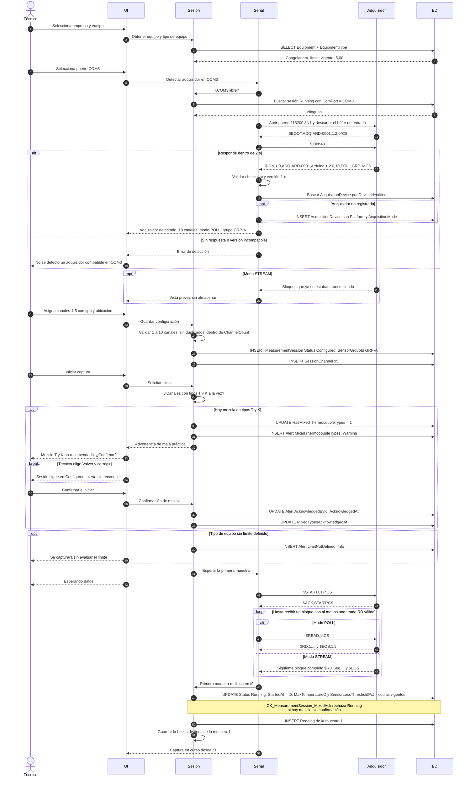
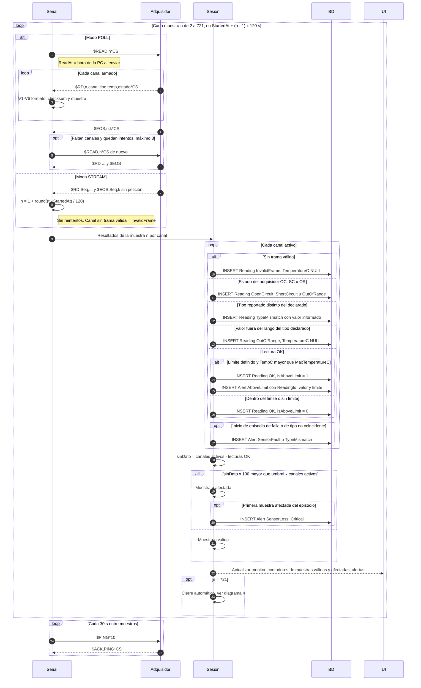
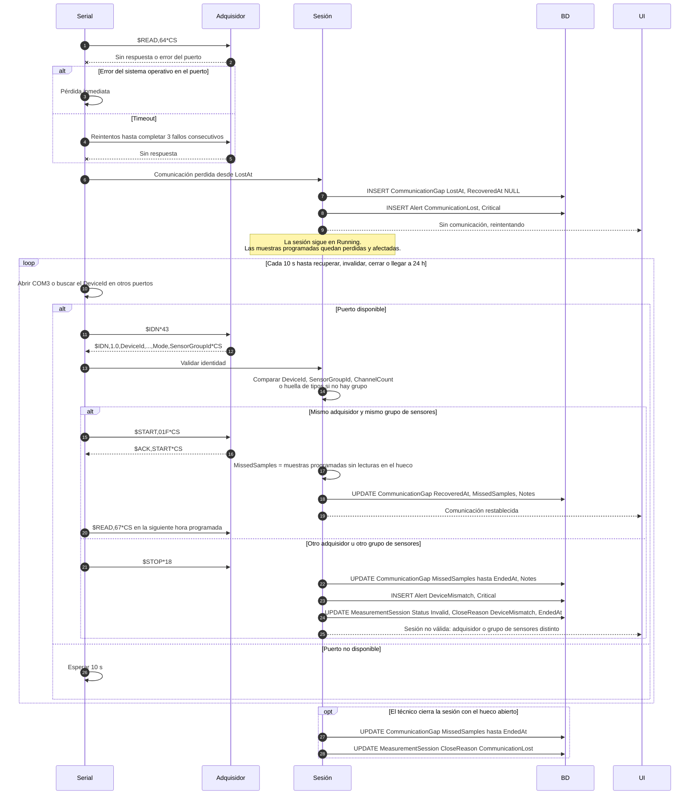
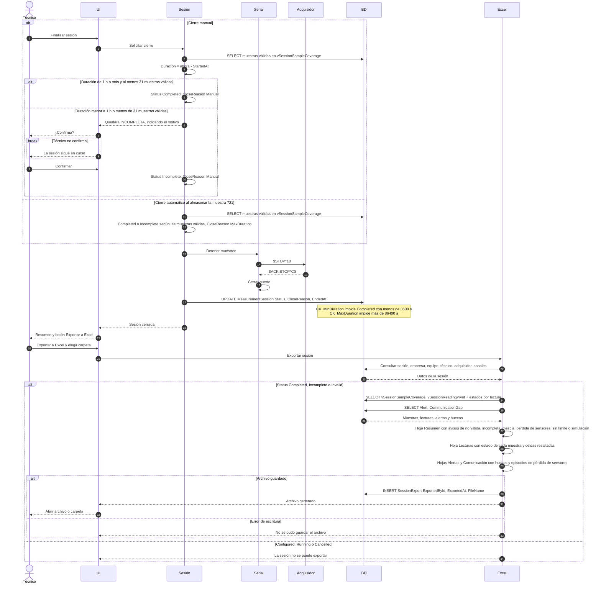
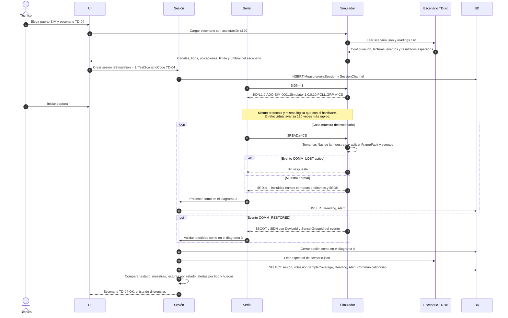

# 04 · Diagramas de secuencia

| Campo | Valor |
|---|---|
| Versión | 0.2 (borrador para revisión) |
| Cambios en 0.2 | Inicio con la primera muestra recibida, modo `STREAM`, evaluación de la pérdida de sensores, invalidación por cambio de adquisidor o de grupo, cierre según las muestras válidas y el nuevo diagrama 5 (sesión simulada). |
| Relacionado | [02-serial-protocol.md](02-serial-protocol.md), [03-user-stories.md](03-user-stories.md), [05-data-model.md](05-data-model.md), [06-test-data.md](06-test-data.md) |

Participantes comunes:

| Participante | Descripción |
|---|---|
| Técnico | Usuario con el rol `Technician`. |
| UI | Interfaz de la aplicación de captura. |
| Sesión | Servicio de sesión de medición: reglas de negocio, ciclo de vida, alertas, pérdida de sensores. |
| Serial | Servicio de adquisición serial: puerto, protocolo, validación de tramas, programador de muestreo. |
| ADQ | Adquisidor (Arduino, Raspberry Pi o simulado) conectado por el puerto COM. |
| BD | SQL Server 2022, base `ThermalCalibration`. |
| Excel | Generador del archivo .xlsx. |

Los checksums de las tramas se abrevian como `*CS`. Los valores reales están en [02-serial-protocol.md](02-serial-protocol.md).

---

## 1. Configuración, detección del adquisidor, advertencia de mezcla e inicio al llegar datos

Cubre HU-03, HU-04, HU-05 y el inicio de HU-06.

---

## 2. Ciclo de captura cada 2 minutos

Cubre HU-06, HU-07, HU-08 y HU-13. Validaciones V1–V10 de [02-serial-protocol.md §7](02-serial-protocol.md#7-validación-de-tramas-en-la-pc).

Ejemplos:

- Evaluación del límite con `MaxTemperatureC = -5,00`: una lectura de `-5,00` se inserta con `IsAboveLimit = 0`, y una de `-4,90` con `IsAboveLimit = 1`, más una alerta `AboveLimit`.
- Pérdida de sensores con 10 canales y umbral del 60 %: 6 canales sin dato (6 × 100 = 600, que no es mayor que 60 × 10 = 600) dejan la muestra válida. Con 7 canales sin dato (700 > 600) la muestra queda afectada.

---

## 3. Pérdida y recuperación de la comunicación serial

Cubre HU-09. Ver [02-serial-protocol.md §9](02-serial-protocol.md#9-pérdida-y-recuperación-de-la-comunicación).

---

## 4. Cierre de sesión y exportación a Excel

Cubre HU-10 y HU-11.

---

## 5. Sesión simulada con el set de datos de prueba

Cubre HU-14. Ver [06-test-data.md](06-test-data.md).

