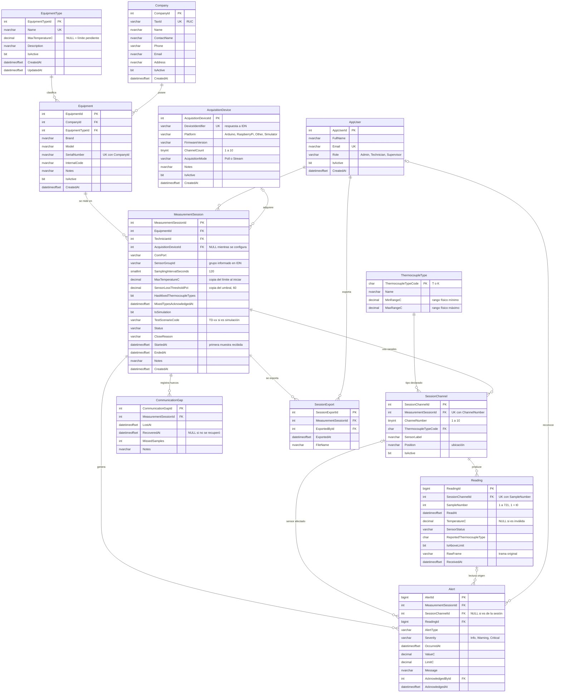
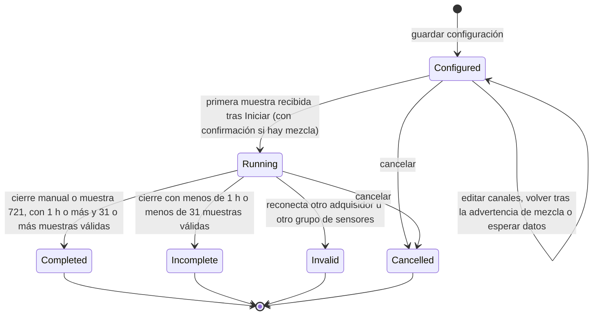

# 05 · Modelo de datos

| Campo | Valor |
|---|---|
| Versión | 0.2 (borrador para revisión) |
| Cambios en 0.2 | Estado `Invalid` y motivo `DeviceMismatch`. Umbral de pérdida de sensores copiado en la sesión. Grupo de sensores. Marca de simulación. Modo de adquisición y plataforma `Simulator`. Alertas `SensorLoss` y `DeviceMismatch`. Vista `vSessionSampleCoverage`. Muestra 1 en t = 0 (hasta la 721). |
| Motor | SQL Server 2022. Base de datos `ThermalCalibration`, esquema `dbo`. |
| Fuente de verdad | [../../db/01-schema.sql](../../db/01-schema.sql). Validado el 2026-09-25: el script se ejecuta sin errores y los 15 escenarios de [06-test-data.md](06-test-data.md) cargan sin violar ninguna restricción. `vSessionSampleCoverage` reproduce las muestras programadas y afectadas esperadas en todos ellos. |
| Convenciones | PascalCase. Tablas en singular. PK `<Tabla>Id` (salvo `ThermocoupleType`, cuya PK es el código natural). Restricciones con prefijos `PK_`, `FK_`, `UQ_`, `CK_`, `DF_` e índices con `IX_`. Fechas en `DATETIMEOFFSET` (con desfase horario). Temperaturas en `DECIMAL` y en °C. |

Este documento describe el modelo. Si hay alguna discrepancia con el script, prevalece el script. Las mejoras propuestas se listan en la [§5](#5-observaciones-y-mejoras-propuestas-al-script) y **no** están aplicadas.

---

## 1. Diagrama entidad-relación

## 2. Ciclo de vida de la sesión

| `Status` | Significado | `StartedAt` | `EndedAt` | `CloseReason` | ¿Exportable? |
|---|---|---|---|---|---|
| `Configured` | Configurada, aún sin captura. Incluye el subestado de interfaz "Esperando datos" (después de pulsar Iniciar y antes de la primera muestra). | NULL | NULL | NULL | No |
| `Running` | Captura en curso (también durante un hueco de comunicación) | Sí | NULL | NULL | No |
| `Completed` | Cerrada con una duración de 1 h a 24 h y al menos 31 muestras válidas | Sí | Sí | `Manual`, `MaxDuration` o `CommunicationLost` | Sí |
| `Incomplete` | Cerrada con menos de 1 h o con menos de 31 muestras válidas | Sí | Sí | `Manual`, `MaxDuration` o `CommunicationLost` | Sí |
| `Invalid` | Cerrada porque al reconectar respondió otro adquisidor u otro grupo de sensores | Sí | Sí | `DeviceMismatch` | Sí, con aviso |
| `Cancelled` | Descartada por el técnico | NULL o sí | NULL o sí | `Cancelled` | No |

## 3. Descripción de las entidades

### 3.1 Catálogos

**`ThermocoupleType`**: tipos de termopar admitidos y su rango físico. Datos iniciales: `T` (-200 a 350 °C) y `K` (-200 a 1260 °C). Se usa para validar el tipo declarado de cada canal (FK) y para marcar como `OutOfRange` los valores imposibles para el tipo declarado. Solo lo modifica el administrador. En la fase 1 es de solo lectura.

**`EquipmentType`**: catálogo ampliable de tipos de equipo (Refrigeradora, Congeladora, Conservadora, Incubadora…) con su **límite máximo** `MaxTemperatureC`. NULL significa *límite pendiente*. Nombre único. Solo el administrador lo crea o edita, y registra `UpdatedAt` al editar. Se desactiva en lugar de borrarse cuando tiene equipos.

El **umbral de pérdida de sensores vigente** (60 % por defecto) es un parámetro de configuración de la aplicación que mantiene el administrador. Al iniciar una sesión se copia en `MeasurementSession.SensorLossThresholdPct`.

### 3.2 Usuarios, empresas y equipos

**`AppUser`**: usuarios de la aplicación con un rol (`Admin`, `Technician`, `Supervisor`). Se llama `AppUser` porque `User` es palabra reservada en SQL Server. El correo es único.

**`Company`**: empresa cliente, identificada por su RUC (`TaxId`, único). Guarda los datos de contacto. Las simulaciones usan una empresa de prueba dedicada.

**`Equipment`**: equipo bajo prueba de una empresa. Tiene tipo, marca, modelo, número de serie (único por empresa) y código interno del cliente. Su historial de sesiones se obtiene con `MeasurementSession.EquipmentId` (índice `IX_MeasurementSession_EquipmentId_StartedAt`).

### 3.3 Adquisición

**`AcquisitionDevice`**: adquisidor identificado por el `DeviceIdentifier` que devuelve el comando `IDN` del protocolo. La aplicación lo registra al detectarlo por primera vez, con su `Platform` y su `AcquisitionMode` (`Poll` o `Stream`), y actualiza `FirmwareVersion` si cambia. `ChannelCount` (1–10) limita los canales que se pueden asignar. Los adquisidores simulados usan `Platform` = `Simulator`.

### 3.4 Sesión de medición

**`MeasurementSession`**: cabecera de la sesión. Registra:

- el equipo, el técnico, el adquisidor, el puerto COM y el **grupo de sensores** (`SensorGroupId`, informado por el adquisidor);
- el intervalo de muestreo (120 s por defecto);
- el **límite aplicado** `MaxTemperatureC` y el **umbral de pérdida de sensores** `SensorLossThresholdPct`, ambos copiados al iniciar;
- el indicador de mezcla con la fecha de confirmación;
- la **marca de simulación** (`IsSimulation`, `TestScenarioCode`);
- el estado, el motivo de cierre, las fechas de inicio (primera muestra recibida) y fin, y las notas.

**`SessionChannel`**: canal activo de la sesión, con su número (1–10, único en la sesión), su **tipo declarado** (FK a `ThermocoupleType`), su ubicación (`Position`) y una etiqueta física opcional (`SensorLabel`). El tipo se guarda por canal para poder representar la mezcla T/K.

### 3.5 Lecturas y eventos

**`Reading`**: una fila por canal y por muestra. Guarda:

- `SampleNumber`: 1 en t = 0, *n* en t = (n − 1) × 2 min, hasta 721.
- `ReadAt`: instante programado de la muestra (hora de la PC).
- `TemperatureC` (NULL si la lectura es inválida), `SensorStatus`, `ReportedThermocoupleType` (tipo informado por el adquisidor) e `IsAboveLimit`.
- `RawFrame`: trama serial original, hasta 200 caracteres.
- `ReceivedAt`: hora de recepción con milisegundos.

Volumen máximo por sesión: 10 × 721 = 7 210 filas.

| `SensorStatus` | Origen | `TemperatureC` | ¿Se evalúa el límite? | ¿Cuenta como dato válido para el umbral? |
|---|---|---|---|---|
| `OK` | Adquisidor, validado por la PC | Obligatoria | Sí, si `MeasurementSession.MaxTemperatureC` no es NULL | **Sí** |
| `OpenCircuit` | Adquisidor (`OC`) | NULL | No | No |
| `ShortCircuit` | Adquisidor (`SC`) | NULL | No | No |
| `OutOfRange` | Adquisidor (`OR`) o PC (valor fuera del rango del tipo) | NULL | No | No |
| `InvalidFrame` | PC (trama corrupta o faltante) | NULL | No | No |
| `TypeMismatch` | PC (tipo informado ≠ declarado) | Valor informado, no confiable | No | No |

**`CommunicationGap`**: intervalo sin comunicación con el adquisidor, con `LostAt`, `RecoveredAt` (NULL si no se recuperó antes del cierre o si la sesión se invalidó), `MissedSamples` y notas (p. ej. reconexión en otro puerto, o el adquisidor distinto que respondió).

**`Alert`**: evento que requiere atención. Siempre pertenece a una sesión. Opcionalmente se asocia a un canal y a una lectura.

| `AlertType` | Severidad | Canal | Lectura | `ValueC` / `LimitC` | Cuándo se genera |
|---|---|---|---|---|---|
| `AboveLimit` | `Warning` | Sí | Sí | Sí / Sí | En **cada** lectura `OK` con `TemperatureC > MaxTemperatureC` |
| `MixedThermocoupleTypes` | `Warning` | No | No | No / No | Al solicitar el inicio de una sesión con canales T y K |
| `TypeMismatch` | `Warning` | Sí | Sí | Sí / No | Al iniciar un episodio de tipo no coincidente en un canal |
| `SensorFault` | `Warning` | Sí | Sí | No / No | Al iniciar un episodio `OpenCircuit`, `ShortCircuit`, `OutOfRange` o `InvalidFrame` en un canal |
| `SensorLoss` | `Critical` | No | No | No / No | Al iniciar un episodio de muestras afectadas (más del umbral de canales sin dato válido) con lecturas |
| `CommunicationLost` | `Critical` | No | No | No / No | Al abrir un `CommunicationGap` |
| `DeviceMismatch` | `Critical` | No | No | No / No | Al reconectar otro adquisidor u otro grupo de sensores. La sesión pasa a `Invalid`. |
| `LimitNotDefined` | `Info` | No | No | No / No | Al iniciar una sesión cuyo tipo de equipo no tiene límite |

El reconocimiento (`AcknowledgedById` + `AcknowledgedAt`) es la única modificación permitida sobre una alerta. En `MixedThermocoupleTypes` el reconocimiento equivale a la confirmación obligatoria del técnico.

### 3.6 Exportación

**`SessionExport`**: bitácora de las exportaciones a Excel (quién, cuándo, nombre del archivo). No guarda el archivo.

### 3.7 Vistas

| Vista | Uso |
|---|---|
| `vSessionThermocoupleMix` | Número de tipos distintos entre los canales activos y el indicador `IsMixed`. Sirve para calcular y verificar `HasMixedThermocoupleTypes`. |
| `vSessionReadingPivot` | Una fila por muestra con las columnas `S1`…`S10` (`TemperatureC`). Es la base de los valores de la hoja "Lecturas". |
| `vSessionSampleCoverage` | Una fila por **muestra programada** (de 1 hasta la muestra correspondiente a `EndedAt`, o a la hora actual si la sesión está en curso), **incluidas las perdidas**. Columnas: `ScheduledAt`, `ActiveChannels`, `ReadingRows`, `ValidReadings` (lecturas `OK`) e `IsAffected`. Es la referencia para contar las muestras válidas al cerrar (RN-03), para la columna "Estado de la muestra" del Excel y para validar los escenarios de prueba. Genera los números de muestra con una tabla de dígitos en línea, sin depender de `GENERATE_SERIES`. |

## 4. Reglas de negocio

### 4.1 Reglas aplicadas en la base de datos

| Restricción | Regla | Ref. |
|---|---|---|
| `CK_ThermocoupleType_Range` | `MinRangeC < MaxRangeC`. | — |
| `UQ_EquipmentType_Name` | Nombre de tipo de equipo único. | HU-02 |
| `CK_AppUser_Role` | Rol ∈ {`Admin`, `Technician`, `Supervisor`}. | Visión §4 |
| `UQ_AppUser_Email` | Correo único. | — |
| `UQ_Company_TaxId` | RUC único. | HU-01 |
| `UQ_Equipment_Company_Serial` | Número de serie único por empresa. | HU-01 |
| `UQ_AcquisitionDevice_Identifier` | Identificador de adquisidor único. | HU-03 |
| `CK_AcquisitionDevice_Platform` | Plataforma ∈ {`Arduino`, `RaspberryPi`, `Other`, `Simulator`}. | Protocolo §4.3 |
| `CK_AcquisitionDevice_Mode` | Modo ∈ {`Poll`, `Stream`}. | Protocolo §4.3 |
| `CK_AcquisitionDevice_ChannelCount` | De 1 a 10 canales. | RN-01 |
| `CK_MeasurementSession_Status` | Estado ∈ {`Configured`, `Running`, `Completed`, `Incomplete`, `Invalid`, `Cancelled`}. | §2 |
| `CK_MeasurementSession_CloseReason` | Motivo NULL o ∈ {`Manual`, `MaxDuration`, `Cancelled`, `CommunicationLost`, `DeviceMismatch`}. | HU-10 |
| `CK_MeasurementSession_Invalid` | `Invalid` si y solo si `CloseReason` = `DeviceMismatch`. | RN-15 |
| `CK_MeasurementSession_Interval` | Intervalo > 0 (120 s por defecto, `DF_MeasurementSession_Interval`). | RN-02 |
| `CK_MeasurementSession_SensorLoss` | 0 < `SensorLossThresholdPct` < 100 (60 por defecto, `DF_MeasurementSession_SensorLoss`). | RN-14 |
| `CK_MeasurementSession_TestScenario` | `TestScenarioCode` solo en sesiones con `IsSimulation` = 1. | RN-16 |
| `CK_MeasurementSession_Dates` | `EndedAt` exige `StartedAt` y `EndedAt >= StartedAt`. | — |
| `CK_MeasurementSession_MaxDuration` | Duración ≤ 86 400 s (24 h). | RN-04 |
| `CK_MeasurementSession_MinDuration` | `Completed` exige una duración ≥ 3 600 s (1 h). | RN-03 |
| `CK_MeasurementSession_MixedAck` | Con mezcla, la sesión solo puede salir de `Configured`/`Cancelled` si tiene `MixedTypesAcknowledgedAt`. | RN-05 |
| `UQ_SessionChannel_Session_Channel` | Un número de canal por sesión. | RN-01 |
| `CK_SessionChannel_ChannelNumber` | Canal de 1 a 10. | RN-01 |
| `FK_SessionChannel_ThermocoupleType` | El tipo declarado debe existir (T o K). | RN-01 |
| `UQ_Reading_Channel_Sample` | Una lectura por canal y muestra. | HU-06 |
| `CK_Reading_SampleNumber` | Muestra de 1 a 721 (t = 0 a t = 24 h). | RN-02, RN-04 |
| `CK_Reading_SensorStatus` | Estado ∈ {`OK`, `OpenCircuit`, `ShortCircuit`, `OutOfRange`, `InvalidFrame`, `TypeMismatch`}. | HU-07 |
| `CK_Reading_TemperatureWhenOk` | Una lectura `OK` debe tener temperatura. | HU-07 |
| `CK_CommunicationGap_Dates` | `RecoveredAt >= LostAt`. | HU-09 |
| `CK_Alert_AlertType` | Tipo ∈ {`AboveLimit`, `MixedThermocoupleTypes`, `TypeMismatch`, `SensorFault`, `SensorLoss`, `CommunicationLost`, `DeviceMismatch`, `LimitNotDefined`}. | §3.5 |
| `CK_Alert_Severity` | Severidad ∈ {`Info`, `Warning`, `Critical`}. | §3.5 |
| `CK_Alert_Ack` | `AcknowledgedById` y `AcknowledgedAt` se rellenan juntos o ninguno. | HU-04, HU-08 |

### 4.2 Reglas aplicadas en la aplicación

| Id | Regla | Motivo por el que no está en la BD |
|---|---|---|
| RA-01 | Validación del RUC (11 dígitos, prefijo 10/15/17/20, dígito verificador módulo 11). | Algoritmo. Se podría añadir un `CHECK` de formato (ver §5). |
| RA-02 | Solo `Admin` edita `EquipmentType`, `AppUser` y el umbral de pérdida de sensores. Solo el técnico de la sesión, un `Admin` o un `Supervisor` pueden cerrarla o cancelarla. | Autorización. |
| RA-03 | Al pasar a `Running` se copian `EquipmentType.MaxTemperatureC` y el umbral vigente en `MeasurementSession.MaxTemperatureC` y `SensorLossThresholdPct`, y después ya no se modifican. | Requiere la lectura de otra tabla o de la configuración en el momento de la transición. |
| RA-04 | Para solicitar el inicio hacen falta: al menos 1 canal activo, un adquisidor detectado (`AcquisitionDeviceId` no NULL), todos los canales ≤ `ChannelCount` y el puerto COM sin otra sesión `Running`. | Reglas entre tablas y de estado. |
| RA-05 | `HasMixedThermocoupleTypes` se calcula con los canales activos (`vSessionThermocoupleMix`) al solicitar el inicio. Si hay mezcla, se crea la alerta `MixedThermocoupleTypes`. | Regla entre tablas. |
| RA-06 | Si `MaxTemperatureC` es NULL al iniciar, se crea la alerta `LimitNotDefined` y no se evalúa el límite. | Evento de negocio. |
| RA-07 | `IsAboveLimit = 1` si y solo si `SensorStatus = 'OK'` y `TemperatureC > MeasurementSession.MaxTemperatureC`. Cada caso genera una alerta `AboveLimit` con `ValueC` y `LimitC`. | Regla entre tablas. |
| RA-08 | `TemperatureC` es NULL para `OpenCircuit`, `ShortCircuit`, `OutOfRange` e `InvalidFrame`. En `TypeMismatch` guarda el valor informado. | Parcialmente expresable (ver §5). |
| RA-09 | Validación de tramas V1–V10, reintentos y verificación de tipo según [02-serial-protocol.md](02-serial-protocol.md). | Lógica de protocolo. |
| RA-10 | Alertas `SensorFault`, `TypeMismatch` y `SensorLoss` por episodio. `AboveLimit` por lectura. | Requiere el estado previo. |
| RA-11 | `StartedAt` = instante de la primera muestra con al menos una trama `RD` válida recibida después de "Iniciar". Esa muestra es la número 1. La muestra *n* se programa (o asigna, en `STREAM`) en `StartedAt + (n − 1) × SamplingIntervalSeconds`. | Temporización y protocolo. |
| RA-12 | Cierre: `Completed` si la duración es ≥ 1 h **y** hay ≥ 31 muestras no afectadas en `vSessionSampleCoverage`. Si no, `Incomplete`. Cierre automático tras la muestra 721 con `MaxDuration`. | La BD valida la duración (`CK_MinDuration`, `CK_MaxDuration`), pero el conteo de muestras válidas depende de la vista y de la transición. |
| RA-13 | `CommunicationGap.MissedSamples` = número de muestras programadas entre `LostAt` y `RecoveredAt` (o `EndedAt`) sin lecturas. | Cálculo. |
| RA-14 | Las lecturas, los huecos y las alertas no se editan ni se borran, salvo el reconocimiento de alertas y el cierre del hueco (`RecoveredAt`, `MissedSamples`, `Notes`). | Se recomienda reforzarlo con permisos (ver §5). |
| RA-15 | Se exportan sesiones `Completed`, `Incomplete` e `Invalid`. Cada exportación inserta un `SessionExport`. | Regla de proceso. |
| RA-16 | Al reconectar se comparan `DeviceId`, `SensorGroupId`, `ChannelCount` y, si no hay grupo, la huella de tipos de la muestra 1. Cualquier diferencia pasa la sesión a `Invalid`/`DeviceMismatch` con alerta `DeviceMismatch`. | Lógica de protocolo. |
| RA-17 | Una muestra está afectada si `(ActiveChannels − ValidReadings) × 100 > SensorLossThresholdPct × ActiveChannels`. Las muestras perdidas por un hueco tienen `ValidReadings` = 0. Coincide con `vSessionSampleCoverage.IsAffected`. | La vista lo calcula. La aplicación lo evalúa en línea para generar la alerta. |
| RA-18 | Un adquisidor con `Platform` = `Simulator` solo se usa en sesiones con `IsSimulation` = 1 y con la empresa de prueba. El modo simulación se deshabilita en producción. | Configuración y regla entre tablas (ver §5, M-13). |

## 5. Observaciones y mejoras propuestas al script

Hallazgos de la revisión de [01-schema.sql](../../db/01-schema.sql) contra esta especificación. **No están aplicados**: requieren aprobación.

| # | Observación | Propuesta |
|---|---|---|
| M-01 | `CK_MeasurementSession_MinDuration` se cumple si `StartedAt` o `EndedAt` son NULL, porque `DATEDIFF` devuelve NULL y un `CHECK` con resultado desconocido pasa. Una sesión `Completed` sin fechas sería aceptada. | Añadir `CHECK (Status NOT IN ('Running','Completed','Incomplete','Invalid') OR StartedAt IS NOT NULL)` y `CHECK (Status NOT IN ('Completed','Incomplete','Invalid') OR EndedAt IS NOT NULL)`. |
| M-02 | No se exige `CloseReason` en las sesiones cerradas ni se impide en las abiertas. | `CHECK ((Status IN ('Completed','Incomplete','Invalid','Cancelled') AND CloseReason IS NOT NULL) OR (Status IN ('Configured','Running') AND CloseReason IS NULL))`. |
| M-03 | Nada impide dos sesiones `Running` en el mismo puerto COM ni en el mismo equipo. | Índices únicos filtrados: `CREATE UNIQUE INDEX UX_MeasurementSession_ComPort_Running ON dbo.MeasurementSession (ComPort) WHERE Status = 'Running'`, y lo mismo para `EquipmentId`. |
| M-04 | `IsAboveLimit` podría valer 1 en una lectura no `OK`. | `CHECK (IsAboveLimit = 0 OR SensorStatus = 'OK')`. |
| M-05 | `TemperatureC` puede tener valor en los estados de falla. | `CHECK (SensorStatus IN ('OK','TypeMismatch') OR TemperatureC IS NULL)`. |
| M-06 | `ReportedThermocoupleType` no tiene FK. | FK a `ThermocoupleType`, o `CHECK (ReportedThermocoupleType IN ('T','K'))`. |
| M-07 | La inmutabilidad de `Reading`, `Alert` y `CommunicationGap` depende solo de la aplicación. | Rol de base de datos de la aplicación con `DENY DELETE` sobre esas tablas y `DENY UPDATE` sobre `Reading`. Alternativa: triggers de auditoría. |
| M-08 | `Company.TaxId` acepta cualquier texto. | `CHECK (TaxId NOT LIKE '%[^0-9]%' AND LEN(TaxId) = 11)`, si solo habrá clientes con RUC peruano. |
| M-09 | `Alert` para `AboveLimit` no exige `SessionChannelId`, `ReadingId`, `ValueC` ni `LimitC`. | `CHECK (AlertType <> 'AboveLimit' OR (SessionChannelId IS NOT NULL AND ReadingId IS NOT NULL AND ValueC IS NOT NULL AND LimitC IS NOT NULL))`. |
| M-10 | `vSessionReadingPivot` solo expone `TemperatureC`. Para el Excel también hacen falta `SensorStatus` e `IsAboveLimit` por celda. | Vista complementaria en formato largo, o dejar el pivotado en el generador. |
| M-11 | ~~`CK_Reading_SampleNumber` admite 721~~ | **Resuelta** por la decisión P-01: la muestra 1 es t = 0 y la 721 es t = 24 h. |
| M-12 | `CK_MeasurementSession_MinDuration` solo controla la duración de reloj. La exigencia de 31 muestras válidas (P-02) es una regla de aplicación (RA-12). | Opcional: trigger `AFTER UPDATE` que rechace `Completed` si `vSessionSampleCoverage` tiene menos de 31 muestras no afectadas. |
| M-13 | Nada impide usar un adquisidor `Simulator` en una sesión real (`IsSimulation` = 0). | Trigger o validación en el procedimiento de inicio. No se puede expresar con un `CHECK` porque cruza tablas. |
| M-14 | `vSessionSampleCoverage` recalcula la cobertura en cada consulta (hasta 721 × 10 filas por sesión). | Suficiente para la fase 1. Si el historial crece, materializar la cobertura al cerrar la sesión (columnas `ValidSamples` y `AffectedSamples` en `MeasurementSession`). |
